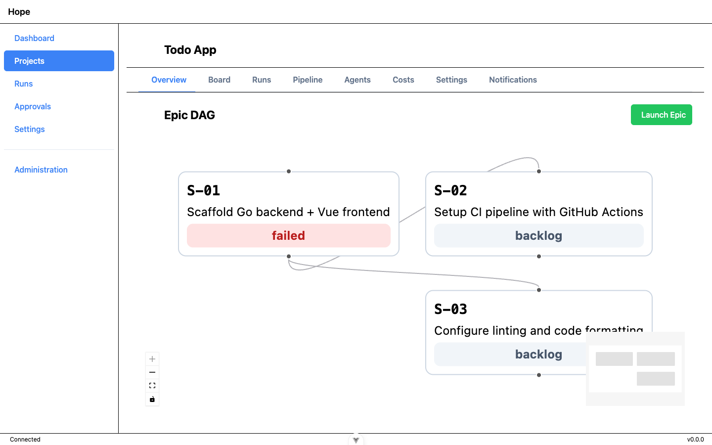
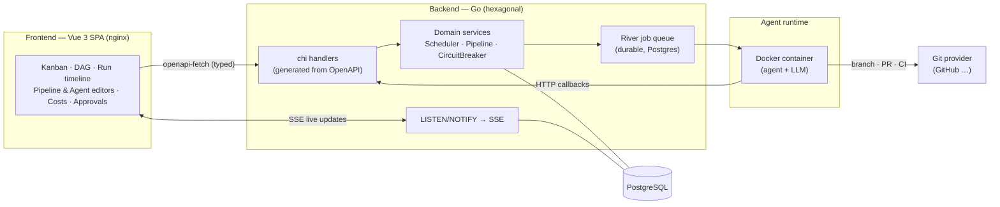
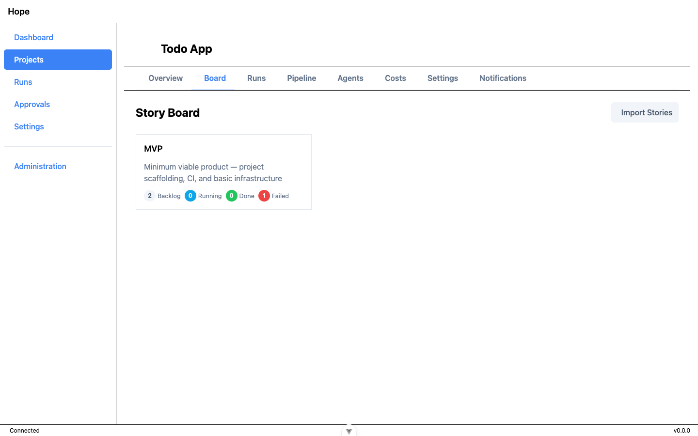
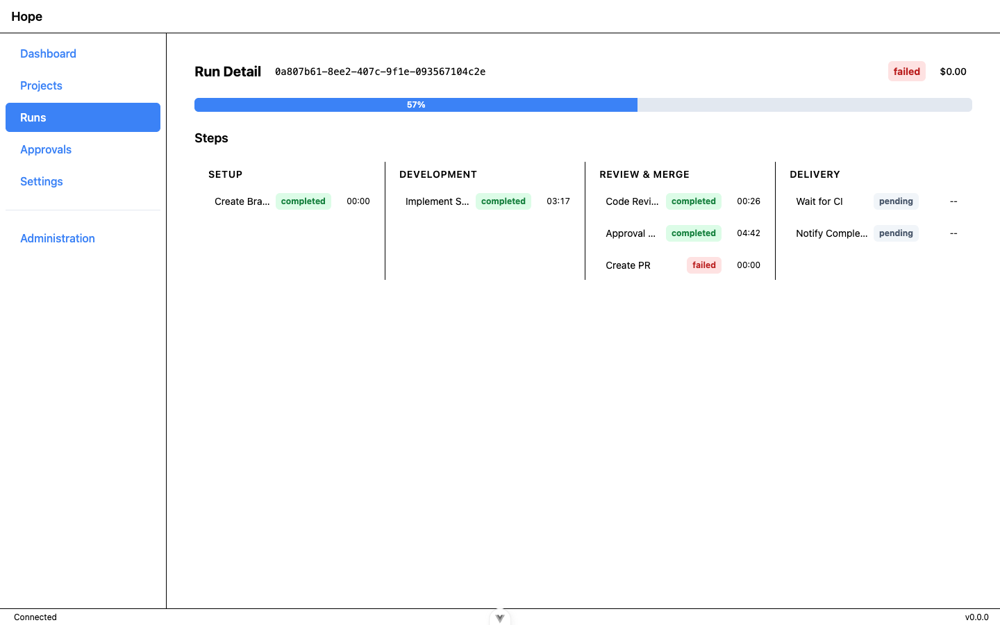
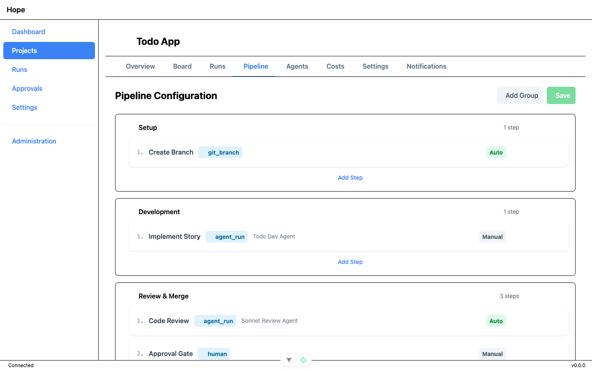
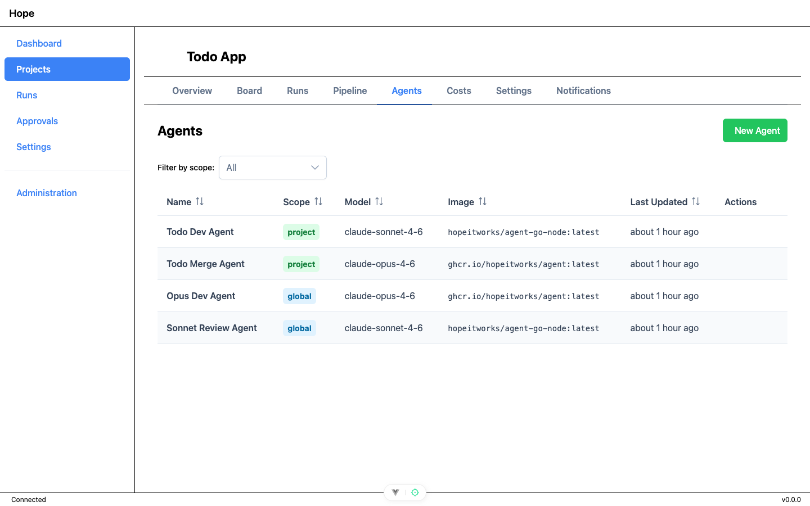
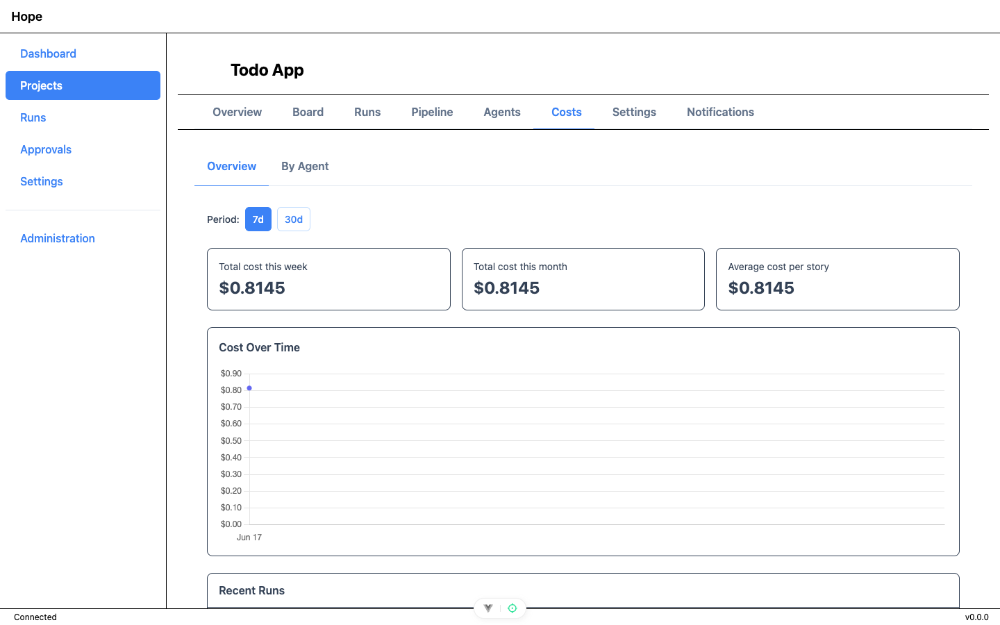
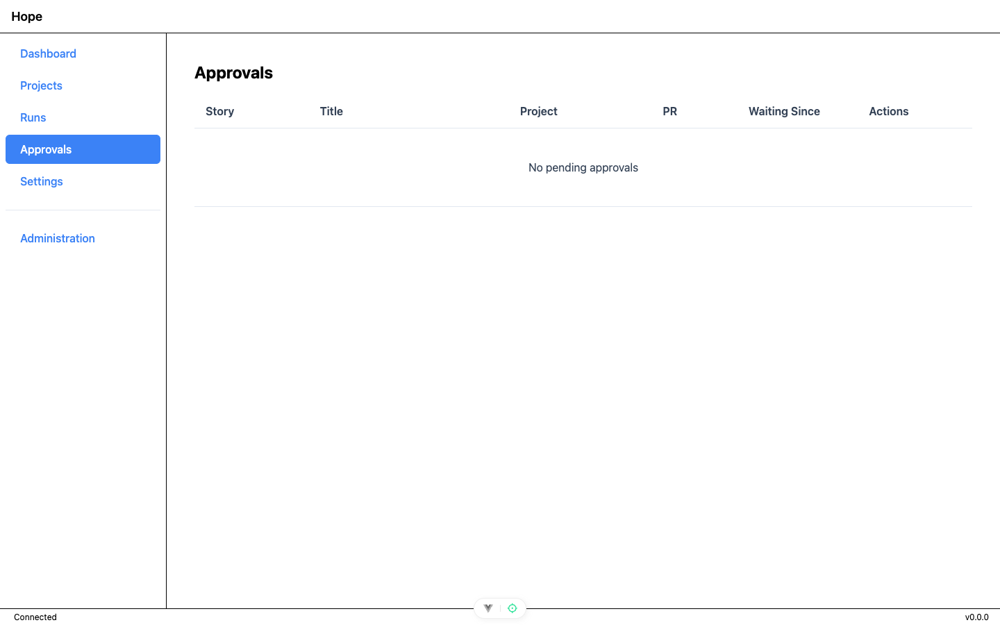

<div align="center">

# hopeitworks

### AI agent orchestration platform for software development

**Plan your work anywhere. Let role-based AI agents implement it in parallel — inside isolated Docker containers, with human-in-the-loop gates, an in-app kanban, and a live execution tree.**

[Architecture](#-architecture) · [Features](#-features) · [Tech stack](#-tech-stack) · [Engineering highlights](#-engineering-highlights) · [Run it locally](#-run-it-locally)

</div>

---

## What it is

**hopeitworks** turns a backlog into merged pull requests. You launch an *epic*; the platform schedules its stories on a dependency graph and runs each one through a fully configurable pipeline — a Docker-isolated AI agent writes the code, opens a branch, a reviewer agent checks it, a human approves at a gate, a PR is opened and CI is polled. You watch the whole thing build in real time.

> **Positioning** — hopeitworks is an **execution layer that is agnostic to both your planning tool and your process.** Plan in markdown, Jira, GitHub Issues, BMAD, GSD — whatever. The team composes its *own* agents (image / model / provider / prompt) and its *own* pipeline (no workflow is imposed). The platform is opinionated only about the **runtime**: containers, parallelism, isolation, and human-in-the-loop.

> **North Star** — *"hopeitworks builds itself"*: the platform is used to develop its own codebase.

<div align="center">

<br><em>Epic DAG — stories scheduled on their dependency graph, status streamed live as agents run.</em>
</div>

---

## The core loop

```
Project (Git repo)
   └─ Epic ──────────── launched as a whole, stories run in parallel
        └─ Story ─────── one user story with testable acceptance criteria
             └─ Run ──── one full pipeline execution for that story
                  └─ Step ── git_branch → agent_run → review → HITL gate → git_pr → ci_poll
                       └─ Agent ── runs the step in an isolated Docker container
```

1. **Plan** anywhere and import stories (markdown, in-app editor, …).
2. **Launch** a story or an entire epic. The scheduler builds a DAG and runs independent stories concurrently.
3. **Execute** — each story flows through its project's pipeline; agents run in throwaway containers and talk back to the API over HTTP callbacks.
4. **Supervise** — follow agent logs over SSE, approve changes at human gates, retry failed steps.
5. **Ship** — branches and PRs land on your Git provider, ready to merge.

---

## ✨ Features

| Area | Capabilities |
|------|--------------|
| **Orchestration & execution** | Launch a story or a whole epic; DAG-based parallel scheduling; per-project configurable pipeline (step groups, agents, models, prompts); pause / resume / cancel a run; retry a failed step from the UI |
| **Agents & runtime** | Configurable `Agent` entity (Docker image · model · provider · prompt); multi-provider (Claude, opencode); Go agent runtime with HTTP callbacks; multi-stack agent images (go-node, node, go, python) |
| **Resilience** | Incremental retry (the agent receives the diff + CI error and fixes the existing code); fallback to a full retry after repeated failures; project-scoped circuit breaker; native CI polling via the Git provider (no agent wasted on waiting) |
| **Human-in-the-loop** | Automatic pause at configured checkpoints; diff viewer; approve / reject with a reason |
| **Real-time monitoring** | SSE streaming of agent logs in the browser; step-by-step progress; live execution tree; Discord & webhook notifications |
| **Cost tracking** | Tokens & cost per step / run / story / agent; cost dashboard with aggregations; per-project budget limits |
| **Stories & epics** | Kanban board with status filtering; markdown story import; in-app story editor; epics with DAG computation and visualization |
| **Auth & projects** | JWT auth, admin/user roles; per-user API keys encrypted with AES-256; projects connected to a Git repo with per-project members & permissions |

**Built-in pipeline actions:** `agent_run` · `ci_poll` · `git_branch` · `git_pr` · `hitl_gate` · `notification` · `incremental_retry`.

---

## 🏗 Architecture

Hexagonal (ports & adapters) backend, an OpenAPI contract as the single source of truth, and a typed Vue 3 SPA.



**Domain model:** `Project → Epic → Story → Run → Step → Agent`. A *Project* is a Git repo with its config; an *Epic* is a set of stories with a dependency DAG; a *Run* is one pipeline execution; a *Step* is a pipeline stage; an *Agent* executes a step in an isolated container.

Detailed design docs live under [`_bmad-output/docs/`](_bmad-output/docs/) (architecture + Mermaid diagrams) and [`docs/product.md`](docs/product.md) (product vision).

---

## 🧰 Tech stack

| Layer | Technologies |
|-------|--------------|
| **Backend** | Go · [chi](https://github.com/go-chi/chi) router · [pgx](https://github.com/jackc/pgx) + [sqlc](https://sqlc.dev) (type-safe SQL) · [google/wire](https://github.com/google/wire) (compile-time DI) · [River](https://riverqueue.com) (Postgres-backed durable job queue) · golang-migrate · pgxlisten (LISTEN/NOTIFY) · JWT · slog |
| **Frontend** | Vue 3 (Composition API) · [PrimeVue 4](https://primevue.org) (unstyled + design tokens) · Tailwind CSS v4 · Pinia · Vue Router · [openapi-fetch](https://openapi-ts.dev) (typed client) · [Vue Flow](https://vueflow.dev) (DAG) · Monaco (editors) · Vitest · Playwright |
| **Contract** | A single [`api/openapi.yaml`](api/openapi.yaml) is the source of truth — the Go server interfaces (oapi-codegen) **and** the TypeScript client are generated from it |
| **Runtime / infra** | Docker (agents spawned through a filtered docker-socket-proxy) · PostgreSQL · nginx (serves the SPA + reverse-proxies the API) · MailHog (dev mail) · SSE |

---

## 💡 Engineering highlights

- **OpenAPI as the single source of truth** — both the Go handler interfaces and the typed TS client are code-generated from one spec, so the API contract cannot silently drift between front and back.
- **Hexagonal architecture with compile-time DI** — strict `domain → port ← adapter` boundaries, compile-time interface checks, and dependency wiring resolved at build time with `wire`.
- **DAG topological scheduling** — stories are ordered with a Kahn topological sort; implicit *file-conflict edges* are added so two agents never edit the same file concurrently.
- **Durable, recoverable execution** — a Postgres-backed job queue, a guarded run/step state machine, and HITL **suspend/resume** that replays a paused run to exactly the right step.
- **Live execution tree** — Postgres `LISTEN/NOTIFY` fan-out to **SSE** with `Last-Event-ID` replay on reconnect, so the UI rebuilds live without polling.
- **Isolation & security by design** — agents run in throwaway Docker containers reached through a **scoped socket-proxy** (no raw Docker daemon access), per-user API keys encrypted with **AES-256**, JWT auth with role-based access.
- **Resilience built in** — a project-scoped **circuit breaker** and **incremental retry** that feeds the agent the previous diff + the CI error instead of starting from scratch.

---

## 🖼 Screenshots

| Story board (kanban) | Run detail & step timeline |
|---|---|
|  |  |

| Configurable pipeline | Agent composition |
|---|---|
|  |  |

| Cost tracking | Human-in-the-loop approvals |
|---|---|
|  |  |

---

## 🚀 Run it locally

The whole stack runs in Docker (frontend, API, Postgres, mail, and a filtered Docker socket proxy).

```bash
# Build images, start the stack, and seed dev data
./scripts/update-stack.sh --reset
```

| Service | URL |
|---------|-----|
| App (Vue SPA via nginx) | http://localhost:5173 |
| API | http://localhost:8080 |
| Mail UI (MailHog) | http://localhost:8025 |
| PostgreSQL | localhost:5432 |

**Seed login:** `admin@hopeitworks.dev` / `admin1234`

> Pipeline execution needs a Git provider with push access (`GITHUB_TOKEN`) and an LLM token for the agents. See [`docs/local-setup.md`](docs/local-setup.md) for the full setup.

### Repository layout

```
backend/        Go API — hexagonal (domain / port / adapter), chi, sqlc, wire, River
frontend/       Vue 3 SPA — PrimeVue 4, Tailwind v4, Pinia, typed OpenAPI client
api/            openapi.yaml — single source of truth for the API contract
agent-runtime/  Go binary executed inside agent containers (HTTP callbacks)
agent-images/   Multi-stack agent Docker images (go-node, node, go, python)
deploy/         docker-compose stack + nginx config
scripts/        Stack lifecycle, dev reset, e2e helpers
docs/           Product vision, setup, design notes
```

---

<div align="center">
<sub>Built with Go, Vue 3, Docker, and PostgreSQL · hexagonal architecture · OpenAPI-first · agent runtime in containers</sub>
</div>
