# Diagrammes Mermaid — Adapters & Infrastructure

## 1. Flux SSE Event complet (Publish → Stream → Client)

Chemin critique d'un événement depuis le service métier jusqu'au navigateur. Illustre le rôle du trigger Postgres et la récupération asynchrone du payload complet.

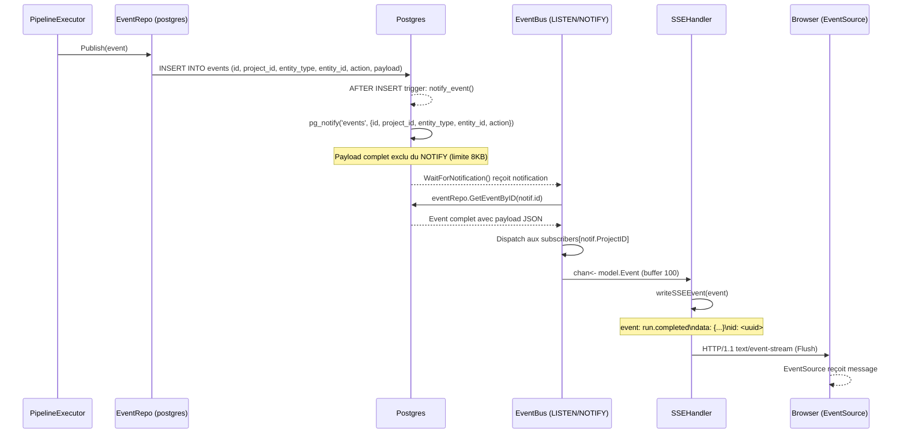

---

## 2. Architecture globale des Adapters (dépendances ports/implémentations)

Vue d'ensemble de la séparation ports/adapters. Montre quels services utilisent quels ports, et quelles implémentations fournissent ces ports.

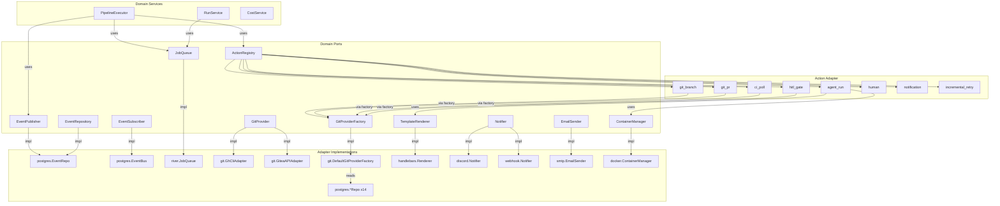

---

## 3. Lifecycle PipelineExecutor + Action Registry

États d'exécution d'un run de pipeline, depuis l'initialisation jusqu'à la complétion ou l'échec.

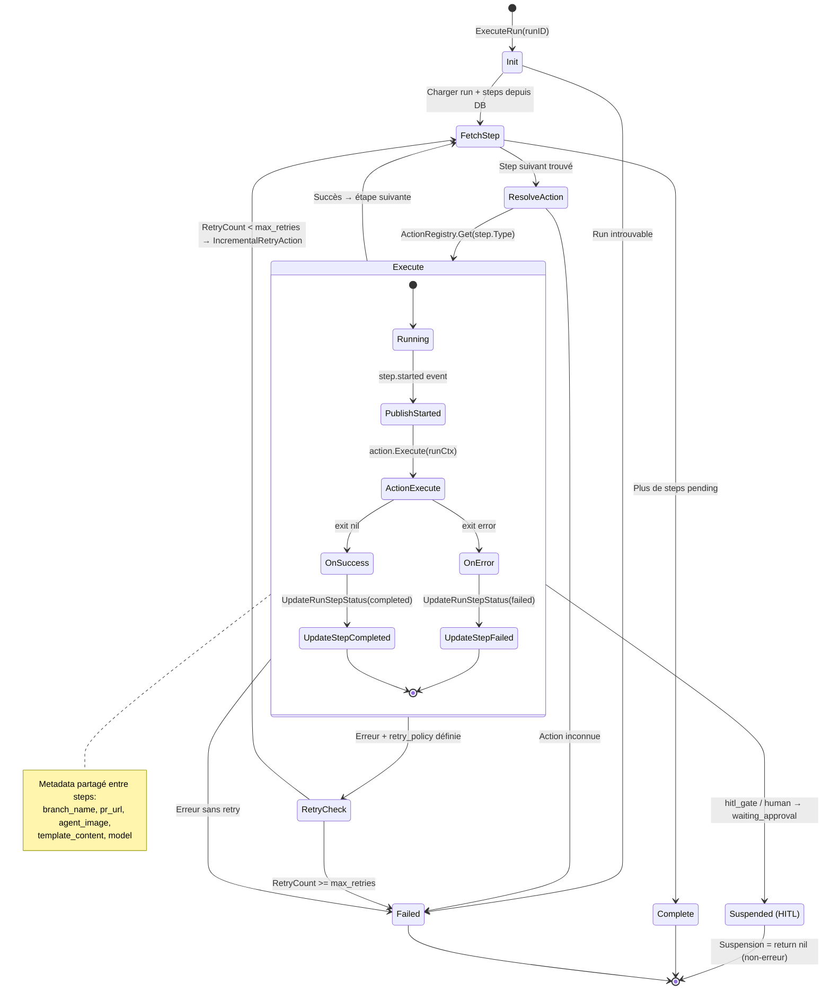

---

## 4. Stratégie Retry incrémental vs full

Arbre de décision de `IncrementalRetryAction` pour déterminer quel type de retry appliquer.

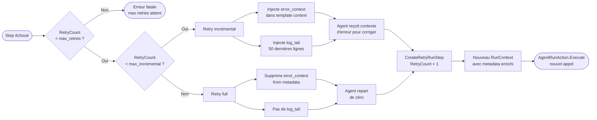

---

## 5. Flux Postgres Pool → Queries → DBTX interface

Abstraction `DBTX` qui permet l'utilisation transparente du pool ou d'une transaction dans les repositories.

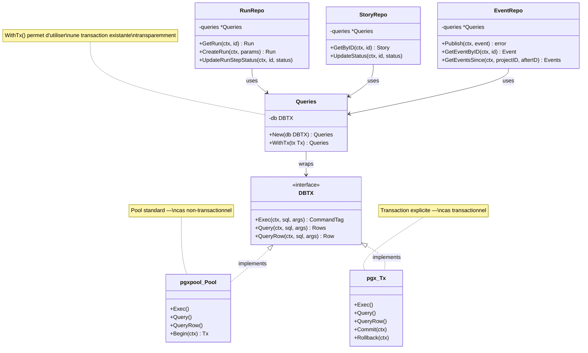

---

## 6. Flow River Job Queue : EnqueueExecuteRun → Worker → Executor

Visualise l'asynchronisme entre la réponse HTTP synchrone et l'exécution pipeline async par River.

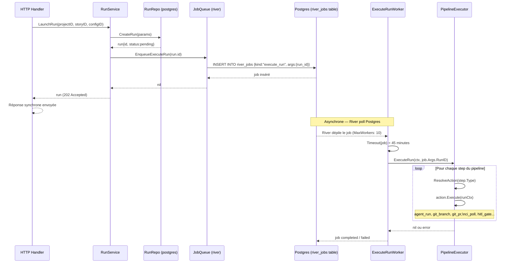

---

## 7. Git Provider Factory + Multi-Provider dispatch

Stratégie multi-provider : sélection de l'adapter GitHub ou Gitea selon la configuration du projet.

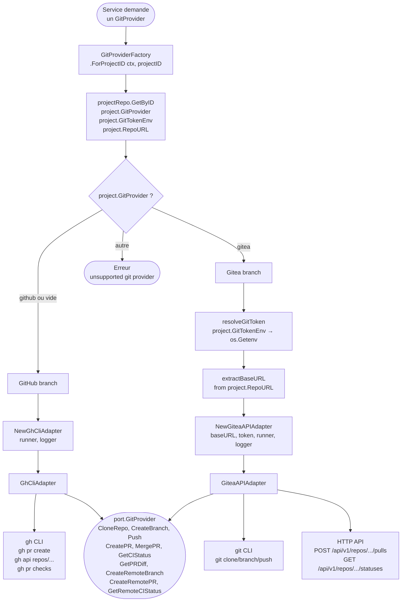

---

## 8. Postgres LISTEN/NOTIFY + Reconnexion (EventBus)

Gestion de la résilience de l'EventBus : reconnexion avec backoff exponentiel, synchronisation goroutine/channel.

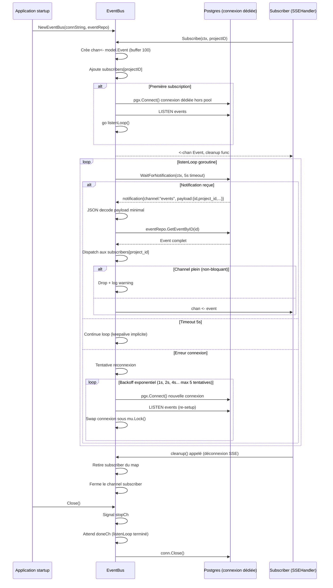

---

## 9. Chaîne Template Rendering : Agent → Handlebars → Prompt final

Source de vérité du template, variables disponibles dans le contexte, et timing du rendu dans AgentRunAction.

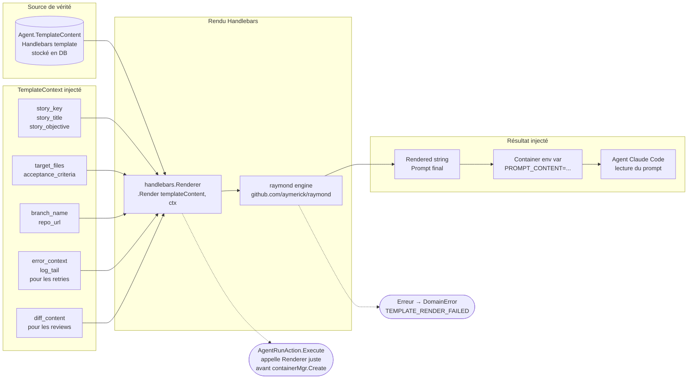

---

## 10. Évaluation CI Status : polling + state machine

Machine à états de `CIPollAction` : intervalles de polling, états finaux vs intermédiaires, gestion des erreurs non-bloquantes.

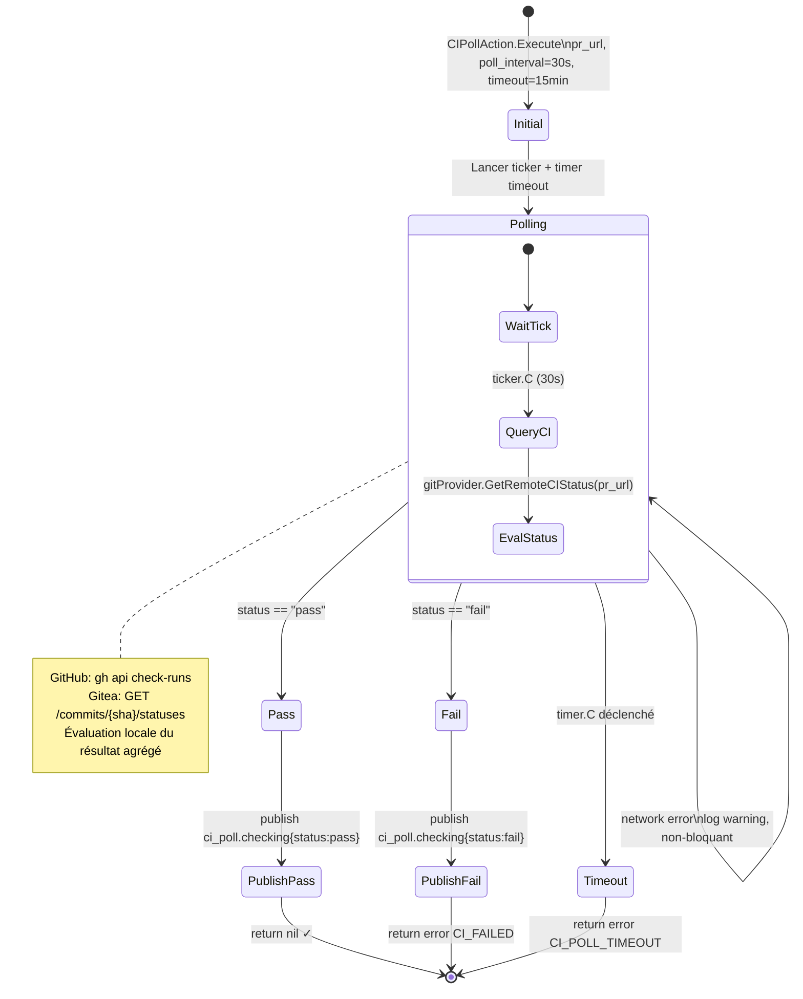

---

## 11. Hiérarchie Actions + Exécution séquentielle

Vue d'ensemble de toutes les actions disponibles dans l'ActionRegistry, leurs dépendances inter-steps via Metadata, et leur ordre d'exécution.

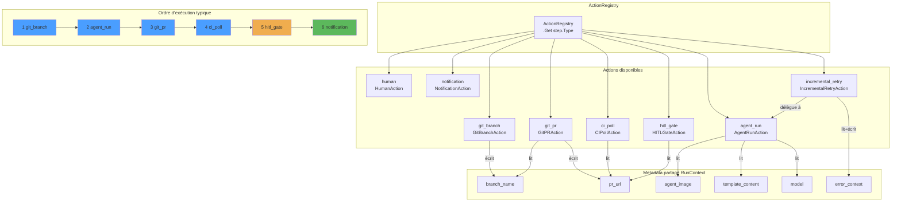

---

## 12. Container Lifecycle : AgentRunAction (create → start → stream → cleanup)

Gestion complète du lifecycle d'un container agent : injection env, buffering logs, parsing coût, cleanup avec timeout.

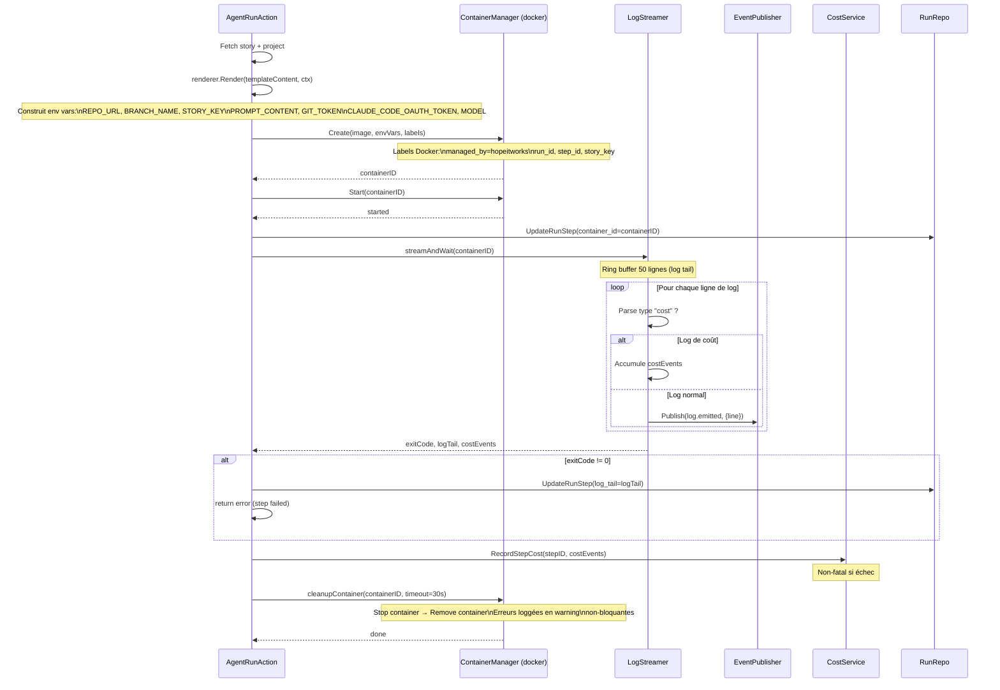
