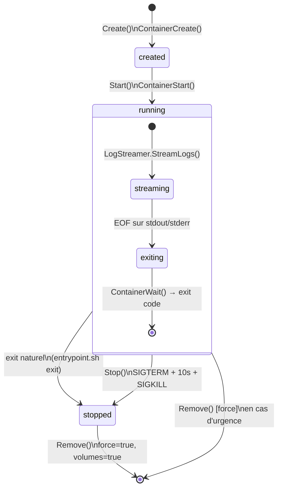
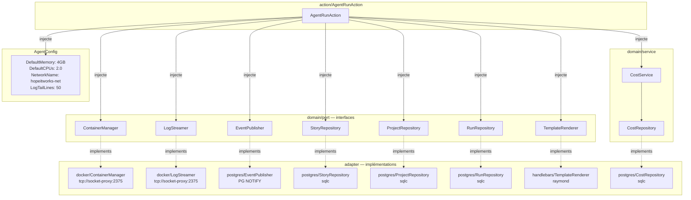
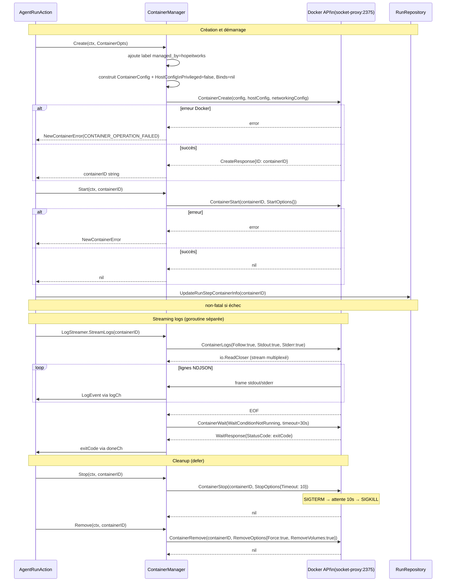

# Diagrammes Mermaid — Agents & Containers

## 1. Container Lifecycle State Machine

Etats d'un container agent depuis sa création jusqu'à sa suppression, avec les transitions déclenchées par `ContainerManager`.



## 2. AgentRunAction Execution Flow

Pipeline complet d'exécution de `AgentRunAction.Execute()`, de la récupération des données jusqu'au cleanup, avec les points de sortie sur erreur.

```mermaid
flowchart TD
    START([Execute&#40;ctx, runCtx&#41;]) --> DEFER[defer cleanupContainer\nStop + Remove]
    DEFER --> FETCH_STORY[1. storyRepo.GetByID\nrunCtx.StoryID]

    FETCH_STORY -->|erreur| ERR_STORY([retour erreur\nstory not found])
    FETCH_STORY -->|ok| FETCH_PROJECT[2. projectRepo.GetByID\nrunCtx.ProjectID]

    FETCH_PROJECT -->|erreur| ERR_PROJ([retour erreur\nproject not found])
    FETCH_PROJECT -->|ok| RENDER[3. renderer.Render\nHandlebars template\n+ TemplateContext]

    RENDER -->|erreur| ERR_RENDER([retour erreur\ntemplate render failed])
    RENDER -->|ok| RESOLVE_IMAGE[4. résolution agentImage\ndepuis runCtx.Metadata]

    RESOLVE_IMAGE -->|absent| ERR_IMG([retour erreur\nagent_image manquant])
    RESOLVE_IMAGE -->|ok| CREATE[5. ContainerManager.Create\nContainerOpts: image, env, labels\nmemory=4GB, CPUs=2.0]

    CREATE -->|erreur Docker| ERR_CREATE([retour erreur\nCONTAINER_OPERATION_FAILED])
    CREATE -->|containerID| START_C[6. ContainerManager.Start\nContainerStart&#40;&#41;]

    START_C -->|erreur| ERR_START([retour erreur\nstart failed])
    START_C -->|ok| PERSIST[7. runRepo.UpdateRunStepContainerInfo\ncontainerID persisté\nnon-fatal si échec]

    PERSIST --> STREAM[8. LogStreamer.StreamLogs\nlogCh + doneCh]

    STREAM --> LOOP{goroutine\nconsomme logCh}
    LOOP -->|type == cost| ACCUMULATE[accumule costEvents\nring buffer log tail]
    LOOP -->|sinon| PUBLISH[EventPublisher.Publish\nlog.emitted → SSE frontend]
    ACCUMULATE --> LOOP
    PUBLISH --> LOOP

    STREAM --> WAIT[attente exitCode\n← doneCh]
    WAIT -->|exitCode != 0| PERSIST_TAIL[9. persistLogTail\nring buffer des dernières lignes]
    PERSIST_TAIL --> ERR_EXIT([retour erreur\nagent failed exitCode])
    WAIT -->|exitCode == 0| COST[10. CostService.RecordStepCost\ncostEvents → DB\nnon-fatal si échec]

    COST --> OK([retour nil\nsuccès])
```



## 3. Dependency Injection Wiring

Structure hexagonale de `AgentRunAction` : dépendances injectées, ports et leurs implémentations adaptateur.



## 4. Log Streaming Architecture (Goroutines & Channels)

Les 3 goroutines de `LogStreamer.streamLoop()` avec leurs channels et points de synchronisation.

```mermaid
flowchart TD
    subgraph Entry["StreamLogs&#40;ctx, containerID&#41;"]
        CL["ContainerLogs&#40;Follow:true&#41;\n→ io.ReadCloser multiplexé"]
    end

    subgraph G1["goroutine 1 — stdcopy demux"]
        SC["stdcopy.StdCopy&#40;pw, pw, reader&#41;\ndémultiplexe frames Docker 8-byte header\nstdout + stderr → même pipe"]
    end

    subgraph Pipe["io.Pipe"]
        PW["pw &#40;PipeWriter&#41;"]
        PR["pr &#40;PipeReader&#41;"]
    end

    subgraph G2["goroutine 2 — scanner"]
        BS["bufio.Scanner&#40;pr&#41;\nscanner.Scan&#40;&#41; ligne par ligne"]
    end

    subgraph LineCh["chan scanResult&#40;buffered&#41;"]
        LC["line: string, ok: bool"]
    end

    subgraph G3["goroutine 3 — streamLoop &#40;select&#41;"]
        SEL{select}
        CTX["case ctx.Done&#40;&#41;\n→ return"]
        IDLE["case idleTimer.C\n→ emit warn LogEvent\n→ reset timer"]
        LINE["case result ← lineCh\n→ parseNDJSONLine&#40;&#41;\n→ reset idleTimer"]
        EOF["result.ok == false\n→ handleContainerExit&#40;&#41;"]
    end

    subgraph Exit["handleContainerExit"]
        CW["ContainerWait&#40;context.Background, 30s&#41;\nWaitConditionNotRunning"]
    end

    subgraph Outputs["channels retournés"]
        LOGCH["logCh chan LogEvent\nbuffered 100"]
        DONECH["doneCh chan int\nbuffered 1\nexitCode"]
    end

    CL --> G1
    G1 --> PW
    PW --> PR
    PR --> G2
    G2 --> LC
    LC --> SEL
    SEL --> CTX
    SEL --> IDLE
    SEL --> LINE
    LINE -->|ok=false / chan closed| EOF
    IDLE --> LOGCH
    LINE -->|LogEvent| LOGCH
    EOF --> CW
    CW -->|exitCode| DONECH
```



## 5. NDJSON Parsing Decision Tree

Logique de `parseNDJSONLine()` : de la ligne brute jusqu'au `LogEvent` retourné.

```mermaid
flowchart TD
    IN["line string"] --> TRIM["strings.TrimSpace&#40;line&#41;"]
    TRIM -->|vide ou espaces| NIL([retour nil\nskip])
    TRIM -->|non vide| UNMARSHAL["json.Unmarshal → map&#91;string&#93;any"]

    UNMARSHAL -->|erreur JSON| PLAIN["LogEvent{IsJSON: false\nLevel: info\nMessage: line}"]
    PLAIN --> RETURN_PLAIN([retour LogEvent plain text])

    UNMARSHAL -->|ok| EXTRACT["IsJSON: true\nextraire: level, message, timestamp, type"]

    EXTRACT --> CHECK_TYPE{event.Type ?}

    CHECK_TYPE -->|type == cost| COST_FIELDS["extraire:\ninput_tokens\noutput_tokens\nmodel"]
    COST_FIELDS --> RETURN_COST([retour LogEvent{Type: cost}])

    CHECK_TYPE -->|type == result| NORMALIZE["normaliser:\ntype = cost\nusage.input_tokens\nusage.output_tokens"]
    NORMALIZE --> PICK_MODEL["modelUsage présent ?\npickPrimaryModel&#40;&#41;\n→ modèle avec max inputTokens"]
    PICK_MODEL --> RETURN_RESULT([retour LogEvent{Type: cost}])

    CHECK_TYPE -->|autre type| RETURN_OTHER([retour LogEvent{Type: autre}])

    subgraph pickPrimaryModel["pickPrimaryModel&#40;modelUsage&#41;"]
        ITER["itère sur modelUsage map\npour chaque modelID → entry"]
        BEST["sélectionne modelID\navec max inputTokens"]
        ITER --> BEST
    end
```

## 6. Container Environment Variables & Metadata Flow

Traçabilité de chaque variable d'environnement depuis sa source jusqu'au container et à l'entrypoint.

```mermaid
graph LR
    subgraph Sources
        RC["runCtx.Metadata\nbranch_name\ntemplate_content\nagent_image\nmodel\nerror_context\nlog_tail"]
        PRJ["project\nRepoURL\nGitProvider\nGitTokenEnv"]
        STR["story\nKey"]
        ENV["os.Getenv&#40;&#41;\nCLAUDE_CODE_OAUTH_TOKEN\n&lt;GitTokenEnv&gt;"]
    end

    subgraph Build["createContainer&#40;&#41; — ContainerOpts.Env"]
        REPO_URL["REPO_URL\n= project.RepoURL"]
        BRANCH_NAME["BRANCH_NAME\n= metadata&#91;branch_name&#93;"]
        STORY_KEY["STORY_KEY\n= story.Key"]
        PROMPT_CONTENT["PROMPT_CONTENT\n= rendered prompt"]
        GIT_TOKEN["GIT_TOKEN\n= os.Getenv&#40;project.GitTokenEnv&#41;"]
        GITHUB_TOKEN["GITHUB_TOKEN\n= même valeur GIT_TOKEN\n&#40;compat backward&#41;"]
        GIT_PROVIDER["GIT_PROVIDER\n= project.GitProvider"]
        OAUTH["CLAUDE_CODE_OAUTH_TOKEN\n= os.Getenv&#40;...&#41;"]
        MODEL_VAR["MODEL\n= metadata&#91;model&#93;\n&#40;optionnel&#41;"]
    end

    subgraph Labels["ContainerOpts.Labels"]
        L1["managed_by = hopeitworks"]
        L2["run_id = runCtx.Run.ID"]
        L3["step_id = runCtx.RunStep.ID"]
        L4["story_key = story.Key"]
    end

    subgraph Container["Container — entrypoint.sh"]
        EP["validation\ngit config\nclone\ncheckout\nclaude --output-format stream-json"]
    end

    PRJ --> REPO_URL
    RC --> BRANCH_NAME
    STR --> STORY_KEY
    RC --> PROMPT_CONTENT
    ENV --> GIT_TOKEN
    ENV --> GITHUB_TOKEN
    PRJ --> GIT_PROVIDER
    ENV --> OAUTH
    RC --> MODEL_VAR

    RC --> L2
    RC --> L3
    STR --> L4

    REPO_URL --> Container
    BRANCH_NAME --> Container
    STORY_KEY --> Container
    PROMPT_CONTENT --> Container
    GIT_TOKEN --> Container
    GITHUB_TOKEN --> Container
    GIT_PROVIDER --> Container
    OAUTH --> Container
    MODEL_VAR --> Container
```



## 7. Docker API Call Sequence (Per Operation)

Interactions exactes entre `ContainerManager` et l'API Docker pour chaque opération du cycle de vie.



## 8. Cost Event Extraction & Accumulation

Flux d'extraction des coûts depuis les logs du container jusqu'à la persistance en base.

```mermaid
flowchart TD
    LOGS["stdout/stderr container\n&#40;NDJSON stream&#41;"] --> PARSE["parseNDJSONLine&#40;&#41;"]

    PARSE -->|type != cost| PUBLISH["EventPublisher.Publish\nlog.emitted → SSE"]
    PARSE -->|type == cost\nformat custom| COST1["LogEvent{\nType: cost\ninput_tokens: N\noutput_tokens: M\nmodel: claude-xxx}"]
    PARSE -->|type == result\nformat stream-json| NORMALIZE["normalisation\ntype = cost\nusage.input_tokens\nusage.output_tokens\npickPrimaryModel&#40;modelUsage&#41;"]
    NORMALIZE --> COST2["LogEvent{\nType: cost\ninput_tokens: N\noutput_tokens: M\nmodel: claude-xxx}"]

    COST1 --> ACCUM["costEvents slice\naccumulation en mémoire\npendant toute la durée du step"]
    COST2 --> ACCUM

    ACCUM -->|exitCode reçu| RECORD["CostService.RecordStepCost&#40;\n  runCtx.RunStep.ID,\n  runCtx.ProjectID,\n  costEvents,\n  agentID\n&#41;"]
    RECORD -->|non-fatal si échec| DB[("Postgres\ntable: step_costs")]

    subgraph Note["Règles"]
        R1["Les cost events ne sont PAS publiés\nvers le SSE / EventPublisher"]
        R2["L'événement result est autoritatif\n&#40;cumul final de tout le run&#41;"]
    end
```



## 9. Container Cleanup Error Recovery

Séquence de cleanup `cleanupContainer()` avec stratégie best-effort et gestion des timeouts indépendants.

```mermaid
flowchart TD
    TRIGGER["defer cleanupContainer&#40;containerID&#41;\ndéclenché en fin d'Execute&#40;&#41;\nquel que soit le chemin de sortie"]

    TRIGGER --> CHECK_ID{containerID\nvide ?}
    CHECK_ID -->|oui| SKIP([rien à nettoyer\nretour immédiat])
    CHECK_ID -->|non| CTX_STOP["context.WithTimeout&#40;Background, 30s&#41;\ncontexte indépendant du parent"]

    CTX_STOP --> STOP["ContainerManager.Stop&#40;ctx30s, containerID&#41;\nSIGTERM envoyé"]

    STOP -->|ok| SIGTERM_WAIT["attente gracieuse\nmax 10s&#40;StopOptions.Timeout&#41;"]
    STOP -->|timeout 10s dépassé| SIGKILL["SIGKILL automatique\npar Docker"]
    STOP -->|erreur Docker| WARN_STOP["logger.Warn\nstop failed — non-fatal\ncontinue vers Remove"]

    SIGTERM_WAIT --> STOPPED[container stopped]
    SIGKILL --> STOPPED

    STOPPED --> REMOVE["ContainerManager.Remove&#40;ctx30s, containerID&#41;\nforce=true, volumes=true"]
    WARN_STOP --> REMOVE

    REMOVE -->|ok| REMOVED([container supprimé\nressources libérées])
    REMOVE -->|erreur Docker| WARN_REMOVE["logger.Warn\nremove failed — non-fatal\norphelin potentiel"]
    WARN_REMOVE --> END([cleanup terminé\nbest effort])

    subgraph Invariants["Invariants"]
        I1["Cleanup TOUJOURS exécuté\nvia defer — tous les chemins"]
        I2["Erreurs loggées en Warn\njamais en Error — non-bloquantes"]
        I3["Timeout 30s indépendant\ndu contexte parent annulé"]
    end
```



## 10. Handler → Service → Action → Adapter Layering

Séparation des responsabilités entre les flux CRUD (AgentService) et le flux d'exécution (AgentRunAction).

```mermaid
graph TB
    subgraph HTTP["API Layer — chi router"]
        AH["AgentHandler\nGET /agents\nGET /projects/:id/agents\nPOST /projects/:id/agents\nPUT /projects/:id/agents/:id\nDELETE /projects/:id/agents/:id"]
        PH["PipelineHandler\nPOST /runs"]
    end

    subgraph Services["domain/service"]
        AS["AgentService\nCreate / GetByID\nListByProject / ListGlobal\nListMerged / Update / Delete"]
        PS["PipelineService\nExecute / ScheduleStep"]
        AR_REG["ActionRegistry\nresolve&#40;step.Type&#41;"]
    end

    subgraph Ports_CRUD["domain/port — CRUD"]
        AREPO["AgentRepository\nCRUD Postgres"]
    end

    subgraph Action["adapter/action"]
        ARA["AgentRunAction\ntype: agent_run\nExecue&#40;ctx, runCtx&#41;"]
    end

    subgraph Ports_Runtime["domain/port — Runtime"]
        CM2["ContainerManager"]
        LS2["LogStreamer"]
        EP2["EventPublisher"]
        REPOS["StoryRepo / ProjectRepo\nRunRepo"]
        TR2["TemplateRenderer"]
    end

    subgraph Adapters_Runtime["adapter/docker + postgres + handlebars"]
        DCM2["docker/ContainerManager"]
        DLS2["docker/LogStreamer"]
        PEP2["postgres/EventPublisher"]
        PREPOS["postgres/Repositories"]
        HBR2["handlebars/Renderer"]
    end

    AH -->|CRUD agents| AS
    AS --> AREPO
    AREPO -->|sqlc| DB[("Postgres")]

    PH -->|lancer un run| PS
    PS --> AR_REG
    AR_REG -->|step.type == agent_run| ARA

    ARA --> CM2
    ARA --> LS2
    ARA --> EP2
    ARA --> REPOS
    ARA --> TR2

    CM2 -.->|impl| DCM2
    LS2 -.->|impl| DLS2
    EP2 -.->|impl| PEP2
    REPOS -.->|impl| PREPOS
    TR2 -.->|impl| HBR2

    subgraph Note2["Séparation stricte"]
        N1["AgentHandler = CRUD only\npas de logique d'exécution"]
        N2["AgentRunAction = exécution only\npas d'accès AgentRepository"]
        N3["Agent.Image/Model/TemplateContent\nrécupérés via Metadata du RunStep\nau moment de l'exécution"]
    end
```


