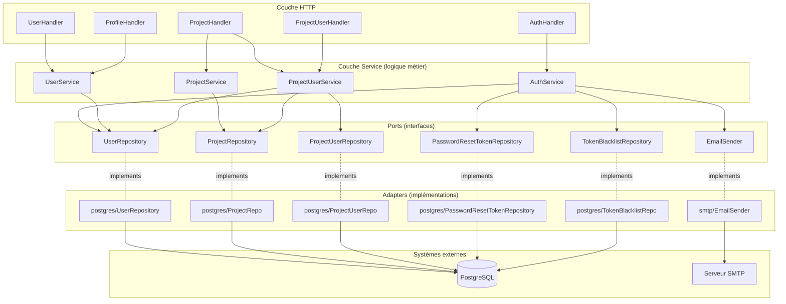
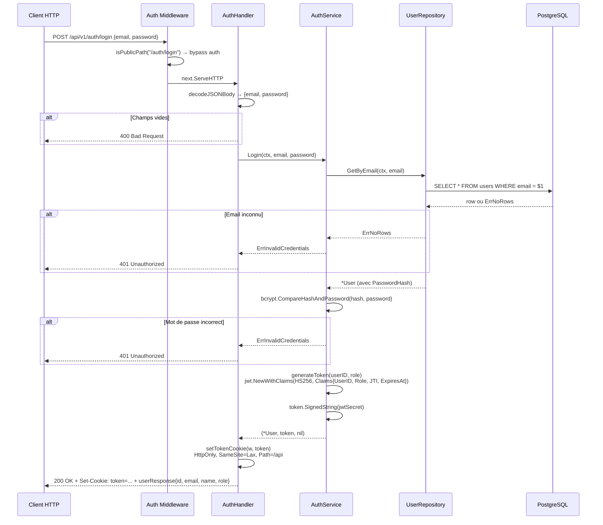
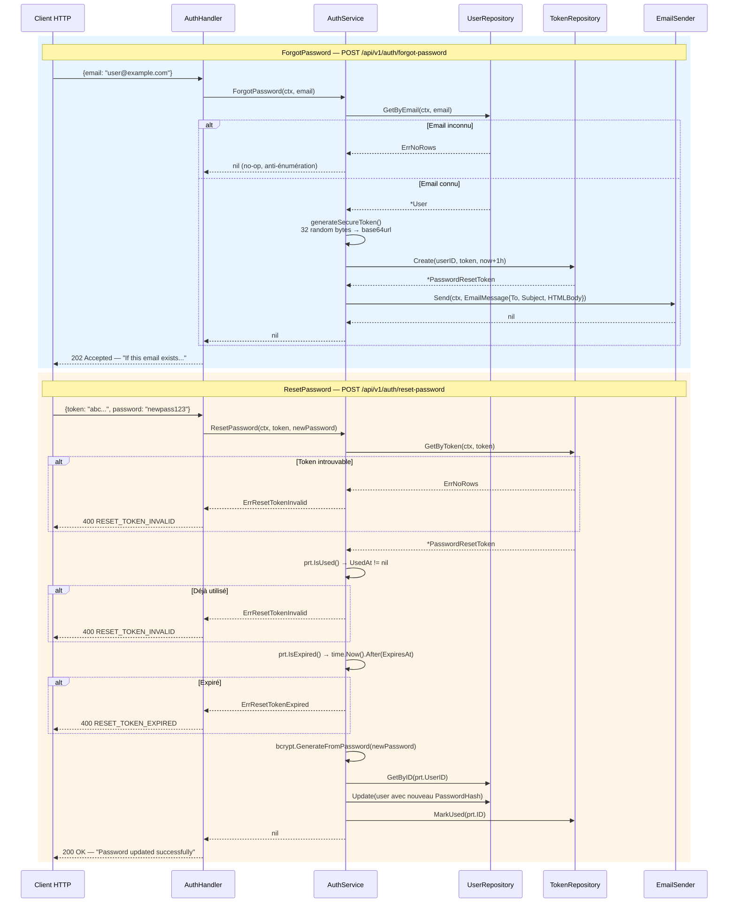
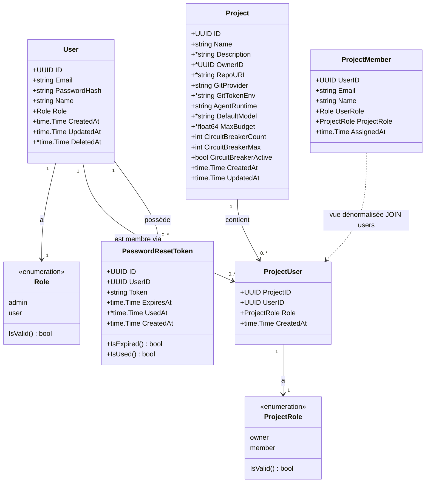
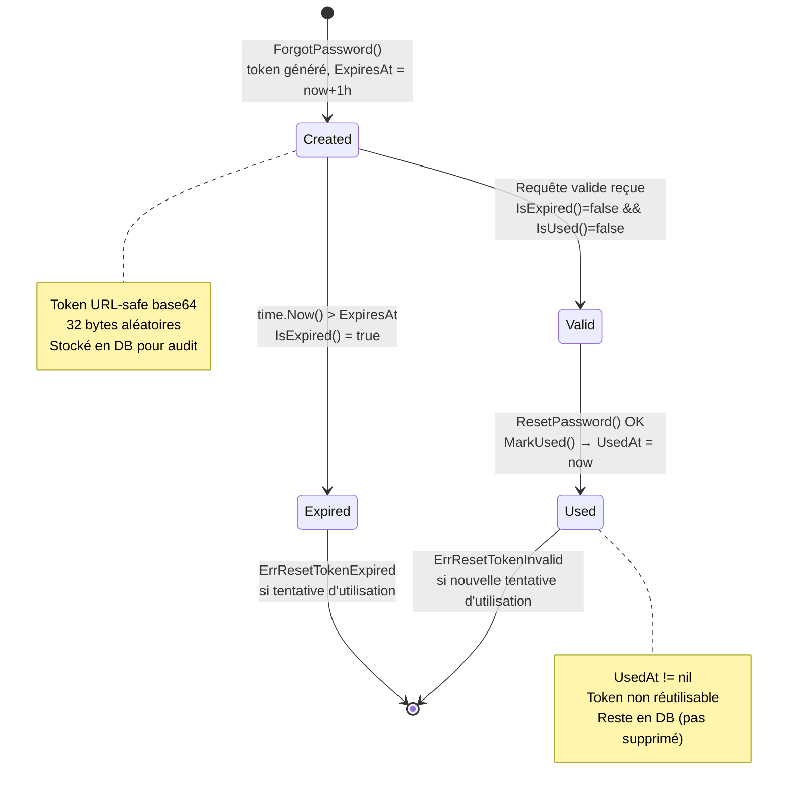
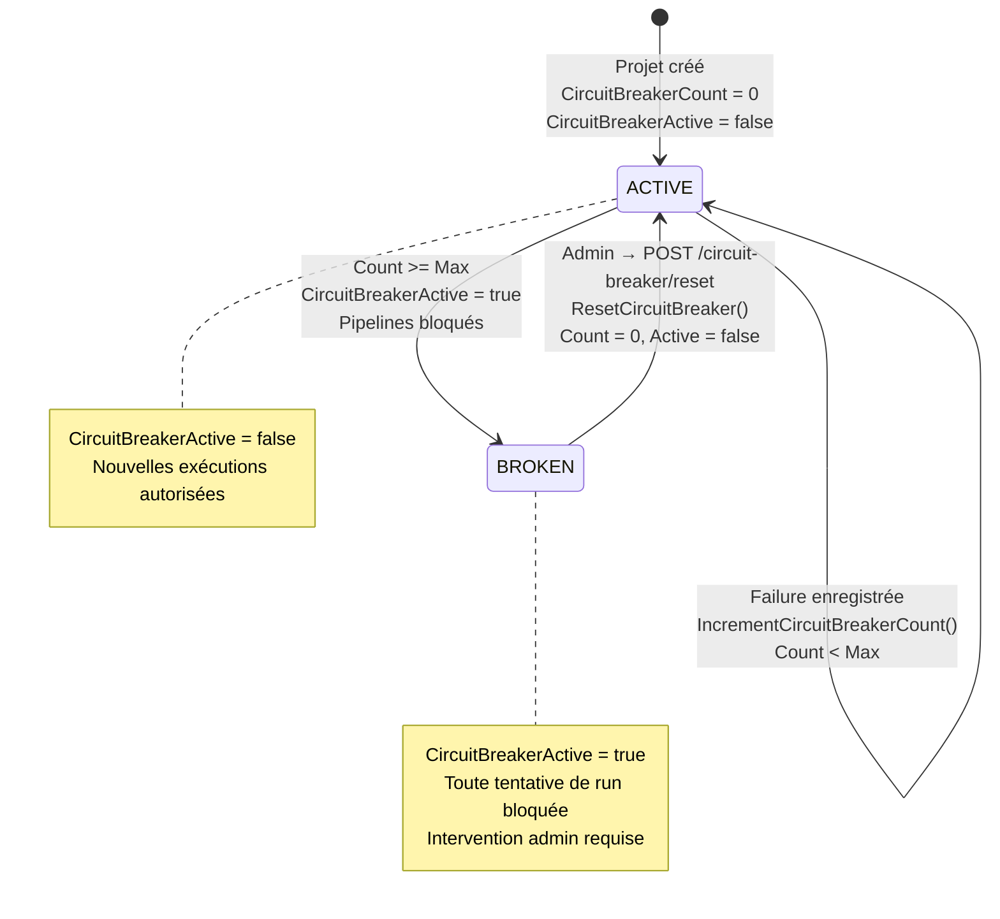
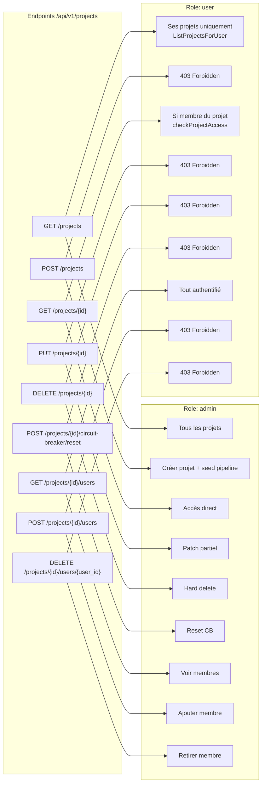
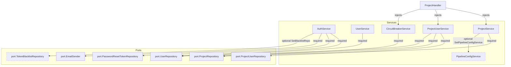
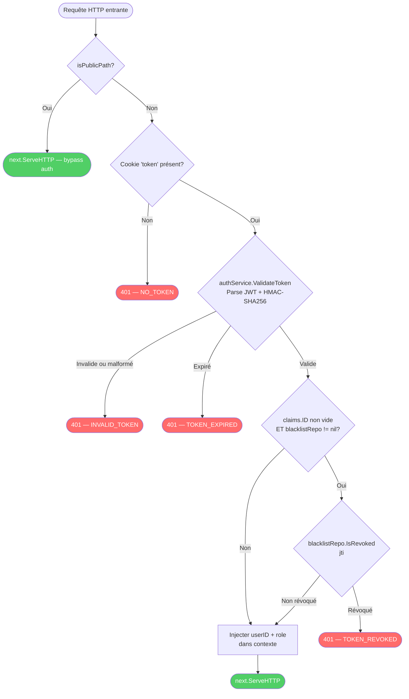

# Diagrammes Mermaid — Auth, Users & Projects

## 1. Architecture hexagonale — Auth/Users/Projects

Les 4 couches de l'architecture hexagonale appliquées au domaine Auth. Montre l'isolation stricte entre Handler, Service, Port et Adapter.



## 2. Flux Login complet

Séquence complète du login : de la requête HTTP jusqu'au cookie JWT retourné, avec les cas d'erreur.



## 3. Flux Forgot Password et Reset Password

Deux séquences distinctes montrant l'anti-énumération sur ForgotPassword et la validation stricte sur ResetPassword.



## 4. Modèle User et ses rôles

Classes du domaine : User, Project, ProjectUser, ProjectMember, PasswordResetToken avec leurs attributs et relations.



## 5. Cycle de vie du PasswordResetToken

États possibles d'un token de réinitialisation de mot de passe, de sa création à son invalidation.



## 6. Circuit Breaker — Transitions d'états

Cycle de vie du circuit breaker intégré dans le modèle Project, avec les conditions de déclenchement et de remise à zéro.



## 7. Matrice d'accès aux endpoints Projects

Résumé des permissions par rôle sur tous les endpoints liés aux projets et à leurs membres.



## 8. Dépendances entre services

Graphe des couplages entre les 4 services du domaine, avec leurs ports injectés et les dépendances optionnelles.



## 9. Validation du token JWT — Arbre de décision

Organigramme du middleware Auth montrant chaque point de contrôle et les erreurs retournées.



## 10. Cycle de vie des données utilisateur

Vue globale des transitions d'état d'un utilisateur, depuis la création jusqu'à la suppression, en passant par les sessions et le reset de mot de passe.

```mermaid
graph LR
    subgraph Creation["Création"]
        REG[POST /auth/register<br/>bcrypt hash password<br/>Role = user]
    end

    subgraph Active["Utilisateur actif"]
        USER[User<br/>DeletedAt = nil]
        COOKIE[Cookie JWT<br/>HttpOnly, SameSite=Lax]
    end

    subgraph Session["Gestion de session"]
        LOGIN[POST /auth/login<br/>bcrypt.Compare<br/>JWT signé HS256 + JTI]
        LOGOUT[POST /auth/logout<br/>JTI → TokenBlacklist]
    end

    subgraph PasswordReset["Reset de mot de passe"]
        FORGOT[ForgotPassword<br/>Token 32 bytes / 1h]
        RESET[ResetPassword<br/>Nouveau hash bcrypt<br/>Token → MarkUsed]
    end

    subgraph Deleted["Suppression"]
        SOFT[DELETE /users/{id}<br/>DeletedAt = now<br/>soft-delete]
    end

    REG -->|201 Created| USER
    USER --> LOGIN
    LOGIN -->|Set-Cookie token| COOKIE
    COOKIE -->|Requêtes authentifiées| USER
    COOKIE --> LOGOUT
    LOGOUT -->|JTI blacklisté<br/>Cookie MaxAge=-1| USER

    USER --> FORGOT
    FORGOT -->|Email envoyé| RESET
    RESET -->|Nouveau PasswordHash| USER

    USER --> SOFT
    SOFT -->|Irréversible| DELETED[Deleted<br/>DeletedAt != nil]

    note1["Opérations réversibles:<br/>login/logout (blacklist JTI)"]
    note2["Opération non réversible:<br/>soft-delete (pas de restore API)"]
```
