# Diagrammes Mermaid — Backend Core Pipeline

## 1. Architecture Hexagonale

Vue d'ensemble des couches hexagonales : domaine au centre, ports comme contrats, adapteurs en périphérie. Flux d'import unidirectionnel strict.

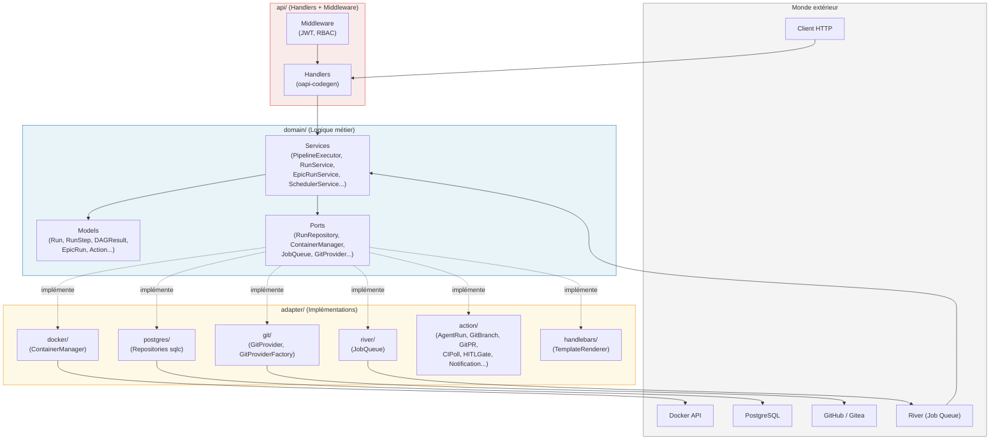

---

## 2. Machine d'états — Run

Tous les états d'un Run avec transitions valides. Les états `completed` et `cancelled` sont terminaux.

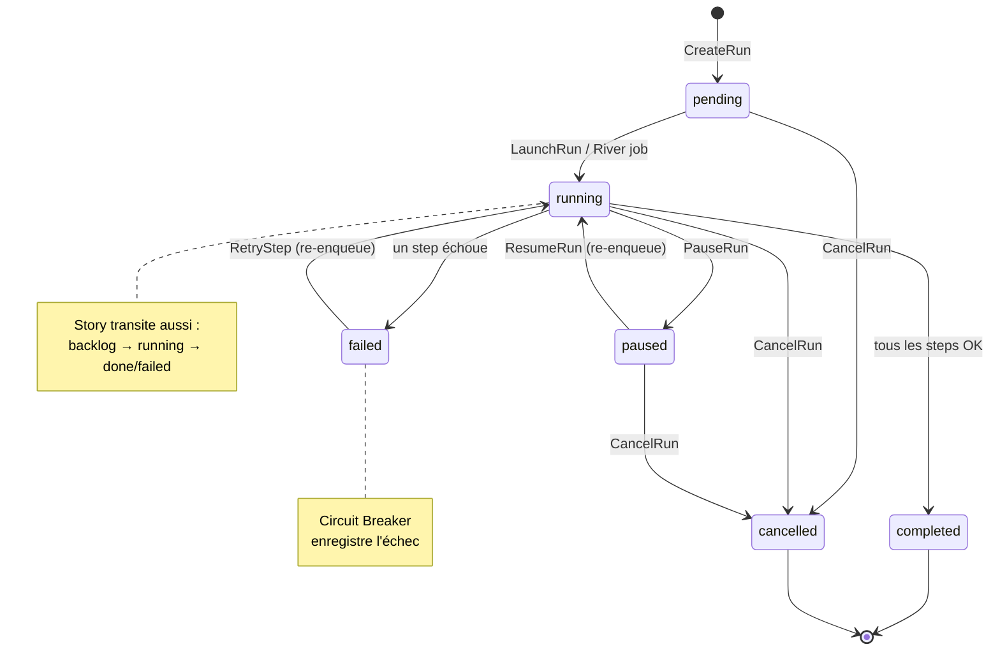

---

## 3. Machine d'états — RunStep

États d'un RunStep avec transitions. Le passage par `waiting_approval` représente la suspension HITL.

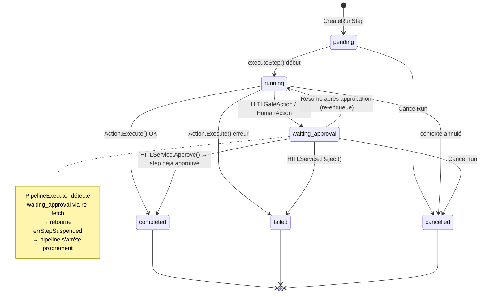

---

## 4. Flux d'exécution — PipelineExecutor.ExecuteRun()

Algorithme complet de l'exécution d'un run, avec points de décision : circuit breaker, pause, annulation, suspension HITL.

```mermaid
flowchart TD
    START([ExecuteRun appelé par River worker]) --> FETCH[Récupère le Run depuis RunRepository]
    FETCH --> CB{Circuit Breaker\nouvert ?}
    CB -- oui --> CBFAIL[Marque run failed\nRetourne erreur CB]
    CBFAIL --> END_ERR([Fin — Échec CB])

    CB -- non --> SORT[Trie les steps par step_order]
    SORT --> TRANSITION[Run: pending → running\nPublie run.started]
    TRANSITION --> STORY[Story: backlog → running\nbest-effort]
    STORY --> MERGE_META[Merge metadata persistées\ndans le dictionnaire partagé]
    MERGE_META --> LOOP_START{Prochain step\nnon-complété ?}

    LOOP_START -- non, tous OK --> COMPLETE[Run: running → completed\nPublie run.completed\nStory: → done\nReset circuit breaker]
    COMPLETE --> END_OK([Fin — Succès])

    LOOP_START -- oui --> CTX_CANCEL{Contexte\nannulé ?}
    CTX_CANCEL -- oui --> CANCEL[handleCancellation()\nStep + run → cancelled\nPublie events cancelled]
    CANCEL --> END_CANCEL([Fin — Annulé])

    CTX_CANCEL -- non --> PAUSE_CHK{Run en\npause en DB ?}
    PAUSE_CHK -- oui --> RETURN_PAUSED([Retourne ErrRunPaused])

    PAUSE_CHK -- non --> EXEC[executeStep()]
    EXEC --> SUSPENDED{Step est\nwaiting_approval ?}
    SUSPENDED -- oui --> RETURN_NIL([Retourne nil — pipeline suspendu])

    SUSPENDED -- non --> STEP_OK{Step OK ?}
    STEP_OK -- oui --> LOOP_START

    STEP_OK -- non --> FAIL[handleStepFailure()\nStep → failed, run → failed\nStory → failed\nRecord CB failure]
    FAIL --> END_FAIL([Fin — Échec step])
```

---

## 5. Algorithme DAG — Kahn's Algorithm (SchedulerService.BuildDAG)

Construction du graphe de dépendances et tri topologique couche par couche.

```mermaid
flowchart TD
    INPUT([stories: []Story]) --> INDEX[Indexation par clé\nmap storyKey → Story]
    INDEX --> GRAPH[Construction du graphe\nadjacency list + in-degree]

    GRAPH --> EXPLICIT[Arêtes explicites\nStory.DependsOn → arêtes directes\ncles inconnues ignorées]
    GRAPH --> IMPLICIT[Arêtes implicites\nConflits fichiers TargetFiles\nSérialisation par ordre lexicographique des clés]

    EXPLICIT --> TOPO[Tri topologique — Kahn]
    IMPLICIT --> TOPO

    TOPO --> ZEROIN[Collecte noeuds\nin-degree = 0\ntri lexicographique → déterminisme]
    ZEROIN --> EMPTY{Aucun noeud\nà in-degree 0 ?}
    EMPTY -- noeud restants --> CYCLE([Erreur: DAG_CYCLE_DETECTED])
    EMPTY -- liste non vide --> LAYER[Groupe les noeuds → couche i]

    LAYER --> DECR[Décrémente in-degree\ndes dépendants]
    DECR --> DONE{Tous les noeuds\ntraités ?}
    DONE -- non --> ZEROIN
    DONE -- oui --> RESULT([DAGResult.Groups\ncouches d'exécution parallèle])

    note1["Exemples:\n• S-01, S-02 indépendants → [[S-01, S-02]]\n• Chaîne A→B→C → [[A],[B],[C]]\n• Diamant → [[A],[B,C],[D]]"]
    RESULT --- note1
```

---

## 6. Orchestration Epic Run — ParallelGroupExecutor

Séquence d'interactions entre services pour l'exécution parallèle par couche DAG avec sémantique fail-fast.

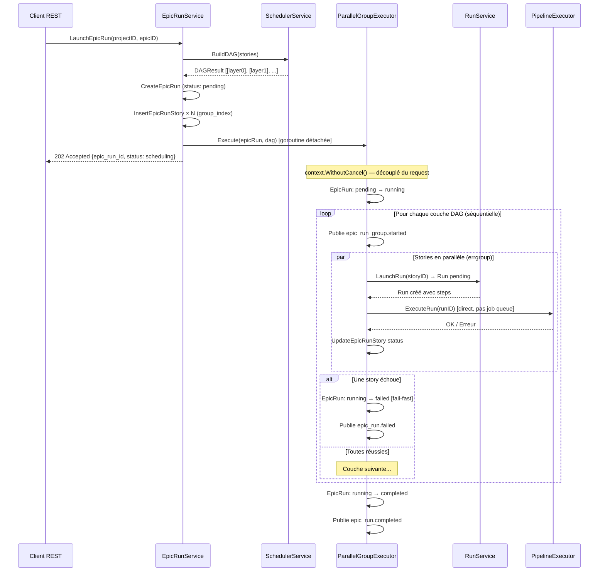

---

## 7. Flux des Metadata entre Actions

Producteurs et consommateurs des clés du dictionnaire `RunContext.Metadata`. Les steps communiquent exclusivement via ce mécanisme.

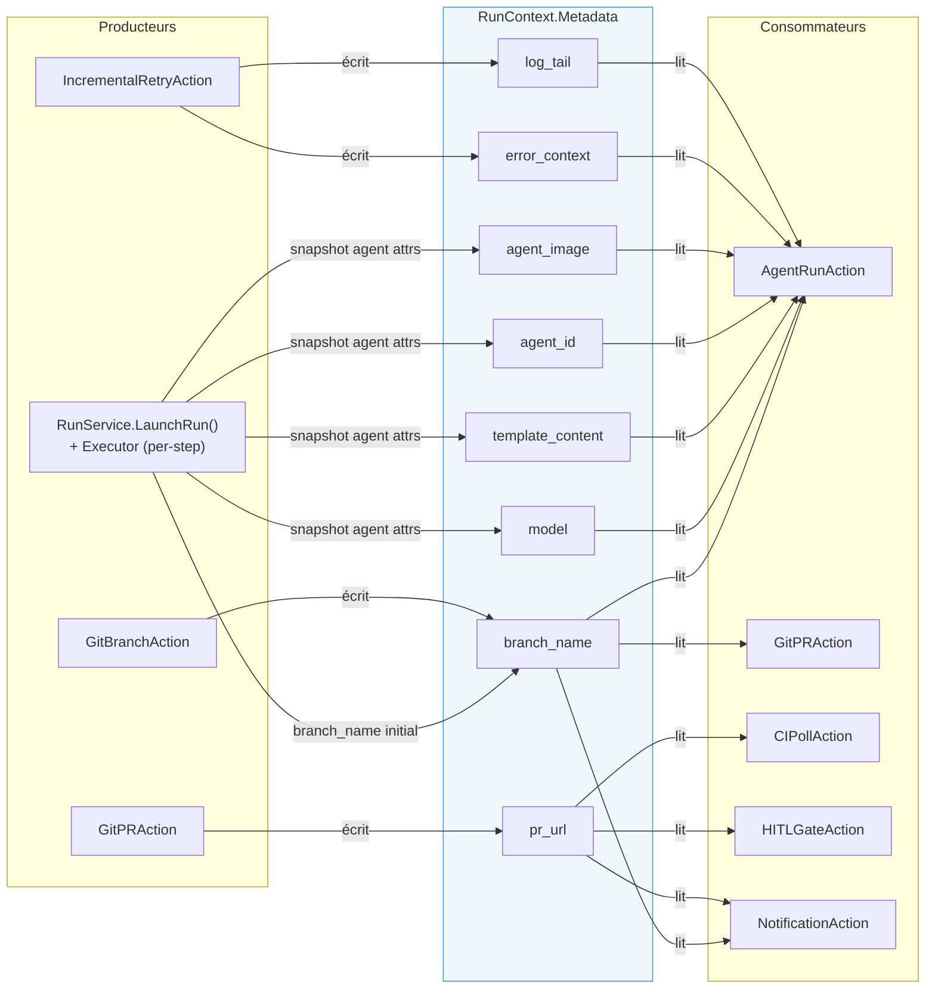

---

## 8. Action Registry — Pattern de dispatch

Peuplement du registre au démarrage et résolution des actions à l'exécution des steps.

```mermaid
flowchart TD
    subgraph INIT["Démarrage main.go (étape 7)"]
        REG[InMemoryActionRegistry]
        A1[AgentRunAction] -->|Register name=agent_run| REG
        A1 -->|RegisterAlias implement| REG
        A1 -->|RegisterAlias review| REG
        A1 -->|RegisterAlias merge| REG
        A2[GitBranchAction] -->|Register name=git_branch| REG
        A3[GitPRAction] -->|Register name=git_pr| REG
        A4[CIPollAction] -->|Register name=ci_poll| REG
        A5[HITLGateAction] -->|Register name=hitl_gate| REG
        A6[HumanAction] -->|Register name=human| REG
        A7[NotificationAction] -->|Register name=notification| REG
        A8[IncrementalRetryAction] -->|Register name=incremental_retry| REG
    end

    subgraph EXEC["executeStep() — runtime"]
        STEP[RunStep.Action\n ex: 'agent_run'] --> LOOKUP["ActionRegistry.Get(step.action)"]
        LOOKUP --> FOUND{Action\ntrouvée ?}
        FOUND -- non --> NOTFOUND[Erreur ACTION_NOT_FOUND\nStep → failed]
        FOUND -- oui --> EXECUTE["Action.Execute(ctx, runCtx)"]
        EXECUTE --> RESULT{Résultat}
        RESULT -- nil --> SUCCESS[Step → completed]
        RESULT -- error --> FAILURE[handleStepFailure()]
        RESULT -- waiting_approval --> SUSPEND[errStepSuspended\nPipeline suspendu]
    end

    REG -.->|injecté dans PipelineExecutor| LOOKUP
```

---

## 9. Circuit Breaker — Logique de décision

Protection contre les cascades d'échecs, état stocké sur l'entité Project en base.

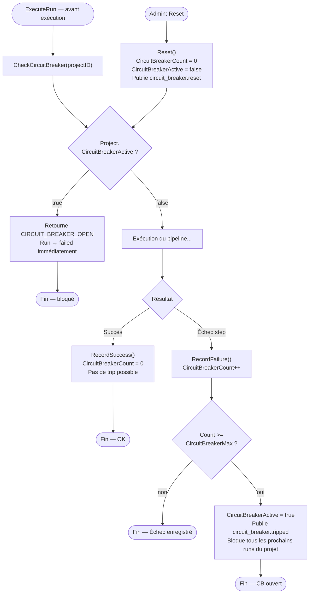

---

## 10. Retry Flow — Incremental vs Full

Décision de type de retry selon le compteur, et données injectées dans chaque stratégie.

```mermaid
flowchart TD
    START([Client POST /runs/runId/steps/stepId/retry]) --> VALIDATE{Step en\nétat failed ?}
    VALIDATE -- non --> ERR_STATE([Erreur: état invalide])
    VALIDATE -- oui --> POLICY[Vérifie RetryPolicy\ndepuis PipelineConfig snapshot]

    POLICY --> LIMIT{RetryCount >=\nMaxRetries ?}
    LIMIT -- oui --> ERR_LIMIT([Erreur: limite atteinte])

    LIMIT -- non --> TYPE{RetryCount\n< MaxIncremental\n(1 ou 2) ?}

    TYPE -- oui, retry incrémental --> INCR["Type: incremental\nInjecte dans Metadata:\n• error_context = step.ErrorMessage\n• log_tail = step.LogTail\nL'agent reçoit le contexte d'erreur\npour cibler la correction"]

    TYPE -- non, retry complet --> FULL["Type: full\nNettoie Metadata:\n• error_context = ''\n• log_tail = ''\nRelance l'agent depuis zéro"]

    INCR --> CREATE["CreateRetryRunStep()\nparent_step_id = stepID\nretry_count++\nretry_type = 'incremental'"]
    FULL --> CREATE2["CreateRetryRunStep()\nparent_step_id = stepID\nretry_count++\nretry_type = 'full'"]

    CREATE --> RESUME["Run: failed → running\nEnqueue execute_run job"]
    CREATE2 --> RESUME

    RESUME --> PE["PipelineExecutor.ExecuteRun()\nSkip steps completed\nExécute le retry step"]
```

---

## 11. Flux Complet — Single Story Run

Séquence complète depuis l'appel REST jusqu'à la completion, passant par le job queue River.

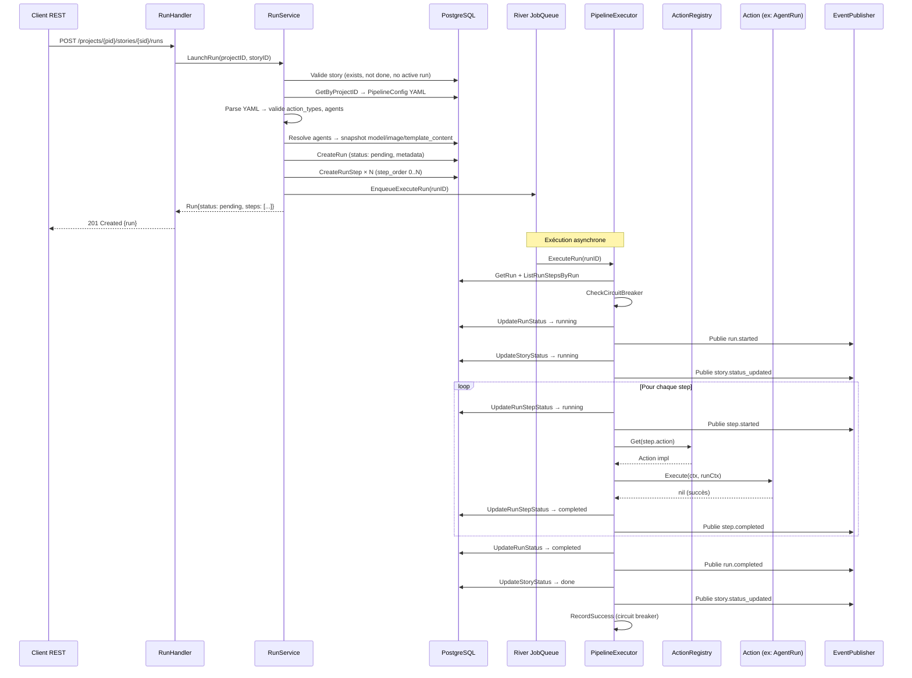

---

## 12. Lifecycle Container Agent et Labels

Création, démarrage, streaming de logs, cleanup. TimeoutEnforcer et OrphanCleaner utilisent les labels pour la supervision.

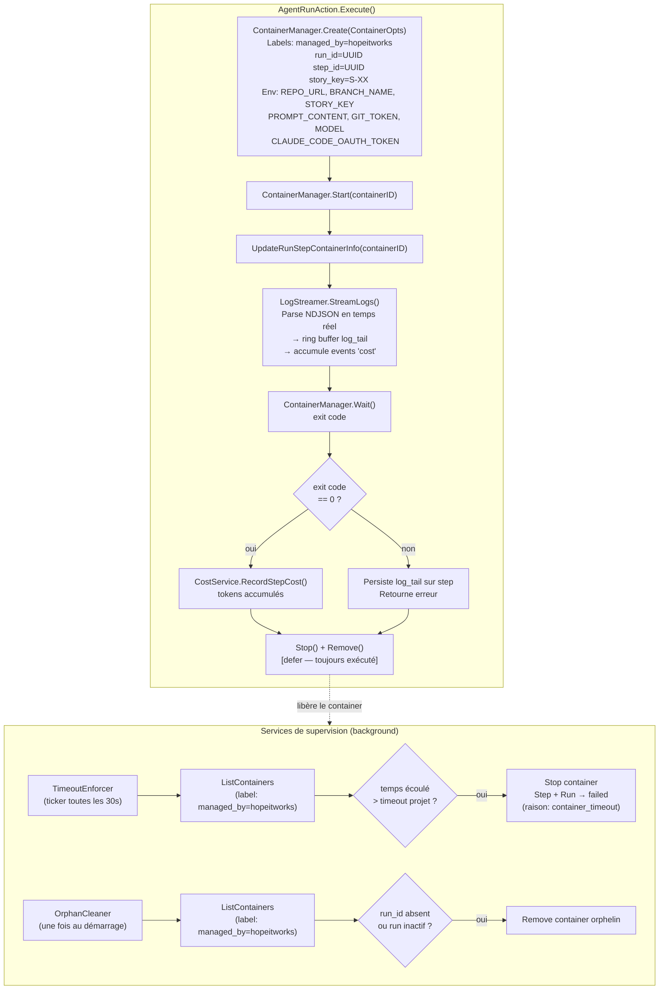

---

## 13. Cost Tracking — Du container au stockage

Flux de parsing des logs NDJSON d'un container agent pour extraire et enregistrer les coûts.

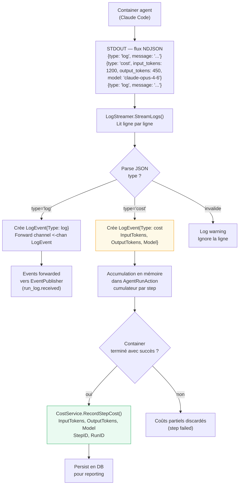

---

## 14. HITL Gate — Suspension et Reprise

Séquence complète de suspension du pipeline par une gate HITL et sa reprise après approbation humaine.

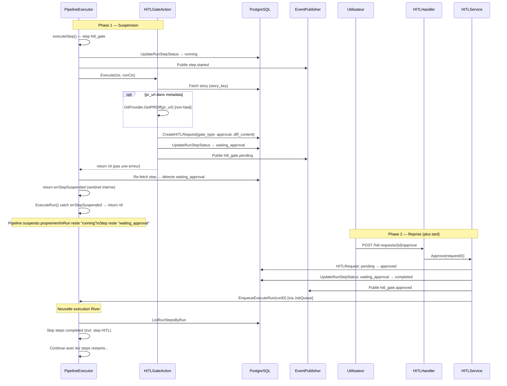

---

## 15. Ordre d'initialisation — Dependency Injection (main.go)

Les 14 étapes d'initialisation dans `main.go`, avec les dépendances d'ordre entre composants.

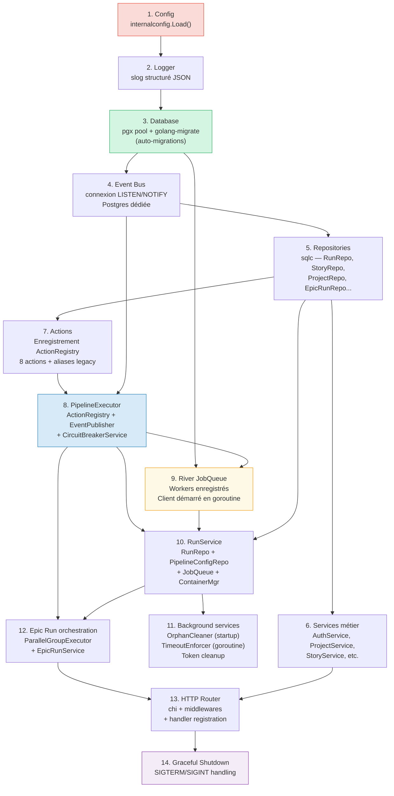
