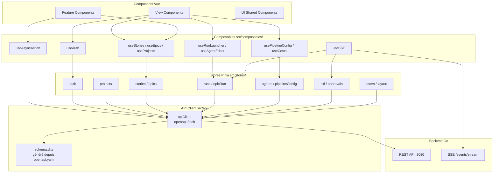
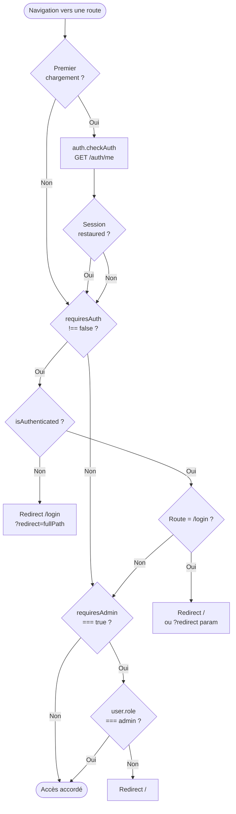
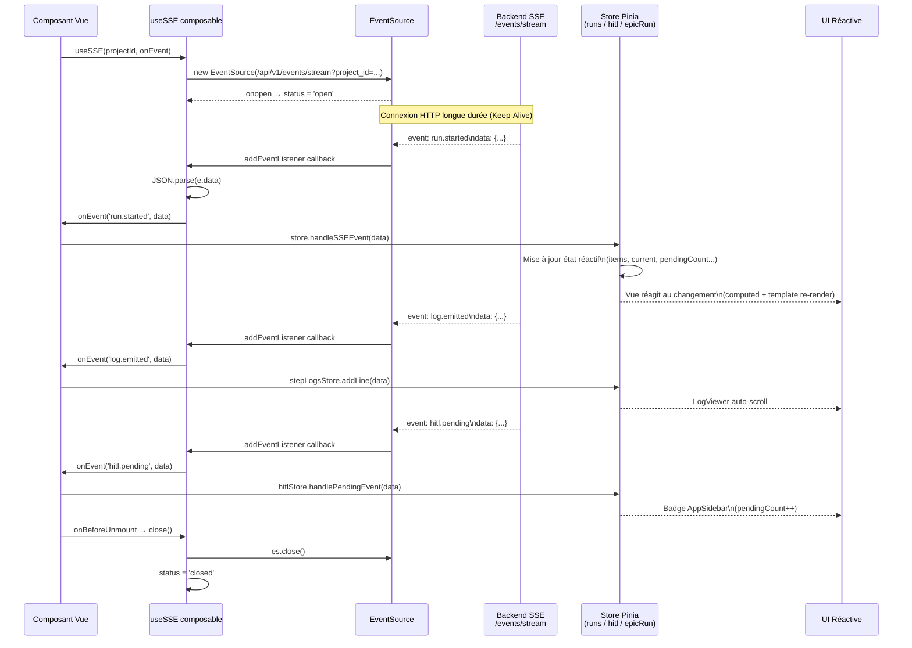
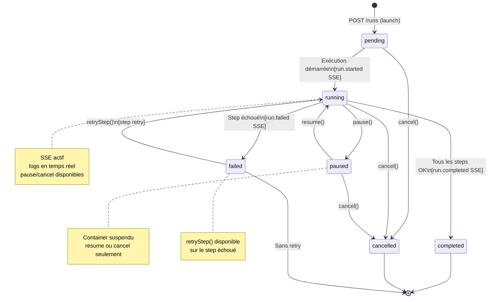
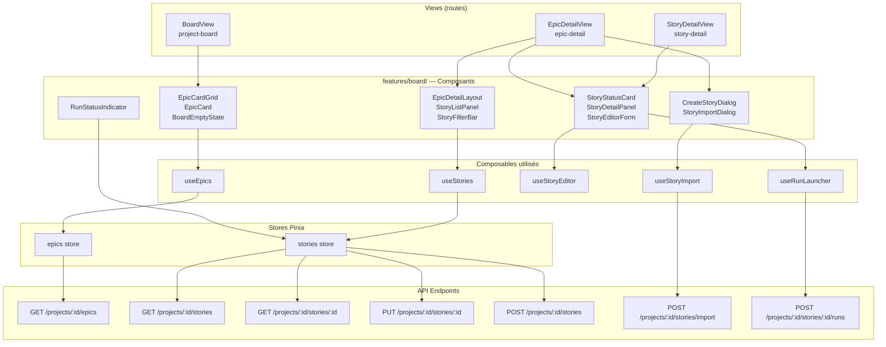
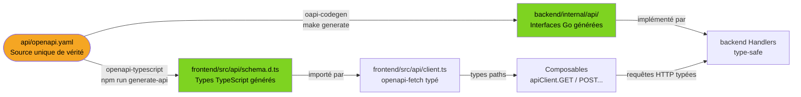
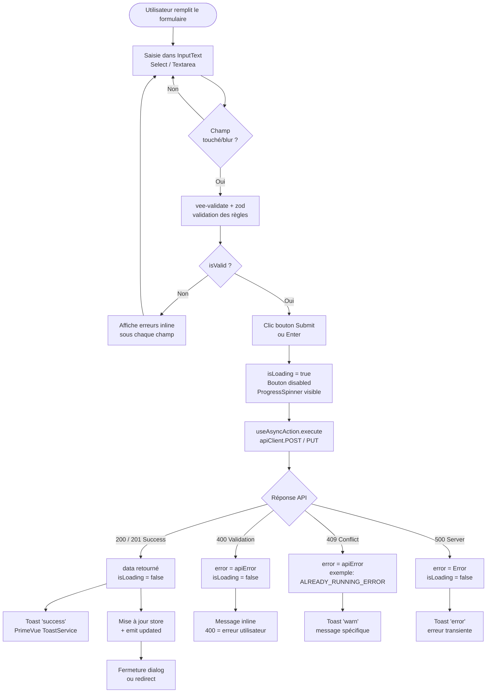
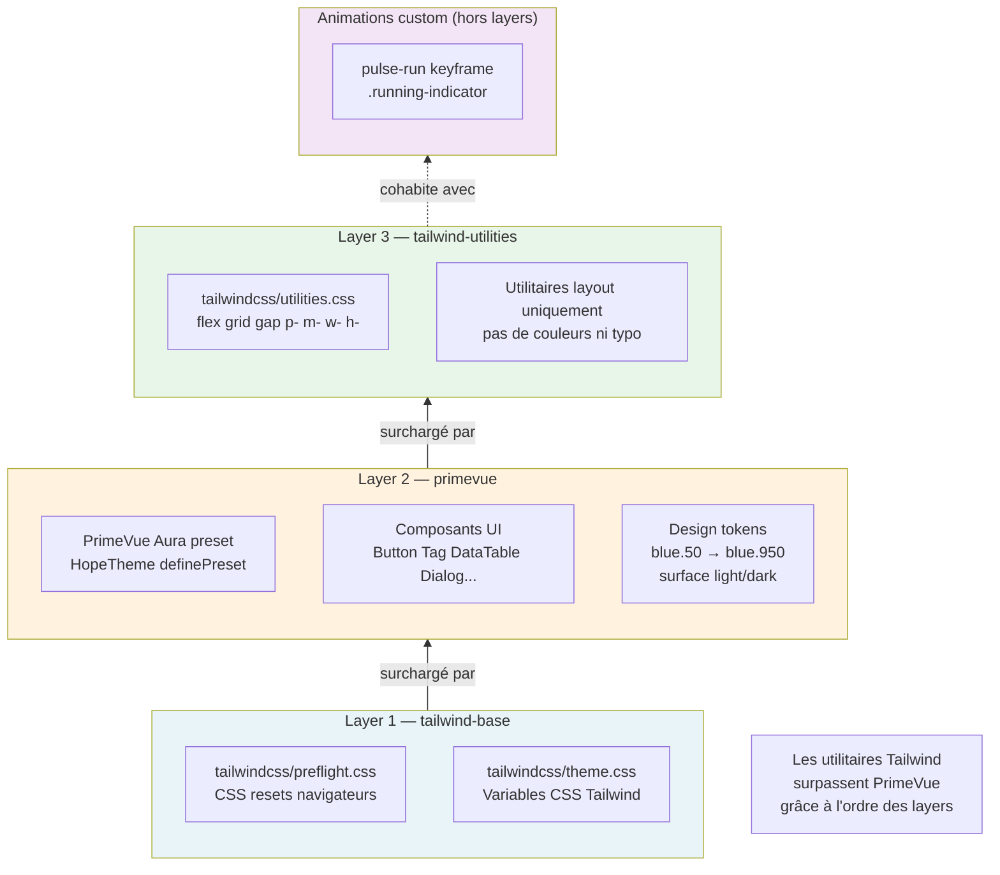
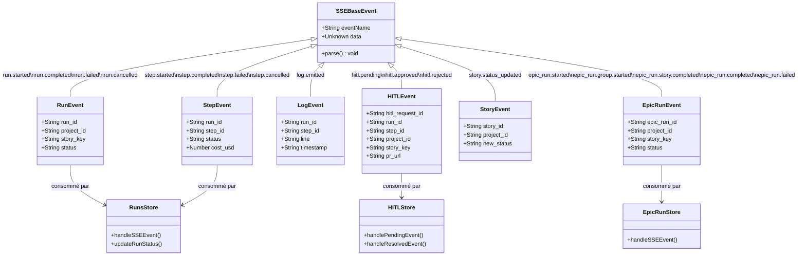

# Diagrammes Mermaid — Frontend

## 1. Architecture globale des Stores et Composables

Flux de dépendances depuis les composants jusqu'au backend : composants Vue → composables → stores Pinia → client API → backend.



---

## 2. Flux d'authentification et guards

Parcours complet depuis la navigation jusqu'à l'accès à une route : restauration de session, vérification d'authentification, guard admin, et redirections.



---

## 3. Cycle de vie SSE et synchronisation temps réel

Séquence complète depuis le montage d'un composant jusqu'à la mise à jour réactive de l'UI via les événements SSE.



---

## 4. État et transitions d'une exécution de run

Machines à états valides pour un run : transitions possibles, actions déclenchantes, et états terminaux.



---

## 5. Anatomie d'une Feature (board comme exemple)

Structure interne de la feature `board` : composants, composables locaux, stores et endpoints API utilisés.



---

## 6. Pipeline de génération de code OpenAPI → Types

Flux complet depuis la spec OpenAPI jusqu'aux types TypeScript et interfaces Go utilisés par le frontend et le backend.



---

## 7. Hiérarchie des routes et lazy-loading

Organisation des routes par domaine, distinction authentifiées / publiques, et stratégie de lazy-loading.

```mermaid
graph TD
    ROOT(["/"])

    subgraph Public["Routes publiques (no auth)"]
        LOGIN[/login]
        FORGOT[/forgot-password]
        RESET[/reset-password]
        NF["/:pathMatch(.*)*\n404 Not Found"]
    end

    subgraph Auth["Routes authentifiées"]
        DASH[/\ndashboard]
        PROFILE[/profile\n🔄 lazy]
        RUNS[/runs]
        APPROVALS[/approvals]

        subgraph Projects["Routes projets /projects/"]
            PLIST[/projects]
            PDET["/projects/:id"]
            POVERVIEW["/projects/:id/\noverview"]
            PBOARD["/projects/:id/board"]
            PRUNS["/projects/:id/runs\n🔄 lazy"]
            PPIPE["/projects/:id/pipeline"]
            PAGENTS["/projects/:id/agents"]
            PAGENT_NEW["/projects/:id/agents/new\n🔄 lazy + Admin"]
            PAGENT_EDIT["/projects/:id/agents/:agentId\n🔄 lazy"]
            PSET["/projects/:id/settings\n🔄 lazy"]
            PNOTIF["/projects/:id/settings/notifications\n🔄 lazy"]
            PCOSTS["/projects/:id/costs\n🔄 lazy"]
            STORY["/projects/:id/stories/:storyId"]
            RUN["/runs/:id"]
            HITL["/projects/:id/runs/:runId/approve/:stepId\n🔄 lazy"]

            subgraph Epics["Routes epics"]
                EPIC_DET["/projects/:id/epics/:epicId\n🔄 lazy"]
                EPIC_DAG["/projects/:id/epics/:epicId/dag\n🔄 lazy"]
                EPIC_RUN["/projects/:id/epic-runs/:epicRunId\n🔄 lazy"]
            end
        end

        subgraph Admin["Routes admin (requiresAdmin)"]
            ADMIN_USERS[/admin/users\n🔄 lazy]
        end
    end

    ROOT --> Public
    ROOT --> Auth
    PDET --> POVERVIEW
    PDET --> PBOARD
    PDET --> PRUNS
    PDET --> Epics
    PDET --> PPIPE
    PDET --> PAGENTS
    PAGENTS --> PAGENT_NEW
    PAGENTS --> PAGENT_EDIT
    PDET --> PSET
    PSET --> PNOTIF
    PDET --> PCOSTS
```

---

## 8. Flux de validation et soumission de formulaire

Cycle complet d'un formulaire : saisie utilisateur, validation vee-validate + zod, appel API, gestion de réponse et notification.



---

## 9. Composition CSS (layers + Tailwind + PrimeVue)

Ordre de cascade CSS des trois layers et leurs zones de responsabilité respectives.



---

## 10. Modèle de données SSE et événements temps réel

Hiérarchie des 18 types d'événements SSE, leurs familles et les stores Pinia qui les consomment.


