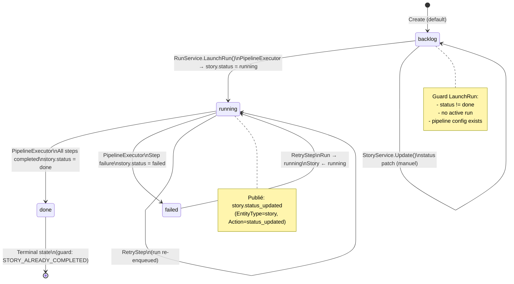
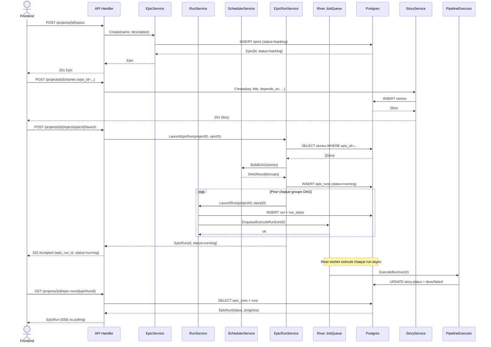
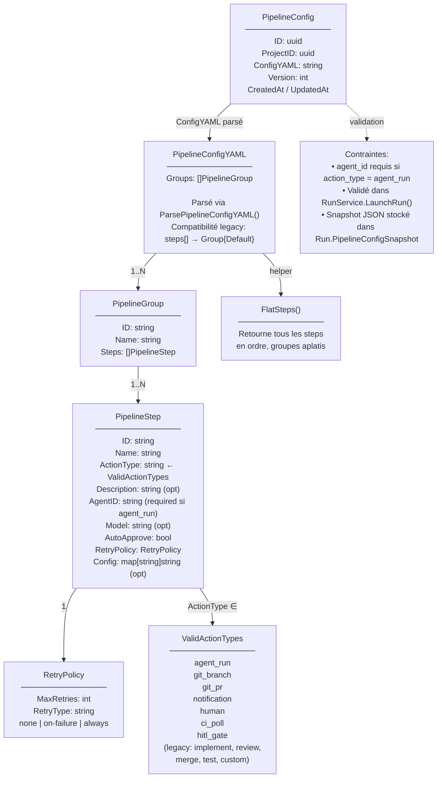
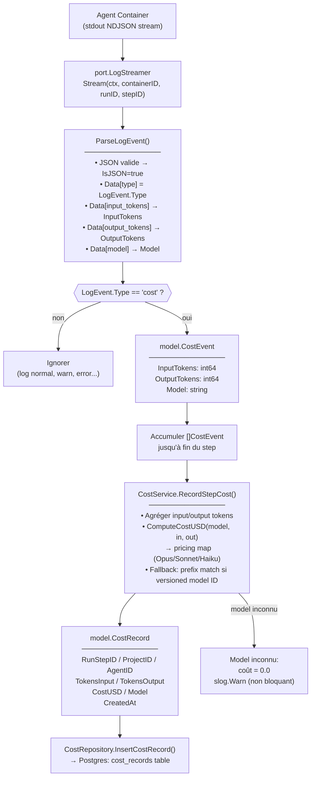
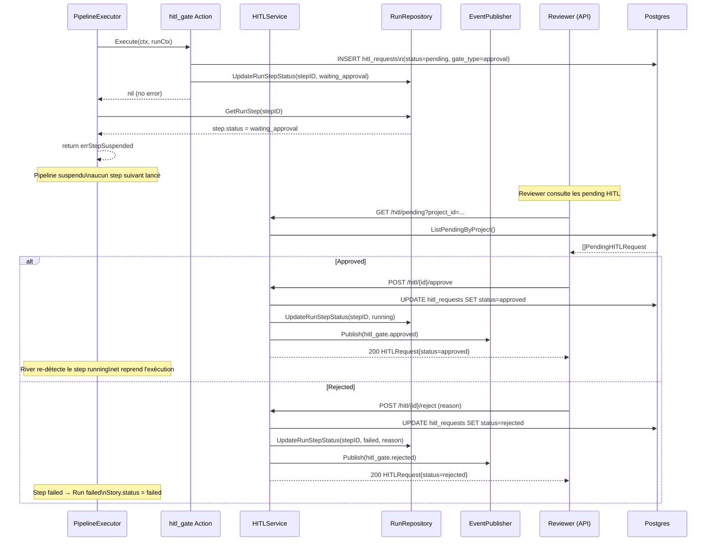
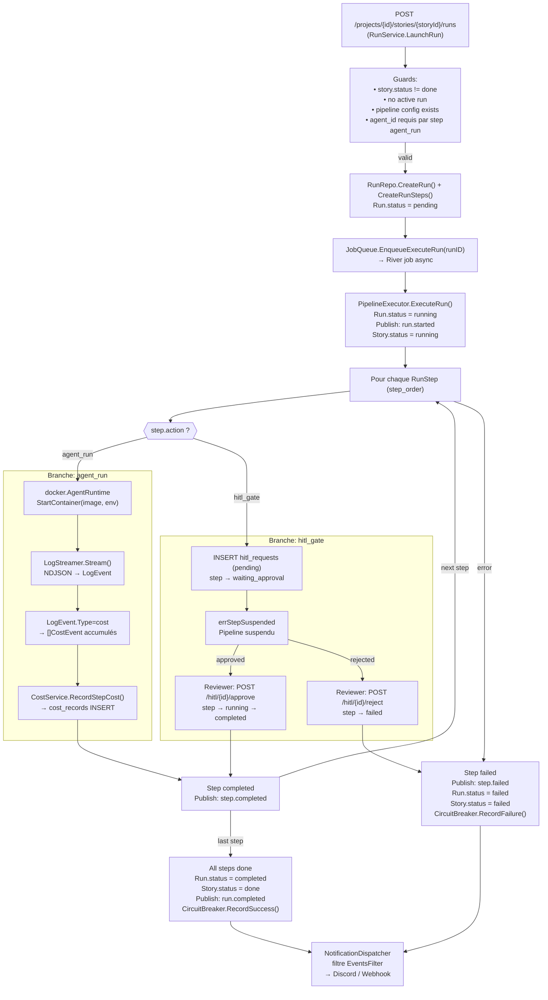
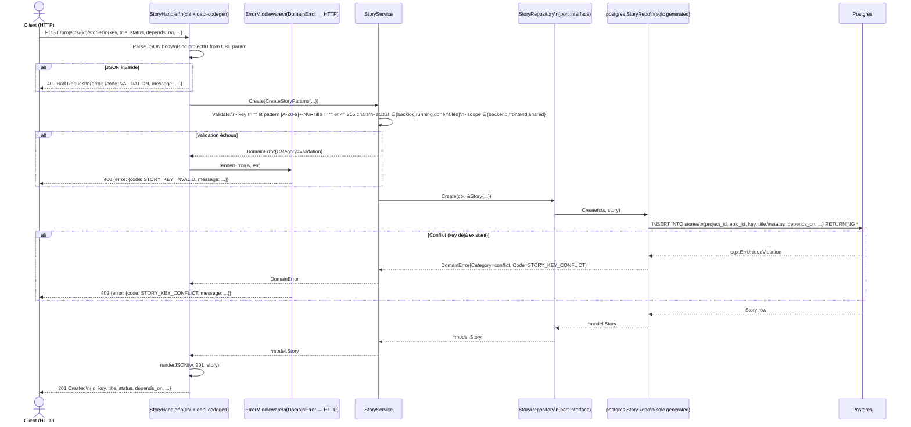

# Diagrammes Mermaid — Stories, Epics & Config

## 1. Architecture Hexagonale — Vue d'ensemble

Montre les 4 couches (handler → service → port ← adapter) appliquées aux domaines Stories, Epics, Pipeline Config, Cost, HITL et Notifications. La flèche indique la direction des dépendances : les services ne dépendent que des ports (interfaces), jamais des adapters.

```mermaid
graph TD
    subgraph HTTP["Couche HTTP (chi)"]
        H1[StoryHandler]
        H2[EpicHandler]
        H3[PipelineConfigHandler]
        H4[CostHandler]
        H5[HITLHandler]
        H6[NotificationConfigHandler]
    end

    subgraph Services["Couche Service (domaine)"]
        S1[StoryService]
        S2[EpicService]
        S3[PipelineConfigService]
        S4[CostService]
        S5[HITLService]
        S6[NotificationConfigService]
        S7[NotificationDispatcher]
        S8[RunService]
        S9[PipelineExecutor]
        S10[SchedulerService]
    end

    subgraph Ports["Ports (interfaces)"]
        P1[StoryRepository]
        P2[EpicRepository]
        P3[PipelineConfigRepository]
        P4[CostRepository]
        P5[HITLRepository]
        P6[NotificationConfigRepository]
        P7[EventPublisher]
        P8[EventSubscriber]
        P9[RunRepository]
        P10[JobQueue]
        P11[Notifier]
    end

    subgraph Adapters["Adapters (Postgres / River / Discord / Webhook)"]
        A1[postgres.StoryRepo]
        A2[postgres.EpicRepo]
        A3[postgres.PipelineConfigRepo]
        A4[postgres.CostRepo]
        A5[postgres.HITLRepo]
        A6[postgres.NotifConfigRepo]
        A7[postgres.EventPublisher]
        A8[postgres.EventSubscriber]
        A9[postgres.RunRepo]
        A10[river.JobQueue]
        A11[discord.Notifier]
        A12[webhook.Notifier]
    end

    H1 --> S1
    H2 --> S2
    H3 --> S3
    H4 --> S4
    H5 --> S5
    H6 --> S6

    S1 --> P1
    S2 --> P2
    S3 --> P3
    S4 --> P4 & P9
    S5 --> P5 & P9 & P7
    S6 --> P6
    S7 --> P8 & P6 & P11
    S8 --> P9 & P10 & P7
    S9 --> P9 & P7

    P1 -.->|implements| A1
    P2 -.->|implements| A2
    P3 -.->|implements| A3
    P4 -.->|implements| A4
    P5 -.->|implements| A5
    P6 -.->|implements| A6
    P7 -.->|implements| A7
    P8 -.->|implements| A8
    P9 -.->|implements| A9
    P10 -.->|implements| A10
    P11 -.->|implements| A11
    P11 -.->|implements| A12
```

---

## 2. Story Lifecycle — Transitions de statut

Montre tous les états possibles d'une Story et les événements qui déclenchent chaque transition. Les transitions sont encodées dans `isValidStoryStatus()` + la logique de `PipelineExecutor` et `RunService`.

---

## 3. DAG Construction & Exécution — Stories dans un Epic

Montre comment le champ `DependsOn []string` (clés de stories) est utilisé par `SchedulerService.BuildDAG()` pour construire les couches d'exécution parallèle via l'algorithme de Kahn. Les file conflicts (TargetFiles) génèrent des edges implicites.

```mermaid
flowchart LR
    subgraph Input["Epic.Stories (input)"]
        ST1["S-01\nDependsOn: []"]
        ST2["S-02\nDependsOn: [S-01]"]
        ST3["S-03\nDependsOn: [S-01]"]
        ST4["S-04\nDependsOn: [S-02, S-03]"]
    end

    subgraph BuildDAG["SchedulerService.BuildDAG()"]
        IDX["Index par Key\nbyKey map[string]*Story"]
        ADJ["Adjacency list\nadj[dep] → []dependents"]
        INDEG["In-degree map\ninDegree[key] = 0"]
        FILE["addFileConflictEdges()\nTargetFiles → edges implicites"]
        KAHN["Kahn's algorithm\ncouche par couche"]
    end

    subgraph DAGResult["DAGResult.Groups"]
        G0["Groups[0]\nS-01 (seul, in-degree=0)"]
        G1["Groups[1]\nS-02 + S-03 (parallèle)"]
        G2["Groups[2]\nS-04 (attend S-02 + S-03)"]
    end

    subgraph Exec["Exécution (EpicRunService)"]
        E0["Lancer S-01\n(attendre completion)"]
        E1["Lancer S-02 ET S-03\nen parallèle"]
        E2["Lancer S-04\n(après S-02 + S-03 done)"]
    end

    Input --> IDX
    IDX --> ADJ
    ADJ --> INDEG
    INDEG --> FILE
    FILE --> KAHN
    KAHN --> DAGResult
    DAGResult --> Exec

    note1["Cycle détecté → DAG_CYCLE_DETECTED\nDomainError (CategoryInvalidState)"]
    KAHN -. "zeroKeys = [] avant fin" .-> note1
```

---

## 4. Epic Lifecycle — Séquence complète avec DAG

Montre le flux complet : création d'un epic → ajout de stories → lancement via `/launch` → DAG scheduling → completion. Les acteurs correspondent aux couches réelles du code.

---

## 5. Pipeline Config — Hiérarchie des modèles

Montre la structure d'imbrication : `PipelineConfig` → `PipelineConfigYAML` → `[]PipelineGroup` → `[]PipelineStep` + `RetryPolicy`. Inclut les contraintes de validation et les action_types valides.

---

## 6. Cost Tracking — Flux de données

Montre le chemin complet depuis le stream de logs NDJSON du container agent jusqu'à l'enregistrement en base. Le `LogEvent.Type == "cost"` est le déclencheur d'extraction.

---

## 7. HITL Gate — Workflow d'approbation

Montre le moment précis où l'executor crée la gate, la suspension du pipeline, l'action du reviewer, et la reprise. L'invariant clé : le step ne progresse que si la gate est approuvée.

---

## 8. Notification Dispatch — Pipeline de routage

Montre le chemin complet d'un event depuis `EventPublisher.Publish()` jusqu'aux notifiers (Discord/Webhook). Le fan-in merge les channels par projet ; les erreurs d'envoi sont silencées (logged, non fatales).

```mermaid
flowchart LR
    PUB["EventPublisher.Publish(event)\n(postgres NOTIFY)"]

    subgraph Dispatcher["NotificationDispatcher.Start()"]
        PROJECTS["projectRepo.List()\n→ tous les projets"]
        SUBSCRIBE["eventSub.Subscribe(ctx, projectID)\n→ chan model.Event + cleanup"]
        FANIN["fanIn goroutine\n(par projet)\n→ merged chan (buf 256)"]
        MERGED["merged chan model.Event"]
        DISPATCH["dispatch(ctx, event)"]
    end

    CONFIGS["repo.ListEnabledByProject()\n→ []NotificationConfig\n(enabled=true, project_id=event.ProjectID)"]

    FILTER{{"cfg.EventsFilter\ncontains event.EventName() ?<br>(format: entity_type.action)"}}

    SKIP2["Ignorer cette config"]

    ROUTER{{"cfg.ChannelType ?"}}

    DISCORD["discord.Notifier.Send()\n→ Discord Webhook POST"]

    WEBHOOK["webhook.Notifier.Send()\n→ Generic HTTP POST"]

    ERR["slog.Warn(send failed)\nNon fatal — pipeline continue"]

    PUB -->|"Postgres LISTEN/NOTIFY"| SUBSCRIBE
    PROJECTS --> SUBSCRIBE
    SUBSCRIBE --> FANIN
    FANIN --> MERGED
    MERGED --> DISPATCH
    DISPATCH --> CONFIGS
    CONFIGS --> FILTER
    FILTER -- "non" --> SKIP2
    FILTER -- "oui" --> ROUTER
    ROUTER -- "discord" --> DISCORD
    ROUTER -- "webhook" --> WEBHOOK
    DISCORD -->|"erreur"| ERR
    WEBHOOK -->|"erreur"| ERR
```

---

## 9. Cross-Domain Event Flow — Happy Path & Sad Path

Montre l'interconnexion de tous les domaines sur le chemin complet d'une story : du lancement au coût, avec branches `agent_run` (cost stream) et `hitl_gate` (approval gate), et propagation des événements vers les notifications.

---

## 10. API Handler → Service → Repository — Chaîne d'appel

Montre une requête HTTP complète (POST /stories) : parsing → validation handler → service → repo → Postgres, avec la gestion des erreurs et le mapping HTTP. Le pattern est identique pour tous les domaines.

