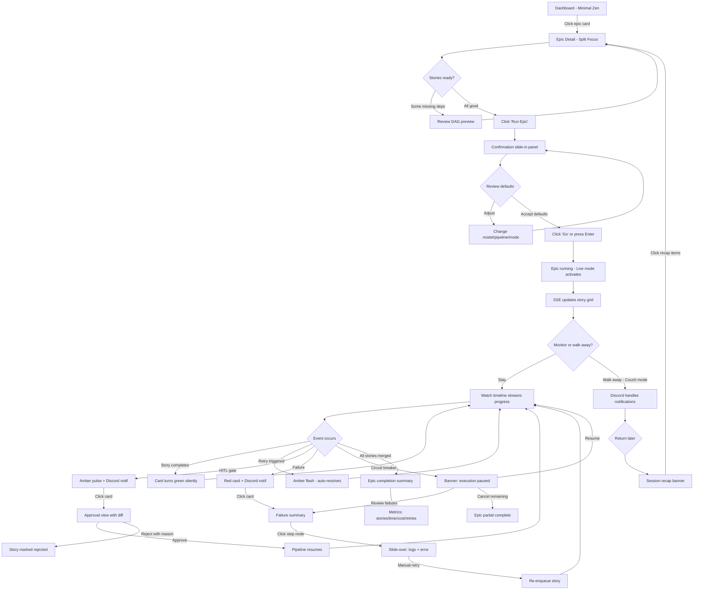
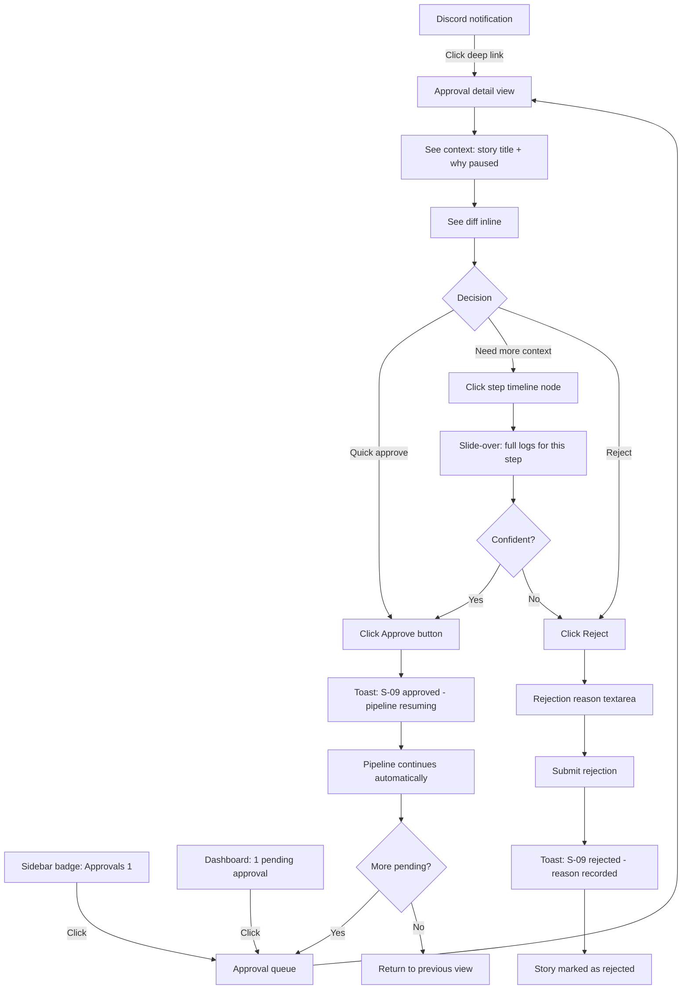
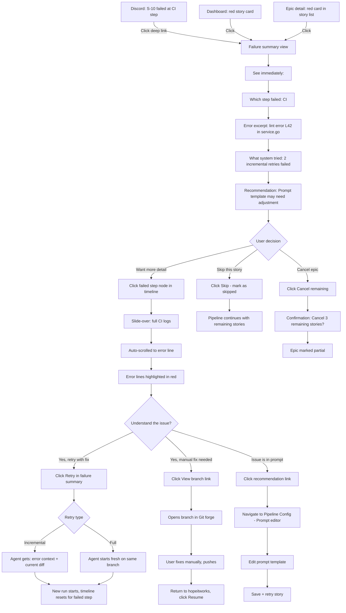

# UX Design Specification hopeitworks

**Author:** Zakari
**Date:** 2026-02-16

---

## Executive Summary

### Project Vision

Hopeitworks v2 is an AI agent orchestration platform that transforms the manual, fragile process of managing AI coding agents into a transparent, automated pipeline. The core UX promise is **trust through transparency** — users should feel confident that automation is working correctly without needing to micromanage, because the system makes its state visible at exactly the right level of detail.

V1 proved the concept but failed on visibility: a CLI-only interface made it impossible to follow runs, understand failures, or trust the automation. V2 rebuilds the experience around real-time observability, composable pipelines, and progressive disclosure — serving power users and newcomers from the same interface.

### Target Users

**Primary: Zakari (Power User / Admin)**
- Launches full epics with parallel agent execution
- Needs granular control: DAG visualization, live logs, HITL approval, cost tracking
- Wants "mission control" experience — see everything, intervene only when needed
- Also handles instance setup, pipeline configuration, user management
- Desktop-first, large screen

**Secondary: Dev Colleague (Karim archetype)**
- Discovers the platform through a colleague's recommendation
- Connects their own repo, writes first story, launches first run
- Needs guided onboarding with immediate visible results
- Magic moment: seeing the PR appear automatically in their Git forge
- May use different Git providers (GitHub, GitLab)

**Tertiary: Functional User (Sophie archetype)**
- PM/PO tracking project progress across epics
- Reviews and approves simple HITL gates (non-code changes)
- Consults metrics: cost, success rate, time per story
- Needs a clean, non-technical dashboard view
- Should never feel lost or overwhelmed by technical details

### Key Design Challenges

1. **Multi-persona complexity** — Four distinct user profiles with radically different needs sharing one interface. The power user wants raw NDJSON logs and DAG control; the functional user wants colored cards and percentages. The interface must serve both without compromising either experience.

2. **Real-time data density** — With multiple agents running in parallel, each streaming logs and progressing through pipeline steps, the risk is information overload. The UX must provide the right level of abstraction: macro view (epic progress) → micro view (step logs) with fluid drill-down transitions.

3. **Invisible orchestration, visible outcomes** — DAG scheduling, incremental retry, circuit breakers, and event-driven state machines run behind the scenes. The challenge is surfacing state changes that matter (failures, HITL gates, completions) while keeping the machinery invisible when everything is nominal.

4. **Trust calibration** — Users must develop trust in automation gradually. Too much automation without visibility breeds anxiety. Too much detail breeds fatigue. The UX must calibrate the right amount of information to build confidence without overwhelming.

### Design Opportunities

1. **"Mission Control" experience** — Inspired by Dagster's pipeline visualization, ArgoCD's sync status model, and n8n/Windmill's visual flow builders. A real-time dashboard where pipelines flow visually, statuses change live via SSE, and the overall health of an epic run is visible at a glance. The desktop-first constraint enables rich, dense information display.

2. **Progressive disclosure as core pattern** — Instead of role-based UI modes, use depth-on-demand. Surface-level: status cards, progress bars, success rates. One click deeper: step timelines, cost breakdowns, retry history. Another click: raw logs, diffs, NDJSON streams. Every user finds their comfort level naturally.

3. **Confidence scoring** — Beyond binary success/fail, display execution health signals: cost vs budget ratio, time vs estimate, retry rate, merge cleanliness. A visual system that communicates "everything is fine" before the user reads any detail — inspired by ArgoCD's green-means-don't-touch philosophy.

4. **Zero-click monitoring** — The default state should communicate health without interaction. Push notifications (Discord, SSE) for required actions, silence for nominal operation. The best UX for a running epic is no UX at all — until human input is needed.

5. **Pipeline as visual story** — Leverage the composable action system (YAML pipelines) to create visual pipeline representations that users can understand intuitively. Each action node shows its state, duration, cost. The pipeline becomes a narrative: branch → implement → CI → review → approve → merge → done.

## Core User Experience

### Defining Experience

The core experience of hopeitworks revolves around a **Launch → Monitor → Intervene** loop. Everything in the product exists to support this cycle:

- **Configure** (before): Tune pipelines, agents, prompts, budgets — the "workshop" where the user prepares the machinery
- **Launch** (trigger): Select scope (story, epic, batch), confirm, go — must feel decisive and immediate
- **Monitor** (passive): Watch progress or walk away — the system communicates health proactively
- **Intervene** (on-demand): Approve HITL gates, review failures, adjust — only when the system asks

The primary user (power user) alternates between three modes throughout the day:

1. **Artisan Mode** — Deep configuration work: editing pipeline YAML, tuning prompt templates, adjusting retry policies, reviewing cost trends. Requires focus, precision, and immediate feedback on changes.
2. **Launch Mode** — Triggering execution: selecting an epic or batch, confirming parameters, hitting go. Must be fast (< 3 clicks from dashboard to running), satisfying, and confidence-inspiring.
3. **Couch Mode** — Fire-and-forget monitoring: the user has stepped away. Notifications (Discord/webhook) handle all communication. On return, a "session recap" summarizes what happened during absence — completions, failures, pending approvals, cost spent.

### Platform Strategy

**Primary platform:** Desktop web application (Vue 3 SPA)
- Optimized for large screens (1440px+ primary breakpoint)
- Mouse/keyboard interaction with keyboard shortcuts for power actions
- Dense information display appropriate for monitoring dashboards

**Secondary interface:** CLI (Go)
- Power user complement for scripting and automation
- Commands: run, status, logs, approve/reject
- Same API backend, different presentation layer

**Notification channels:** Discord webhooks, generic webhooks
- "Couch mode" enabler — system reaches out to user, not the other way
- Event-based: success, failure, HITL pending, budget warning

**Runtime-aware UX:**
- Docker mode: UI indicates that closing the browser does not stop runs, but the host machine must stay on. Subtle persistent indicator.
- K8s mode: Full fire-and-forget. Runs survive independently. Session recap on return is the primary catch-up mechanism.

**Offline/reconnection behavior:**
- SSE auto-reconnects on tab focus
- On reconnection, UI fetches current state + missed events since last-event-id
- "Session recap" banner: "While you were away: 8 stories merged, 1 failed (retry succeeded), 1 pending approval" — clickable to drill into each

### Effortless Interactions

**Launch flow (< 3 clicks):**
Dashboard → Select epic → "Run Epic" → Confirmation with smart defaults (pipeline, model, auto/supervised) → Go. The confirmation modal pre-fills based on project defaults. Power users can launch without confirmation via keyboard shortcut.

**Status at a glance (zero clicks):**
The dashboard default view shows all active runs with real-time progress. No refresh needed — SSE pushes state changes. Color coding (green/amber/red) communicates health instantly. Inspired by Dagster's run timeline and ArgoCD's application grid.

**HITL approval (1 click from notification):**
Discord notification includes context (story title, what changed, why approval needed). Web UI shows diff inline. One click: approve. Two fields: reject with reason. No navigation required — deep link from notification straight to approval view.

**Failure investigation (2 clicks max):**
From any failed status indicator → click → see the specific step that failed → click → see the relevant log lines (auto-scrolled to error). No hunting through pages of logs. The system highlights the failure point.

**Cost awareness (always visible):**
Running cost displayed as a subtle counter on active runs. Budget usage shown as a progress bar per project. No dedicated "cost page" needed — cost is contextual information woven into existing views.

### Critical Success Moments

1. **First epic completion** — The moment all stories in an epic show green. The UI should celebrate this subtly (not confetti, but a clear visual completion state). Summary: time taken, cost, success rate, stories merged. This is the "it works" moment.

2. **Successful incremental retry** — A CI failure that the system fixes automatically. The UI should make this visible: "CI failed → retry → fixed → merged" as a mini-narrative on the step timeline. This builds trust in automation.

3. **Couch mode return** — Coming back to the dashboard after being away and seeing a clean recap. "12/12 stories merged. Total cost: $28. Average time: 8 min/story." This is the "I can trust this" moment.

4. **First run for a new user (Karim)** — Writing a story, clicking run, seeing logs stream in real-time, and the PR appearing in their Git forge. The journey from "what is this" to "this is useful" must happen in a single session.

5. **Pipeline tuning payoff** — After adjusting prompt templates or retry policies, seeing measurable improvement in success rate or cost. The system should surface these trends: "Success rate: 72% → 91% after prompt change on Feb 15."

### Experience Principles

1. **Trust through transparency** — Every automated action is traceable. Users can always drill down from outcome to cause. The system never hides what it's doing, but only shows details when asked.

2. **Silence is golden** — The best monitoring experience is no interaction at all. The system speaks up only when human input is needed or something is wrong. Green means don't touch.

3. **Depth on demand** — One interface, multiple depths. Surface: status cards and progress bars. Mid: step timelines and cost breakdowns. Deep: raw logs and diffs. No user modes, no role-based views — just progressive disclosure.

4. **Speed to action** — Every common action reachable in ≤ 3 interactions. Launch, approve, investigate, configure. Keyboard shortcuts for power users. Smart defaults eliminate unnecessary decisions.

5. **Context travels with you** — Deep links from notifications to exact approval/failure. Session recaps on return. Cost shown in-context, not in a separate page. Information appears where and when it's relevant.

## Desired Emotional Response

### Primary Emotional Goals

**The Commander's Calm** — The dominant emotional state of hopeitworks is controlled confidence. The user feels like a pilot who has activated autopilot: in command, trusting the system, calm because everything is visible. Three feelings blend together:

- **Control** — "I decided when to launch, I can intervene anytime"
- **Satisfaction** — "I see my orders being executed in parallel"
- **Calm** — "The system handles complexity, I handle decisions"

This is not the excitement of a new toy. It's the quiet confidence of a well-tuned machine doing exactly what it was configured to do.

### Emotional Journey Mapping

| Stage | Target Emotion | Anti-Pattern |
|-------|---------------|-------------|
| **First discovery** | "This is simple AND powerful" — Accessible power, not intimidating complexity | Overwhelming dashboards, unclear entry points |
| **First launch** | "Let's go" — Decisive, immediate, satisfying click | Long configuration wizards, unclear what happens next |
| **Monitoring active runs** | "Everything is under control" — Calm awareness, not anxious watching | Refresh-heavy UX, missing status info, wall of unstructured data |
| **Successful completion** | "It just works" — Quiet satisfaction, measured outcomes | Anticlimactic ending, no summary, unclear what actually happened |
| **Auto-retry succeeds** | "Normal, that's expected" — Confidence in the system, not surprise | Retry treated as exceptional, alarming notifications for handled errors |
| **Failure / circuit breaker** | "I know what happened and what to do" — Informed, not panicked | Cryptic errors, no guidance, user left to investigate alone |
| **Returning after absence** | "I'm caught up in 5 seconds" — Quick context recovery | Stale UI, no recap, manual investigation of what happened |

### Micro-Emotions

**Confidence over Excitement** — The product should feel reliable, not flashy. Users trust it because it behaves predictably and communicates clearly. No surprises in the good sense means no surprises in the bad sense either.

**Curiosity over Anxiety** — When something unexpected happens (retry, failure, cost spike), the user's instinct should be "show me what happened" (curiosity), not "oh no what broke" (anxiety). This is achieved through clear, factual, actionable communication.

**Mastery over Dependency** — The tuning experience (prompts, pipelines, retry policies) should make users feel like they're getting better at orchestrating agents. The system surfaces trends ("success rate improved after your prompt change") that reward expertise.

**Calm over Urgency** — Even when intervention is needed (HITL gate, failure), the tone is measured. "Story S-09 needs your approval" not "URGENT: Pipeline blocked!" The system protects the user from urgency by handling what it can and presenting what it can't calmly.

### Design Implications

| Emotion | UX Design Approach |
|---------|-------------------|
| **Commander's calm** | Dashboard as "mission control" — dense but organized, real-time but not frantic. Muted color palette with meaningful color accents (green=nominal, amber=attention, red=action needed) |
| **"Normal, that's expected"** | Auto-retry shown as a natural pipeline substep, not an error state. Timeline shows: "CI failed → auto-retry → fixed → merged" as one continuous flow, not an incident |
| **"Simple AND powerful"** | Progressive disclosure at every level. Default views are clean and scannable. Power features (raw logs, DAG control, YAML editor) are always accessible but never in the way |
| **Informed, not panicked** | Failure states include: what happened, why, what the system already tried, and what the user can do. Actionable recommendations with one-click resolution where possible |
| **Actionable intelligence on failure** | When circuit breaker triggers or budget is exceeded, the system provides specific recommendations: "Prompt template X has 60% failure rate — consider adjusting section Y." Future MCP integration enables "Fix this for me" — the system proposes a concrete action (via Claude Code), user approves, system executes. This is reverse-HITL: system proposes, human disposes |
| **Quick context recovery** | Session recap banner on reconnection. Activity feed with semantic grouping ("8 stories merged" not 8 individual events). Time-relative markers ("2h ago", "while you were away") |

### Emotional Design Principles

1. **Predictability breeds trust** — Consistent behavior, consistent UI patterns, consistent communication tone. The user should always know what to expect from an action. No modal surprises, no state changes without visual feedback.

2. **Calm urgency** — When action is needed, communicate clearly but without panic. Red means "you need to do something", not "something terrible happened." The system has already contained the issue; it just needs a human decision.

3. **Celebrate outcomes, not actions** — Don't celebrate clicking "Run." Celebrate "Epic completed: 12/12 stories, $28, 0 manual interventions." The reward is in the result, not the trigger.

4. **Intelligence, not just information** — Don't just show data; show insight. Not "3 retries on S-03" but "S-03 required 3 retries — prompt section 'error handling' may need refinement." The system learns and advises, moving toward self-improving orchestration.

5. **Respect attention** — Every notification, every status change, every UI element must earn its screen space. If it doesn't help the user make a decision or feel confident, it shouldn't be there. Silence is a feature.

## UX Pattern Analysis & Inspiration

### Inspiring Products Analysis

**Dagster — "The Pipeline Observatory"**
- **What it nails:** The run timeline is best-in-class for pipeline monitoring. Each run shows a horizontal timeline of steps with real-time status coloring. The asset lineage graph visualizes dependencies as a flowing DAG. Status is communicated through color + shape + position simultaneously.
- **Key UX pattern:** Timeline-as-truth — the timeline IS the interface, not a widget inside it. Everything radiates from the temporal view of execution.
- **Transferable to hopeitworks:** Run timeline for story pipeline steps (branch → implement → CI → review → merge). DAG view for epic dependency visualization across stories.

**Windmill / n8n — "The Visual Flow"**
- **What they nail:** The flow builder makes pipelines tangible. Nodes represent actions, edges represent data flow. You SEE the pipeline as a spatial layout. State changes propagate visually through the graph — a node turns green, the edge animates, the next node activates.
- **Key UX pattern:** Spatial pipeline comprehension — understanding through layout, not through lists. The topology IS the explanation.
- **Transferable to hopeitworks:** Pipeline configuration visualization. Instead of only YAML editing, show the pipeline as a visual flow: each action node with its config, connections showing step order. Read-only for MVP, interactive post-MVP.

**Linear — "The Developer's Sanctuary" (new inspiration)**
- **What it nails:** The gold standard for developer tool UX. Dense information display that never feels cluttered. Keyboard-first navigation (Cmd+K command palette, single-key shortcuts). Instant responsiveness — every action feels immediate. Dark mode that actually works. Opinionated defaults that eliminate decision fatigue.
- **Key UX pattern:** Keyboard-first density — pack maximum information per pixel while maintaining scannability through typography hierarchy, subtle separators, and consistent spacing. Command palette as universal entry point.
- **Transferable to hopeitworks:** Cmd+K palette for quick actions (launch run, jump to story, approve HITL). Keyboard shortcuts for power user flows. Typography-driven hierarchy for dashboard density. The "fast by default" feel.

**Vercel Dashboard — "The Deployment Confidence" (new inspiration)**
- **What it nails:** Deploy status communicates health in 2 seconds flat. The build log viewer auto-scrolls to the relevant section. Error states show exactly what failed with contextual help links. The transition from "deploying..." to "ready" feels satisfying.
- **Key UX pattern:** Status-as-hero — the deployment status is the largest, most prominent element. Everything else is secondary until something needs attention.
- **Transferable to hopeitworks:** Run status as the hero element on the dashboard. Log viewer with auto-scroll to errors. The satisfying state transition animation when a story completes.

**ArgoCD — "The GitOps Truth"**
- **What it nails:** The application grid communicates cluster-wide health at a glance: green boxes = synced, yellow = progressing, red = degraded. The sync status model is binary and unambiguous. The CLI auth model (`argocd login <url>`) is elegant.
- **Key UX pattern:** Grid-of-health — many items, each with a clear binary state, arranged spatially. Scan the grid, spot the outlier. No reading required.
- **Transferable to hopeitworks:** Story grid on epic view — each story as a card with color-coded status. Instant visual scan for "which stories need attention." The green-means-don't-touch philosophy.

### Transferable UX Patterns

**Navigation Patterns:**

| Pattern | Source | Application in hopeitworks |
|---------|--------|--------------------------|
| **Command palette (Cmd+K)** | Linear | Quick jump: "run S-03", "approve pending", "open project X". Universal search + action trigger |
| **Sidebar + content** | Dagster, Linear | Left sidebar: projects, epics, stories hierarchy. Main content: contextual view. Collapsible for more space |
| **Breadcrumb drill-down** | Dagster | Project → Epic → Story → Run → Step → Logs. Always know where you are, always able to go up |

**Interaction Patterns:**

| Pattern | Source | Application in hopeitworks |
|---------|--------|--------------------------|
| **Timeline-as-interface** | Dagster | Story run displayed as horizontal step timeline. Each node = action (branch, implement, CI, review, merge). Click to expand |
| **Visual flow graph** | n8n, Windmill | Pipeline config displayed as connected nodes. DAG view for epic story dependencies. Read-only MVP, interactive post-MVP |
| **Status grid** | ArgoCD | Epic overview: stories as cards in a grid, color = status. Scan 12 stories in 1 second |
| **Auto-scroll logs** | Vercel | Log viewer pins to bottom during streaming, releases when user scrolls up. Error lines highlighted in red |
| **Keyboard shortcuts** | Linear | R = run, A = approve, L = logs, Esc = back. Single-key actions for power users |

**Visual Patterns:**

| Pattern | Source | Application in hopeitworks |
|---------|--------|--------------------------|
| **Color as status language** | ArgoCD, Dagster | Green = complete/nominal, Blue = running, Amber = attention/retry, Red = failed/action needed, Gray = pending/queued |
| **Typography hierarchy** | Linear | Large: epic/project name. Medium: story titles. Small: metadata (cost, time, status). Mono: logs, code |
| **Dark mode as default** | Linear, Vercel | Developer tool = dark mode first. Muted backgrounds, bright accents for status. Easier on eyes for extended monitoring |
| **Animated state transitions** | Vercel, n8n | Smooth color transitions when status changes. Edge animation when data flows between pipeline nodes. Subtle but confidence-building |

### Anti-Patterns to Avoid

| Anti-Pattern | Source | Why it fails for hopeitworks |
|-------------|--------|------------------------------|
| **Plugin ecosystem complexity** | Backstage | Setup takes hours. Configuration is a project in itself. Completely opposed to "docker-compose up → running in 2 min" |
| **Dashboard-of-dashboards** | Backstage, Grafana (uncurated) | Too many views, too many options, no clear starting point. User asks "where do I look?" instead of immediately seeing what matters |
| **Modal hell** | Legacy enterprise tools | Every action spawns a modal, which spawns another modal. Hopeitworks should use inline expansion, slide-overs, and context panels instead |
| **Log-only debugging** | GitHub Actions | When something fails, you're dumped into a wall of logs. No summary, no highlight, no "here's what went wrong." Hopeitworks must always provide a failure summary BEFORE raw logs |
| **Configuration-as-onboarding** | Jenkins, many DevOps tools | First experience is a 15-field form. Hopeitworks should run with smart defaults — configure later, launch now |
| **Polling UX** | V1 Hopeitworks | Manual refresh, stale data, "is it still running?" anxiety. SSE eliminates this entirely, but the UX must also FEEL real-time (animations, transitions) |

### Design Inspiration Strategy

**Adopt directly:**
- Dagster's **run timeline** for story step visualization
- Linear's **Cmd+K command palette** for power user navigation
- ArgoCD's **color-coded status grid** for epic story overview
- Vercel's **auto-scroll log viewer** with error highlighting
- Linear's **dark mode as default** with typography-driven hierarchy

**Adapt for hopeitworks:**
- n8n/Windmill's **flow builder** → read-only pipeline visualization for MVP (show pipeline as visual graph), interactive editor post-MVP
- Dagster's **asset lineage** → story dependency DAG for epic view, simplified to show story-level dependencies (not step-level)
- Linear's **keyboard shortcuts** → context-aware: R launches run from story view, A approves from approval queue, etc.

**Invent for hopeitworks:**
- **Session recap banner** — no existing tool does "while you were away" well for pipeline monitoring. This is a differentiator.
- **Confidence score** — composite health indicator per run/epic (cost efficiency + retry rate + time). No direct equivalent exists.
- **Reverse-HITL recommendations** — system-initiated fix proposals on failure. Unique to AI-powered orchestration.

**Reject explicitly:**
- Backstage's plugin model and setup complexity
- Jenkins' configuration-first onboarding
- GitHub Actions' log-wall debugging
- Any modal-heavy interaction pattern
- Any polling-based status update mechanism

## Design System Foundation

### Design System Choice

**PrimeVue 4 (Aura preset, unstyled mode) + Tailwind CSS v4** — Themeable system approach aligned with architecture decisions.

This is a "controlled flexibility" strategy: PrimeVue provides battle-tested interactive components (DataTable, Timeline, Dialog, Toast, Menu) while unstyled mode + Aura preset gives full visual control through design tokens. Tailwind handles layout composition only — never color, never component styling.

### Rationale for Selection

| Factor | Decision | Rationale |
|--------|----------|-----------|
| **Component richness** | PrimeVue 4 | 90+ components. DataTable, Timeline, Toast, Dialog, Tag — all needed for mission control UX. No reinventing wheels |
| **Visual control** | Unstyled mode + Aura | Full token-based theming without fighting framework defaults. Aura as starting point, customized to hopeitworks identity |
| **Layout system** | Tailwind CSS v4 | AI agents write Tailwind well. Utility-first for flex/grid/gap/padding. No custom CSS for layout |
| **Dark mode** | Native token support | PrimeVue tokens support light/dark natively. Toggle via `.dark` class on `<html>`, persisted in localStorage |
| **CSS architecture** | CSS layers | `@layer tailwind-base, primevue, tailwind-utilities` — deterministic priority, no specificity wars |
| **Agent-friendliness** | High | PrimeVue components are well-documented, Tailwind utilities are predictable. AI coding agents can implement UI stories reliably |

### Implementation Approach

**Theme Architecture:**

```
Design Tokens (3 levels)
├── Primitive    → Raw values: colors, spacing, radii, fonts
├── Semantic     → Meaning: surface, text, border, status colors
└── Component    → PrimeVue overrides: button, datatable, timeline
```

**Dark Mode First:**
- Default theme = dark. Developer monitoring tool convention.
- Light mode available via toggle, persisted in localStorage
- All design tokens defined in both modes simultaneously
- Status colors (green/blue/amber/red) optimized for dark backgrounds first, adjusted for light mode contrast

**Status Color System:**

| Status | Token Name | Dark Mode | Semantic Meaning |
|--------|-----------|-----------|-----------------|
| Completed/Merged | `--status-success` | Muted green (#4ade80) | Nominal, no action needed |
| Running/In Progress | `--status-active` | Soft blue (#60a5fa) | Work happening, passive monitoring |
| Retry/Attention | `--status-warning` | Warm amber (#fbbf24) | System is handling it, awareness only |
| HITL Pending | `--status-pending` | Brighter amber (#f59e0b) | User action needed, not urgent |
| Failed/Action Required | `--status-danger` | Muted red (#f87171) | User must intervene |
| Queued/Waiting | `--status-neutral` | Dim gray (#6b7280) | Inactive, waiting for dependency |

Note: All status colors are muted, not saturated. The dashboard should feel calm even with mixed statuses. Only `--status-danger` draws strong attention, and even then it's controlled — red, not screaming red.

### Customization Strategy

**Contextual Density Model:**

The interface uses two density modes based on view purpose, not user preference:

**Compact density** — for scanning and monitoring:
- Dashboard: active runs grid, story status cards
- Epic view: story grid with status indicators
- Log viewer: monospace, tight line-height, maximum lines visible
- Cost overview: dense metrics, small numbers
- PrimeVue `size="small"` on DataTable, Timeline in these contexts
- Reduced padding (p-2, gap-2), tighter spacing

**Comfortable density** — for focus and decision-making:
- Story detail: full description, acceptance criteria, context
- HITL approval: diff viewer with generous spacing for readability
- Pipeline editor: YAML/visual editor with room to work
- Project settings: forms with clear labels and spacing
- Standard PrimeVue sizing, generous padding (p-4, gap-4)

The transition between densities is contextual and automatic — drilling down from a compact grid into a comfortable detail view feels like "zooming in."

**Typography System:**

| Level | Usage | Font | Size |
|-------|-------|------|------|
| **Display** | Epic name, project title | System sans (Inter/system-ui) | 24-28px, semibold |
| **Heading** | Story titles, section headers | System sans | 18-20px, medium |
| **Body** | Descriptions, form labels | System sans | 14px, regular |
| **Caption** | Metadata, timestamps, costs | System sans | 12px, regular, muted |
| **Mono** | Logs, code, YAML, story keys | JetBrains Mono / system mono | 13px, regular |

System fonts for performance (no font loading). Monospace font for all technical content — logs, diffs, pipeline YAML, story keys (S-01, E-03).

**Component Mapping to UX Patterns:**

| UX Pattern | PrimeVue Component | Customization |
|-----------|-------------------|---------------|
| Status grid (ArgoCD) | DataView + custom card template | Cards with status color border-left, compact layout |
| Run timeline (Dagster) | Timeline | Horizontal mode, step nodes with status icons + duration |
| Command palette (Linear) | Dialog + InputText + custom | Cmd+K triggered overlay, fuzzy search, action list |
| Log viewer | Custom (not PrimeVue) | Virtualized list, ANSI color support, auto-scroll, error highlighting |
| DAG visualization | Custom (@vue-flow/core) | Story nodes, dependency edges, status-colored nodes |
| Pipeline flow view | Custom (@vue-flow/core) | Action nodes, step connections, read-only MVP |
| Diff viewer | Custom (diff2html) | Inline diff, side-by-side option, approve/reject actions |
| YAML editor | Custom (Monaco) | Syntax highlighting, validation, pipeline-aware autocomplete |
| Toast notifications | Toast (PrimeVue service) | Status-colored, auto-dismiss for info, sticky for actions |
| Confirmation dialogs | ConfirmDialog (PrimeVue service) | Contextual — "Run 12 stories?" with cost estimate |
| Navigation | PanelMenu (sidebar) + Menubar | Collapsible sidebar, breadcrumb trail, keyboard navigable |
| Forms | InputText, Select, Textarea, FloatLabel | Comfortable density, clear validation states |
| Status indicators | Tag with severity mapping | Consistent status→severity→color across all views |
| Session recap | Message (PrimeVue) + custom | Top banner on reconnection, dismissible, clickable items |

## Defining Experience

### The One-Liner

**"Orchestre tes agents, le code se livre."**

The defining experience of hopeitworks is the moment a user launches an epic and watches autonomous agents deliver code in parallel — from story to merged PR — while maintaining full orchestral control over the process.

### User Mental Model: The Conductor

The user's mental model is that of an **orchestra conductor**:

- The conductor doesn't play instruments — they orchestrate. Hopeitworks users don't write code; they direct agents who do.
- The conductor sees the **full score** (DAG view) — which sections play when, what depends on what, where the crescendos and pauses are.
- The conductor **hears every section** (monitoring) — real-time awareness of each agent's progress without needing to stand next to every musician.
- The conductor **intervenes with gestures** (HITL) — a nod to continue, a hand raised to pause, a correction when something drifts. Minimal but decisive.
- When the orchestra is in flow, the conductor's job is to **watch and feel** — couch mode. The music plays itself.

**UX implication:** The interface should make the user feel like they're standing on a podium with a panoramic view, not sitting at a desk buried in terminals. Information flows TO them; they don't go hunting for it.

### Success Criteria

| Criteria | Metric | UX Signal |
|----------|--------|-----------|
| **Instant comprehension** | User understands epic status in < 3 seconds | Color-coded story grid, progress indicators, no reading required |
| **Launch confidence** | User launches without hesitation | Smart defaults, cost estimate shown, clear "Go" action |
| **Passive trust** | User walks away without anxiety | Notifications reach them, session recap on return |
| **Intervention speed** | HITL approval in < 30 seconds from notification | Deep link → diff → approve. No navigation needed |
| **Outcome satisfaction** | User feels accomplished at epic completion | Summary with metrics: stories merged, cost, time, success rate |
| **Mastery progression** | User improves pipeline config over time | Trend visualization, before/after metrics on config changes |

### Novel vs. Established Patterns

**Established patterns (adopt):**
- Dashboard monitoring (Dagster, Grafana) — users know how to read status grids and timelines
- Command palette (Linear, VS Code) — power users expect Cmd+K
- Log streaming (Vercel, any CI tool) — familiar auto-scroll + search pattern
- Diff review (GitHub, GitLab) — standard inline/side-by-side diff

**Novel patterns (invent for hopeitworks):**

1. **Orchestral DAG** — The DAG is not just a dependency graph; it's a live performance view. Stories are musicians, edges are cues. When a story completes, the next group "enters" visually. The user watches the performance unfold left to right, like a musical score progressing through time.

2. **Confidence pulse** — A subtle ambient indicator (think: a calm heartbeat) that communicates system health without numbers. Green steady pulse = everything nominal. Amber pulse = attention but handled. Red pulse = needs you. Visible in the browser tab favicon and dashboard header. The conductor glances at the orchestra and knows if things are fine.

3. **Reverse-HITL** — When the system fails and has a recommendation, it doesn't just report — it proposes a fix. "CI failed on lint rule X. Suggested: update .eslintrc to allow Y. [Apply fix] [Ignore]". The system is a proactive first violin suggesting the next phrase to the conductor.

4. **Session recap as program notes** — Returning after absence, the user sees a structured recap like concert program notes: "Act 1 (completed): 8 stories merged. Act 2 (in progress): 3 running, 1 awaiting encore (HITL). Intermission cost: $18."

### Experience Mechanics

**1. Initiation — "Raising the baton"**
- User navigates to epic view (sidebar → project → epic)
- Sees story grid: all stories with status, dependencies visible
- Clicks "Run Epic" (prominent button, primary action)
- Confirmation panel slides in: pipeline config summary, model, estimated cost range, auto/supervised toggle
- Smart defaults pre-filled from project config
- User clicks "Go" — or presses Enter (keyboard shortcut)
- Total: 2-3 clicks from dashboard to running

**2. Interaction — "The performance"**
- Dashboard transitions to live mode: story grid updates via SSE
- Stories change color as they progress through pipeline steps
- Active stories show a mini-timeline (branch → implement → CI → ...)
- DAG view available: see parallel groups executing, dependencies resolving, next groups queuing
- Click any story → slide-over panel with step timeline + live logs
- Cost counter ticks up in the header area
- Notifications fire for HITL gates and failures

**3. Feedback — "Hearing the orchestra"**
- **Nominal:** Stories silently progress green. No noise for success.
- **Retry:** Amber flash on the story card, timeline shows "CI failed → auto-retry" as a natural substep. Returns to blue (running) automatically. No alarm.
- **HITL gate:** Story card pulses amber. Notification sent (Discord). Click → approval view with diff inline. Approve/Reject.
- **Failure:** Story card turns red. Click → failure summary: what step failed, error excerpt, what the system tried, recommendation. Drill deeper → full logs.
- **Circuit breaker:** Banner appears: "Execution paused: 3 consecutive failures on project X. [Review failures] [Resume] [Cancel remaining]"

**4. Completion — "The final bow"**
- Last story merges. Epic card shows full green.
- Completion summary appears (inline, not modal):
  - Stories: 12/12 merged
  - Time: 1h 47min
  - Cost: $28.40
  - Retries: 3 (all auto-resolved)
  - Manual interventions: 1 (HITL approval on S-09)
- Toast notification: "Epic 3 completed" (also sent to Discord)
- Summary persisted — accessible anytime from epic history

## Visual Design Foundation

### Color System

**Brand Identity: "Mission Control Teal"**

The visual identity of hopeitworks is built around a teal accent on dark surfaces — clean, technical, confident. The palette evokes monitoring dashboards and control rooms without feeling clinical.

**Primary Palette (Dark Mode — Default):**

| Token | Value | Usage |
|-------|-------|-------|
| `--surface-ground` | #0f172a (slate-900) | Page background |
| `--surface-section` | #1e293b (slate-800) | Cards, panels |
| `--surface-card` | #334155 (slate-700) | Elevated elements, hover states |
| `--surface-overlay` | #475569 (slate-600) | Modals, dropdowns |
| `--surface-border` | #475569/50% | Subtle dividers |
| `--text-primary` | #f1f5f9 (slate-100) | Primary text |
| `--text-secondary` | #94a3b8 (slate-400) | Secondary text, labels |
| `--text-muted` | #64748b (slate-500) | Timestamps, captions |

**Accent Colors:**

| Token | Value | Usage |
|-------|-------|-------|
| `--primary` | #14b8a6 (teal-500) | Primary actions, links, active states |
| `--primary-hover` | #2dd4bf (teal-400) | Hover on primary elements |
| `--primary-subtle` | #14b8a6/15% | Primary backgrounds (selected row, active tab) |
| `--primary-text` | #0f172a | Text on primary-colored buttons |

**Status Colors (contextualized):**

| Token | Value | Usage |
|-------|-------|-------|
| `--status-success` | #4ade80 (green-400) | Completed, merged, nominal |
| `--status-active` | #60a5fa (blue-400) | Running, in progress |
| `--status-warning` | #fbbf24 (amber-400) | Retry, attention |
| `--status-pending` | #f59e0b (amber-500) | HITL pending, needs user |
| `--status-danger` | #f87171 (red-400) | Failed, action required |
| `--status-neutral` | #6b7280 (gray-500) | Queued, waiting |

**Light Mode (Toggle):**
- Surfaces invert: white (#ffffff) → slate-50 (#f8fafc) → slate-100
- Text inverts: slate-900 for primary, slate-600 for secondary
- Accent stays teal but shifts to teal-600 (#0d9488) for contrast
- Status colors shift to -500/-600 variants for white backgrounds
- All tokens defined as CSS custom properties, toggled via `.dark` class

**Color Usage Rules:**
1. Teal is for **interactive elements only** — buttons, links, active indicators, focus rings. Never for status.
2. Status colors are **semantic only** — never decorative. Green means success, always.
3. Surfaces use **slate scale only** — no warm grays, no cool blues. Consistent neutral backdrop.
4. Text uses **3 levels max** — primary, secondary, muted. No intermediate shades.

### Typography System

**Font Stack:**
```css
--font-sans: 'Inter', ui-sans-serif, system-ui, sans-serif;
--font-mono: 'JetBrains Mono', ui-monospace, monospace;
```

Inter loaded via CDN (variable font, ~30KB). Fallback to system fonts. JetBrains Mono for all technical content — loaded only when needed (code views, log viewer).

**Type Scale (based on 4px grid):**

| Level | Size | Weight | Line-height | Usage |
|-------|------|--------|-------------|-------|
| Display | 28px | 600 | 36px | Page titles: "Epic 3 — Auth System" |
| H1 | 24px | 600 | 32px | Section headers: "Active Runs" |
| H2 | 20px | 500 | 28px | Card titles: story names |
| H3 | 16px | 500 | 24px | Subsection labels |
| Body | 14px | 400 | 20px | Descriptions, form labels |
| Caption | 12px | 400 | 16px | Metadata: timestamps, costs, IDs |
| Mono-Body | 13px | 400 | 20px | Logs, code, YAML |
| Mono-Small | 11px | 400 | 16px | Inline code, story keys (S-01) |

**Typography Rules:**
1. **Mono for truth** — anything machine-generated or machine-readable uses monospace: logs, diffs, YAML, story keys, costs ($28.40)
2. **Weight for hierarchy** — semibold (600) for page-level, medium (500) for section-level, regular (400) for content. Never bold (700).
3. **Muted for metadata** — timestamps, IDs, secondary counts always in `--text-muted`. Information is available but doesn't compete.

### Spacing & Layout Foundation

**Base Unit: 4px**

All spacing derives from a 4px grid:

| Token | Value | Usage |
|-------|-------|-------|
| `--space-1` | 4px | Tight gaps: icon-to-text, badge padding |
| `--space-2` | 8px | Compact: list items, small card padding |
| `--space-3` | 12px | Default: card content padding, form gaps |
| `--space-4` | 16px | Comfortable: section spacing, form padding |
| `--space-6` | 24px | Generous: between sections, panel gaps |
| `--space-8` | 32px | Large: page margins, major section breaks |

**Layout Structure:**

```
┌─────────────────────────────────────────────────────────┐
│ Header (48px) — Logo, project selector, Cmd+K, user     │
├────────┬────────────────────────────────────────────────┤
│        │                                                │
│ Sidebar│  Main Content Area                             │
│ (240px)│  ┌──────────────────────────────────────────┐  │
│        │  │ Page Header (breadcrumb + actions)        │  │
│ - Proj │  ├──────────────────────────────────────────┤  │
│ - Epics│  │                                          │  │
│ - Runs │  │ Content (scrollable)                     │  │
│ - Appro│  │                                          │  │
│ - Conf │  │                                          │  │
│        │  └──────────────────────────────────────────┘  │
│        │                                                │
├────────┴────────────────────────────────────────────────┤
│ Status Bar (24px) — Runtime mode, connection, cost       │
└─────────────────────────────────────────────────────────┘
```

- **Header (48px):** Compact. Logo left, project dropdown, Cmd+K search center, user avatar + dark mode toggle right.
- **Sidebar (240px, collapsible to 48px icons):** Navigation tree. Projects → Epics → Stories. Quick access: Active Runs, Approvals, Pipeline Config. Keyboard: [ to toggle.
- **Main content:** Scrollable. Page header with breadcrumbs + contextual actions (Run Epic, Approve). Content area adapts to view (grid, timeline, editor, logs).
- **Status bar (24px):** Persistent bottom bar. Shows: runtime mode (Docker/K8s), SSE connection status (green dot), active runs count, running cost counter. The "confidence pulse" lives here.
- **Slide-over panel (400px):** Right-side drawer for detail views. Story detail, step logs, approval diff. Doesn't navigate away from current view — drill down without losing context.

**Responsive Breakpoints:**

| Breakpoint | Behavior |
|-----------|----------|
| ≥1440px | Full layout: sidebar + content + slide-over side by side |
| ≥1024px | Sidebar + content. Slide-over overlays content |
| <1024px | Sidebar collapses to icons. Hamburger menu on mobile |

Primary design target: 1440px+ (desktop monitoring).

### Accessibility Considerations

**Contrast Ratios (WCAG AA minimum):**
- Primary text on dark surface: #f1f5f9 on #0f172a = 15.4:1
- Secondary text on dark surface: #94a3b8 on #0f172a = 5.6:1
- Teal accent on dark surface: #14b8a6 on #1e293b = 5.2:1
- Status colors on dark surface: all ≥ 4.5:1

**Beyond Color:**
- Status never communicated by color alone — always paired with icon + text label. Colorblind users can distinguish all states.
- Focus rings use teal outline (2px) — visible on all surfaces
- Keyboard navigation: all interactive elements reachable via Tab, actions via Enter/Space
- Screen reader: semantic HTML, ARIA labels on status indicators, live regions for SSE updates

**Motion:**
- Respect `prefers-reduced-motion`: disable pulse animations, state transition animations, edge flow animations
- All animations are cosmetic, never required for comprehension

## Design Direction Decision

### Design Directions Explored

Six design directions were generated and evaluated as interactive HTML mockups (see `ux-design-directions.html`):

1. **Grid Monitor** (ArgoCD) — Story cards in a grid
2. **Timeline Stream** (Dagster) — Horizontal step timelines per story
3. **Split Focus** (Linear) — List + detail panel
4. **Command Center** — Multi-panel dense layout
5. **Kanban Flow** — Status column cards
6. **Minimal Zen** — Hero metrics, progressive expansion

### Chosen Direction

**Hybrid: Minimal Zen + Split Focus + Timeline Stream**

The chosen design direction combines elements from three mockups into a progressive disclosure flow that serves all user modes:

**Layer 1 — Dashboard (Minimal Zen base)**
The landing page. Hero metrics dominate: epic progress ring, stories merged/running/pending counts, total cost, active agents. Below: condensed activity feed and pending approvals. This view answers "is everything OK?" in under 3 seconds. Serves both couch mode (quick glance) and functional users (Sophie archetype).

Key elements:
- Large progress indicator (ring or bar) for active epic
- 4 metric cards: merged, running, needs attention, total cost
- Pending approvals section (if any) with one-click approve
- Recent activity feed (semantic groups, not raw events)
- "Run Epic" prominent action button

**Layer 2 — Epic Detail (Split Focus base)**
When drilling into an epic. Left panel: compact story list with status badges, filterable and sortable. Right panel: selected story detail with full context. The Split Focus pattern allows scanning multiple stories while focusing on one.

Key elements:
- Left panel (300px): story list, each row = key + title + status badge + cost. Click to select. Keyboard: up/down to navigate.
- Right panel: story detail header (title, status, cost, duration) + step timeline + contextual actions (approve, retry, view logs)
- Filter bar: by status, by dependency group
- "Run Epic" / "Pause" actions in page header

**Layer 3 — Story Steps (Timeline Stream)**
Within the story detail (right panel of Split Focus), the pipeline steps are shown as a **horizontal timeline stream**. Each step is a connected node: branch → implement → CI → review → merge.

Key elements:
- Horizontal node chain with connecting edges
- Each node: step name, status icon, duration, cost
- Active node has a subtle pulse animation
- Completed nodes: green with checkmark
- Failed nodes: red with X, click to see error summary
- Retry shown as a branch in the timeline (not a separate line)
- Click any node → expand to show step detail (logs, output)

**Layer 4 — Deep Detail (Slide-over)**
Clicking a timeline node or "View Logs" opens a slide-over panel (400px from right) with full step detail: complete logs with ANSI rendering, diff viewer for review steps, error details for failed steps. The slide-over doesn't navigate away — the story context remains visible behind it.

### Design Rationale

| Decision | Rationale |
|----------|-----------|
| **Zen dashboard as home** | Matches "silence is golden" principle. Default state communicates health without detail. Power users click through, functional users may never need to go deeper |
| **Split Focus for epic detail** | The conductor needs to see the full orchestra (story list) while focusing on a section (selected story). List + detail is the natural pattern for this |
| **Timeline Stream for steps** | The horizontal timeline makes pipeline execution tangible and visual. Steps flowing left to right mirrors the mental model of a pipeline progressing through stages |
| **Slide-over for deep detail** | Preserves context. Opening logs doesn't lose the epic view. The user can close the slide-over and immediately see where they were. Supports the "depth on demand" principle |
| **Progressive disclosure flow** | Zen → Focus → Timeline → Logs maps to: glance → investigate → understand → debug. Each layer adds detail without overwhelming. Users naturally find their depth |

### Implementation Approach

**View Routing:**

| Route | View | Layout |
|-------|------|--------|
| `/` | Dashboard (Minimal Zen) | Full width, no split |
| `/projects/:id` | Project overview | Full width with epic cards |
| `/projects/:id/epics/:id` | Epic detail (Split Focus) | Left list + right detail |
| `/runs/:id` | Run detail | Step timeline + logs |
| `/approvals` | Approval queue | List with inline diff |
| `/pipeline-config` | Pipeline editor | Monaco editor, full width |

**Slide-over Triggers:**
- Click story in list → story detail in right panel (not slide-over)
- Click timeline step node → slide-over with step logs
- Click "View Diff" on review step → slide-over with diff viewer
- Click notification → slide-over with approval context

**View Transitions:**
- Dashboard → Epic: standard route navigation
- Story list selection: instant panel swap (no route change)
- Slide-over: animated slide from right (200ms ease-out)
- All transitions respect `prefers-reduced-motion`

**Responsive Degradation:**
- 1440px+: Full Split Focus with slide-over side by side
- 1024-1440px: Split Focus, slide-over overlays right panel
- <1024px: Stacked layout — list view, tap for detail (mobile-friendly for approval on phone)

## User Journey Flows

### Flow 1: Launch & Monitor Epic (Zakari Power User)

**Entry:** Dashboard (Minimal Zen) → Epic card or sidebar navigation
**Goal:** Launch all stories of an epic and monitor until completion
**Duration:** 3 clicks to launch, then passive monitoring



**Screen-by-screen walkthrough:**

| Step | View | Layout | Key Elements |
|------|------|--------|-------------|
| 1. Land | Dashboard | Zen | Epic card: "Epic 3 — 0/12", "Run Epic" button |
| 2. Review | Epic detail | Split Focus | Left: 12 stories with statuses. Right: selected story detail |
| 3. Launch | Confirmation panel | Slide-in from right | Pipeline: default, Model: sonnet, Mode: auto, Est. cost: $25-35 |
| 4. Monitor | Epic detail (live) | Split Focus + SSE | Stories update in real-time. Timeline streams animate. Cost ticks |
| 5. Intervene | Approval view | Right panel swap | Diff inline, Approve/Reject buttons, story context header |
| 6. Investigate | Failure detail | Slide-over | Error summary → step logs → recommendation |
| 7. Complete | Completion summary | Inline in right panel | Metrics card: 12/12, $28.40, 1h47m, 3 auto-retries |

**Keyboard shortcuts for this flow:**
- `R` — Run epic (from epic detail view)
- `Enter` — Confirm launch (from confirmation panel)
- `A` — Approve (from approval view)
- `J/K` — Navigate stories up/down (in story list)
- `L` — Open logs for selected story
- `Esc` — Close slide-over / go back

---

### Flow 2: HITL Approval (Cross-Journey)

**Entry:** Discord notification OR Approval badge in sidebar OR Dashboard pending section
**Goal:** Review pending change and approve/reject in < 30 seconds
**Duration:** Notification to decision in 3 clicks max



**Screen-by-screen walkthrough:**

| Step | View | Key Elements |
|------|------|-------------|
| 1. Alert | Discord / Dashboard / Sidebar | "S-09 HITL approval: needs your review" + deep link |
| 2. Queue | Approval queue (if multiple) | List of pending approvals: story key, title, waiting since, step name |
| 3. Review | Approval detail | Header: story context. Body: inline diff (diff2html). Footer: Approve / Reject |
| 4. Investigate (optional) | Slide-over | Full step logs, agent output, files changed list |
| 5. Decide | Same view | One-click Approve (teal button) or Reject (opens reason field) |
| 6. Confirm | Toast notification | "Approved — pipeline resuming" or "Rejected — reason recorded" |

**Design details:**
- Diff viewer uses comfortable density (generous spacing for readability)
- Approve button is teal (primary), prominent. Reject is text-only, secondary
- If coming from Discord deep link: lands directly on approval detail, no queue
- Keyboard: `A` to approve, `R` to reject (opens reason field), `Esc` to go back

---

### Flow 3: First Run Onboarding (Karim Dev Colleague)

**Entry:** Receives instance URL from Zakari
**Goal:** Connect repo, write first story, see first PR created automatically
**Duration:** < 15 minutes from login to first merged PR

```mermaid
flowchart TD
    A[Receives URL from colleague] --> B[Login page]
    B -->|JWT credentials provided by admin| C[First login]
    C --> D[Dashboard - empty state]

    D --> E{Guided or explore?}
    E -->|Empty state CTA| F[Create your first project card]

    F --> G[Project creation form]
    G --> G1[Project name]
    G1 --> G2[Git repo URL]
    G2 --> G3[Git provider auto-detected]
    G3 --> G4[Connect - validate access]
    G4 --> H{Connection OK?}

    H -->|Fail| I[Error: check token/permissions]
    I --> G2
    H -->|Success| J[Project created - pipeline defaults applied]

    J --> K[Project view - empty stories]
    K --> L[Write your first story CTA]

    L --> M[Story editor]
    M --> M1[Title: Refactor /users endpoint]
    M1 --> M2[Objective: markdown textarea]
    M2 --> M3[Target files: optional]
    M3 --> M4[Save story]

    M4 --> N[Story detail view]
    N --> O[Click Run Story]
    O --> P[Confirmation: pipeline + model + defaults]
    P --> Q[Click Go]

    Q --> R[First run starts!]
    R --> S[Timeline stream animates: branch then implement]
    S --> T[Live logs streaming in right panel]
    T --> U[Karim watches agent work in real-time]

    U --> V{Agent completes}
    V -->|PR created| W[Timeline: implement done then CI running]
    W --> X[CI passes then Review then Auto-merge]
    X --> Y[Story card turns green]
    Y --> Z[Toast: Story merged - PR #42 in GitLab]
    Z --> AA[Click PR link - opens in Git forge]

    AA --> AB[Magic moment: PR exists, code is good]
```



**Screen-by-screen walkthrough:**

| Step | View | Key Elements |
|------|------|-------------|
| 1. Login | Login page | Clean, simple. URL + credentials. No configuration |
| 2. Empty state | Dashboard | Friendly empty state: "Welcome Karim. Create your first project to get started." Single CTA button |
| 3. Create project | Form (comfortable density) | 3 fields only: name, repo URL, token. Provider auto-detected. Validate button tests connection |
| 4. First story | Story editor | Guided: title, objective (markdown), optional target files. "Keep it simple for your first run" hint |
| 5. First launch | Confirmation panel | Pre-filled defaults. "Your first run! Pipeline: default, Model: sonnet" |
| 6. First monitor | Split Focus + Timeline | Left: 1 story. Right: live timeline + streaming logs. This is the WOW moment |
| 7. First success | Completion | Green card, PR link, cost summary. "Your first story merged! Cost: $2.80" |

**Onboarding design principles:**
- **Zero configuration upfront** — defaults for everything (pipeline, model, retry policy)
- **Empty states are invitations** — every empty screen has a clear CTA with encouraging copy
- **Progressive complexity** — first run uses simplest flow. Advanced features discovered later
- **Immediate payoff** — from login to first PR in < 15 minutes. No tutorial, no docs, just do
- **Celebrate the first win** — first completed story gets a slightly more prominent completion state

---

### Flow 4: Failure Investigation (Error Path)

**Entry:** Red status on story card OR Discord failure notification
**Goal:** Understand what failed, why, and take corrective action
**Duration:** < 2 minutes from failure alert to understanding + action



**Failure summary anatomy:**

```
┌─────────────────────────────────────────────────────┐
│ ❌ S-10 Prompt renderer — Failed at CI step         │
├─────────────────────────────────────────────────────┤
│                                                     │
│ Step: ci_poll (step 4/7)                           │
│ Error: lint error on line 42 of prompt_renderer.go  │
│ Duration: 4m 23s | Cost: $3.40                     │
│                                                     │
│ System tried:                                       │
│ ├─ Incremental retry #1: fixed import, lint persists│
│ └─ Incremental retry #2: wrong fix, same error      │
│                                                     │
│ Recommendation:                                     │
│ Prompt template 'implement.hbs' may need explicit   │
│ lint rules for this project. Consider adding         │
│ linter config to CLAUDE.md.                         │
│                                                     │
│ [Retry] [View Logs] [View Branch] [Skip]            │
└─────────────────────────────────────────────────────┘
```

**Design details:**
- Failure summary uses comfortable density — this is a focus moment
- Error excerpt in monospace, highlighted background
- "System tried" section shows retry history as mini-timeline
- Recommendation is actionable: links to prompt editor or CLAUDE.md
- Retry dropdown: incremental (default) or full, explained in tooltip
- Log viewer auto-scrolls to first error line, not top of file

---

### Journey Patterns

**Common patterns across all flows:**

| Pattern | Description | Used in |
|---------|-------------|---------|
| **Entry multiplicity** | Every critical view reachable from 3+ entry points (sidebar, dashboard, notification, Cmd+K) | All flows |
| **Confirmation for destructive/costly** | Launch, cancel, reject require confirmation. Approve does not (speed > safety for approval) | Flow 1, 2, 4 |
| **Toast for outcomes** | Every completed action gets a toast: success (auto-dismiss 5s) or error (sticky) | All flows |
| **Slide-over for depth** | Detail views open in slide-over, preserving parent context | Flow 1, 2, 4 |
| **Deep links from notifications** | Discord notifications link directly to the relevant view, skipping navigation | Flow 2, 4 |
| **Empty states as CTAs** | Empty screens always offer the logical next action | Flow 3 |
| **Keyboard acceleration** | Every primary action has a single-key shortcut in context | All flows |

### Flow Optimization Principles

1. **Minimize clicks to value** — Launch: 3 clicks. Approve: 1 click from notification. Investigate: 2 clicks to error line. Every additional click must justify its existence.

2. **Front-load the answer** — Failure summary shows the error excerpt FIRST, not buried in logs. Approval shows the diff FIRST, not behind a "view changes" button. Users get the answer before they ask the question.

3. **Parallel paths, single destination** — Every critical view is reachable from multiple entry points but always lands on the same screen. Consistency regardless of how you got there.

4. **Progressive commitment** — Onboarding asks for the minimum at each step. Don't ask for pipeline config during project creation. Don't ask for retry policy during first run. Defaults handle it.

5. **Error paths are first-class** — Failure investigation is not an afterthought. It has dedicated UX (failure summary), dedicated layout (comfortable density), and dedicated intelligence (recommendations). Errors are opportunities to build trust.

## Component Strategy

### Design System Components

**PrimeVue 4 Foundation Components (used as-is or themed via Aura tokens):**

| Category | Components | hopeitworks Usage |
|----------|-----------|-------------------|
| **Navigation** | PanelMenu, Menubar, Breadcrumb, TabView | Sidebar tree, header bar, drill-down breadcrumbs, detail tabs |
| **Data Display** | DataTable, DataView, Paginator | Approval queue list, run history table, project settings |
| **Forms** | InputText, Textarea, Select, FloatLabel, InputSwitch, InputNumber | Project creation, story editor, pipeline config forms |
| **Feedback** | Toast, Message, ConfirmDialog, Dialog | Action confirmations, error alerts, destructive action gates |
| **Status** | Tag (severity mapping), Badge, ProgressBar | Status badges on stories, approval count badge, step progress |
| **Layout** | Card, Divider, Skeleton, Avatar, Tooltip | Card containers, loading states, user display, contextual hints |
| **Actions** | Button, SplitButton | Primary actions (Run, Approve), secondary actions with dropdown (Retry: incremental/full) |

**PrimeVue Theming Strategy:**
- All components themed via Aura preset token overrides — no custom CSS on PrimeVue internals
- Status Tag severity mapping: `success` → merged, `info` → running, `warn` → attention/HITL, `danger` → failed, `secondary` → queued
- Two density contexts applied via wrapper class: `.density-compact` (DataTable size="small", reduced padding) and `.density-comfortable` (standard sizing, generous spacing)

### Custom Components

#### 1. StoryStatusCard

**Purpose:** Compact card representing a single story in the epic Split Focus list. The primary scanning unit — users read 12+ of these at a glance.

**Content:** Story key (S-01), title, status badge, cost, duration, dependency indicator.

**States:**
| State | Visual | Behavior |
|-------|--------|----------|
| Queued | Gray left border, muted text | Static, waiting for dependencies |
| Running | Blue left border, subtle pulse on status icon | Updates via SSE, cost counter ticks |
| Retry | Amber left border, retry count badge | Brief amber flash on transition |
| HITL Pending | Amber left border, brighter pulse | Draws attention without alarm |
| Completed | Green left border, checkmark icon | Settles into calm state |
| Failed | Red left border, X icon | Stays red until user action |
| Skipped | Strikethrough title, gray | Dimmed, non-interactive |

**Variants:** Compact (list row in Split Focus, ~48px height) and Expanded (dashboard card, ~80px height with mini-timeline preview).

**Accessibility:** ARIA role="listitem", status announced via aria-label ("Story S-01, Refactor users endpoint, status: running, cost: $2.40"). Keyboard: focus ring, Enter to select.

**Interaction:** Click → selects in Split Focus right panel. Hover → subtle elevation. Right-click → context menu (run, skip, view logs).

---

#### 2. PipelineTimeline

**Purpose:** Horizontal step visualization showing a story's pipeline execution as connected nodes — the Dagster-inspired Timeline Stream.

**Content:** Step nodes (branch, implement, ci_poll, review, approve, merge) with status, duration, cost per step.

**Anatomy:**
```
○──────●──────●──────◉──────○──────○
branch  impl   CI    review  merge  done
 ✓ 4s   ✓ 3m  ✓ 45s  ● 12s   ○      ○
```

**States per node:**
| State | Icon | Visual |
|-------|------|--------|
| Pending | Empty circle | Gray, dim |
| Running | Filled circle with pulse | Blue, animated ring |
| Completed | Checkmark circle | Green, solid |
| Failed | X circle | Red, click to expand |
| Retry | Circular arrow | Amber, branch shows in timeline |
| Skipped | Dash circle | Gray, strikethrough |

**Retry branch:** When a step retries, the timeline shows a branch: the failed attempt as a small dimmed node above, the retry continuing the main line. Visual narrative: "it tried, failed, retried, succeeded."

**Variants:** Compact (single row, icons only, for StoryStatusCard expanded variant) and Full (multi-row with labels, durations, costs — for story detail right panel).

**Accessibility:** ARIA role="list" with each step as role="listitem". Status and duration announced. Keyboard: arrow keys navigate nodes, Enter expands node detail.

---

#### 3. LogViewer

**Purpose:** Virtualized, streaming log display with ANSI color support and auto-scroll — the debugging workhorse for deep investigation.

**Content:** NDJSON or plain text log lines, streamed via SSE.

**Features:**
| Feature | Description |
|---------|-------------|
| Virtualization | Only renders visible lines (~50 in viewport). Handles 100K+ lines without performance degradation |
| ANSI colors | Full ANSI escape code rendering (colors, bold, dim). Agent output appears as-is |
| Auto-scroll | Pins to bottom during streaming. Releases when user scrolls up. "Jump to bottom" button appears |
| Error highlighting | Lines matching error/panic/fatal patterns get red background highlight |
| Search | Cmd+F within logs. Highlights matches, jump between |
| Line numbers | Monospace line numbers, click to copy line reference |
| Timestamp toggle | Show/hide timestamps per line |

**States:** Streaming (auto-scroll active, green dot indicator), Paused (user scrolled up, amber "streaming" badge), Complete (all logs loaded, no indicator), Empty (no logs yet, "Waiting for logs..." placeholder).

**Accessibility:** ARIA role="log" with aria-live="polite" for new lines (when streaming). Search results announced. Keyboard: Cmd+F to search, Esc to dismiss.

**Implementation:** Custom component using virtual scrolling (vue-virtual-scroller or custom IntersectionObserver). ANSI parsing via `ansi-to-html` or similar. No PrimeVue dependency.

---

#### 4. CommandPalette

**Purpose:** Universal search + action trigger (Linear Cmd+K pattern). The power user's primary navigation tool.

**Content:** Fuzzy search across: stories (by key/title), epics, projects, actions (run, approve, settings), recent items.

**Anatomy:**
```
┌─────────────────────────────────────┐
│ 🔍 Type a command or search...      │
├─────────────────────────────────────┤
│ Recently used                       │
│   S-09 Prompt renderer       Story  │
│   Run Epic 3                Action  │
│                                     │
│ Actions                             │
│   Run story...              ⌘R     │
│   Approve pending...        ⌘A     │
│   Open settings             ⌘,     │
└─────────────────────────────────────┘
```

**States:** Closed (hidden), Open (focused input, recent items shown), Searching (fuzzy results grouped by type), Action selected (executes and closes).

**Accessibility:** ARIA role="combobox" with listbox. Arrow keys navigate, Enter selects, Esc closes. Results announced to screen readers.

**Implementation:** PrimeVue Dialog (unstyled) + custom search input + custom result list. Fuzzy search via `fuse.js`.

---

#### 5. SessionRecapBanner

**Purpose:** "While you were away" summary displayed on reconnection. The concert program notes pattern.

**Content:** Time away, completed stories count, failed count, pending approvals, cost spent during absence.

**Anatomy:**
```
┌─────────────────────────────────────────────────────────────┐
│ ℹ While you were away (2h 34m):                        [✕] │
│ 8 stories merged · 1 failed (auto-retried → fixed) ·       │
│ 1 pending approval · Cost: $18.20                           │
│ [View details]                                              │
└─────────────────────────────────────────────────────────────┘
```

**States:** Visible (new reconnection, data available), Expanded (clicked "View details" — itemized list), Dismissed (user clicks X — persisted until next absence).

**Accessibility:** ARIA role="status" with aria-live="polite". Dismissible via Esc. Items are clickable links to relevant views.

**Implementation:** PrimeVue Message component (themed) + custom content. SSE reconnection handler populates data from missed events since `last-event-id`.

---

#### 6. ConfidencePulse

**Purpose:** Ambient health indicator — a visual heartbeat that communicates system state without reading. The conductor's peripheral awareness.

**Content:** Composite health derived from: active failure count, retry rate, HITL queue depth, cost vs budget ratio.

**Visual:**
| Health | Indicator | Favicon |
|--------|-----------|---------|
| Nominal | Teal dot, steady | Green dot |
| Attention | Amber dot, slow pulse | Amber dot |
| Action needed | Red dot, faster pulse | Red dot with badge |
| No active runs | Gray dot, static | Default favicon |

**Location:** Status bar (bottom left), browser favicon.

**Implementation:** CSS animation on a small dot element. Favicon updated via canvas API. Health state computed from SSE event stream.

---

#### 7. FailureSummaryCard

**Purpose:** Structured error display that front-loads the answer. The anti-log-wall pattern.

**Content:** Failed step name, error excerpt, retry history, system recommendation, action buttons.

**Anatomy:**
```
┌─────────────────────────────────────────────────────────────┐
│ ❌ S-10 Prompt renderer — Failed at CI step                 │
├─────────────────────────────────────────────────────────────┤
│                                                             │
│ Step: ci_poll (step 4/7)                                    │
│ Error: lint error on line 42 of prompt_renderer.go          │
│ Duration: 4m 23s | Cost: $3.40                              │
│                                                             │
│ System tried:                                               │
│ ├─ Incremental retry #1: fixed import, lint persists        │
│ └─ Incremental retry #2: wrong fix, same error              │
│                                                             │
│ Recommendation:                                             │
│ Prompt template 'implement.hbs' may need explicit           │
│ lint rules for this project. Consider adding                │
│ linter config to CLAUDE.md.                                 │
│                                                             │
│ [Retry] [View Logs] [View Branch] [Skip]                    │
└─────────────────────────────────────────────────────────────┘
```

**States:** Fresh failure (prominent, full detail), Retrying (dimmed, "retry in progress" overlay), Resolved (green border, "auto-resolved" label), User-skipped (gray, strikethrough).

**Accessibility:** ARIA role="alert" on initial display. Error excerpt in monospace with aria-label. Action buttons keyboard-accessible.

---

#### 8. EpicProgressRing

**Purpose:** Circular progress indicator showing epic completion as the dashboard hero metric.

**Content:** Percentage complete, stories merged / total, inner label.

**Variants:** Large (dashboard hero, 160px), Small (inline in epic list, 32px).

**Implementation:** SVG-based ring with animated stroke-dashoffset. Color transitions through status colors as completion progresses.

---

#### 9. CostCounter

**Purpose:** Real-time ticking cost display for active runs.

**Content:** Dollar amount, updating via SSE cost events.

**Variants:** Inline (in StoryStatusCard, caption size), Header (in page header or status bar, body size with monospace).

**Implementation:** Monospace display with CSS `font-variant-numeric: tabular-nums` to prevent layout shift on digit changes. Smooth CSS transition on value change.

---

#### 10. DiffViewer

**Purpose:** Code diff display for HITL approval flow. Shows what the agent changed.

**Content:** Unified or side-by-side diff with syntax highlighting.

**States:** Loading (skeleton), Loaded (diff rendered), Empty ("No changes to review"), Error ("Failed to load diff").

**Implementation:** `diff2html` library with custom theme matching hopeitworks dark mode tokens. Approve/Reject action bar pinned at top. Toggle between unified and side-by-side via button.

**Accessibility:** Keyboard navigable between hunks. Added/removed lines announced. Color + icon (+ / -) for colorblind support.

---

#### 11. DAGView

**Purpose:** Story dependency graph for epic visualization. The orchestral score view — see which stories can run in parallel, which depend on others.

**Content:** Story nodes (mini StoryStatusCard), dependency edges, execution groups.

**Implementation:** `@vue-flow/core` with custom node components. Animated edges show data flow direction. Auto-layout via dagre algorithm. Read-only for MVP. Zoom/pan via mouse.

---

#### 12. PipelineFlowEditor

**Purpose:** Visual representation of pipeline YAML configuration. Shows the action sequence as connected nodes.

**Content:** Action nodes (branch, implement, ci_poll, review, merge) with configuration summary per node.

**Implementation:** `@vue-flow/core` with action nodes. Read-only visualization for MVP — renders from pipeline YAML. Interactive editor post-MVP with Monaco for node config editing.

---

#### 13. MetricCard

**Purpose:** Dashboard hero metric display — single number with label and optional trend indicator.

**Content:** Label, value (monospace), optional delta with up/down arrow, optional comparison period.

**Variants:** Hero (large, dashboard top row, ~120px height), Compact (small, 4-up grid, ~60px height).

**Implementation:** Custom component with PrimeVue Card as base. `font-variant-numeric: tabular-nums` for stable number width.

---

#### 14. SlideOverPanel

**Purpose:** Right-side drawer for depth-on-demand detail views. Preserves parent context — the user never loses where they were.

**Content:** Dynamic — receives any content via slot (logs, diffs, step details, story details).

**States:** Closed (hidden, no DOM), Opening (200ms slide from right), Open (400px width, backdrop shadow on parent), Closing (200ms slide out).

**Props:** `width` (default 400px, configurable), `title` (shown in header), `closable` (default true).

**Accessibility:** Focus trapped inside when open. Esc to close. ARIA role="dialog" with aria-label. Return focus to trigger element on close.

**Implementation:** Vue Teleport to body. Vue Transition for animation. Click-outside to close. Respects `prefers-reduced-motion` (instant open/close when enabled).

### Component Implementation Strategy

**Design Token Integration:**
All custom components consume the same CSS custom property tokens as PrimeVue themed components. No hardcoded colors anywhere. This ensures dark/light mode toggle works automatically across all components and visual consistency is maintained between PrimeVue and custom components.

**Composition Pattern:**
Custom components are built by composing PrimeVue primitives where possible:
- FailureSummaryCard = Card + Tag + Button + custom layout
- CommandPalette = Dialog + InputText + custom result list
- SessionRecapBanner = Message + custom content slot
- MetricCard = Card + custom content

Pure custom components (no PrimeVue base):
- LogViewer (performance-critical, virtualized rendering)
- PipelineTimeline (SVG/CSS, unique interaction model)
- DAGView / PipelineFlowEditor (@vue-flow/core)
- DiffViewer (diff2html library)
- ConfidencePulse (minimal, CSS animation only)
- EpicProgressRing (SVG)
- CostCounter (minimal, CSS transition only)

**Third-Party Dependencies:**

| Library | Purpose | Component | Bundle Impact |
|---------|---------|-----------|---------------|
| `@vue-flow/core` | Graph rendering | DAGView, PipelineFlowEditor | ~45KB gzip, lazy-loaded |
| `diff2html` | Diff rendering | DiffViewer | ~25KB gzip, lazy-loaded |
| `fuse.js` | Fuzzy search | CommandPalette | ~5KB gzip |
| `ansi-to-html` | Log ANSI parsing | LogViewer | ~3KB gzip |
| `monaco-editor` | YAML editing | PipelineFlowEditor (post-MVP) | ~1MB, lazy-loaded on demand |

All heavy libraries lazy-loaded via dynamic `import()` to keep initial bundle under 200KB.

### Implementation Roadmap

**Phase 1 — Core MVP (Epic 2: Web UI MVP)**
Critical for launch and monitoring flows:
- StoryStatusCard — needed for every view, the atomic scanning unit
- PipelineTimeline — defines the core monitoring experience
- LogViewer — essential for debugging and investigation
- SlideOverPanel — enables depth-on-demand pattern across all views
- MetricCard — dashboard hero metrics (Zen layer)
- CostCounter — cost awareness always visible
- EpicProgressRing — dashboard visual identity

**Phase 2 — Interaction Layer (Epic 2 continued)**
Enables full user journey coverage:
- FailureSummaryCard — error investigation flow (flow 4)
- DiffViewer — HITL approval flow (flow 2)
- CommandPalette — power user acceleration (Cmd+K)
- SessionRecapBanner — couch mode return experience

**Phase 3 — Advanced Visualization (Epic 4+)**
Enhanced orchestration experience:
- DAGView — epic dependency visualization (orchestral score)
- PipelineFlowEditor — visual pipeline config (read-only)
- ConfidencePulse — ambient health monitoring (status bar + favicon)

**Phase 4 — Post-MVP Enhancements**
Interactive and advanced features:
- PipelineFlowEditor interactive mode (Monaco + @vue-flow)
- DAGView interactive (drag to reorder, manual dependency override)
- Advanced LogViewer (regex filter, export, multi-source merge)
- Multi-run comparison view

## UX Consistency Patterns

### Button Hierarchy

**Action Levels:**

| Level | Style | Usage | Examples |
|-------|-------|-------|----------|
| **Primary** | Teal background (`--primary`), dark text | One per view. The main action the user came to do | "Run Epic", "Go", "Approve" |
| **Secondary** | Transparent, teal border | Supporting actions alongside primary | "Pause", "View Logs", "Save Draft" |
| **Ghost** | Text only, teal color | Tertiary actions, navigation-like | "View Branch", "View Details", "Edit" |
| **Danger** | Red background (`--status-danger`) | Destructive actions requiring confirmation | "Cancel Remaining", "Delete Project" |
| **Danger Ghost** | Text only, red color | Lower-stakes destructive actions | "Reject", "Skip Story" |

**Button Rules:**
1. **One primary per visible area** — never two teal buttons competing for attention
2. **Destructive actions always require confirmation** — ConfirmDialog with clear consequences ("Cancel 3 remaining stories?")
3. **Approve is primary, Reject is danger ghost** — approve should be easier than reject (speed > safety for approval)
4. **Icon + label on desktop, icon-only in compact density** — buttons in story list rows use icon-only with tooltip
5. **Keyboard shortcut hint** — primary actions show shortcut in tooltip ("Run Epic (R)")

**Button States:**
| State | Visual |
|-------|--------|
| Default | Normal colors |
| Hover | Lighter variant (`--primary-hover`) |
| Active/Pressed | Darker variant, slight scale(0.98) |
| Disabled | 50% opacity, no cursor pointer |
| Loading | Spinner replaces icon, text stays, disabled |

### Feedback Patterns

**Toast Notifications (PrimeVue Toast service):**

| Type | Duration | Closable | Usage |
|------|----------|----------|-------|
| **Success** | Auto-dismiss 5s | Yes | "S-09 merged — PR #42", "Epic completed" |
| **Info** | Auto-dismiss 5s | Yes | "Pipeline resumed", "Settings saved" |
| **Warning** | Auto-dismiss 8s | Yes | "Budget at 80%", "Retry in progress" |
| **Error** | Sticky (no auto-dismiss) | Yes | "S-10 failed at CI step", "Connection lost" |
| **Action** | Sticky | No (action required) | "S-09 needs approval [View]" |

**Toast Rules:**
1. **Position: top-right** — visible without blocking content
2. **Stack limit: 3** — older toasts dismissed when exceeding limit
3. **Clickable toasts** — success/error toasts link to relevant view (deep link)
4. **No toast for expected behavior** — auto-retry doesn't toast. Only outcomes that change user awareness

**Inline Feedback:**
| Situation | Pattern |
|-----------|---------|
| Form validation | Red border + error text below field. Shown on blur, not on type |
| Save confirmation | Brief "Saved" text replacing button for 2s, then revert |
| Connection status | Green dot in status bar (connected), amber dot + "Reconnecting..." (reconnecting), red dot + "Disconnected" (lost) |
| Empty search results | "No results for 'query'" with suggestion to broaden search |

**Status Transitions:**
- All status changes animate with a 300ms CSS transition
- Color transitions: smooth blend from old to new status color
- Card elevation: brief 200ms lift on status change, then settle
- New items: fade-in (200ms). Removed items: fade-out (150ms)
- Respect `prefers-reduced-motion`: instant transitions, no animations

### Form Patterns

**Form Layout:**

| Context | Layout | Density |
|---------|--------|---------|
| Project creation | Single column, comfortable | Full-width fields, generous spacing (gap-4) |
| Story editor | Single column, comfortable | Title (large input), objective (tall textarea), optional fields collapsed |
| Pipeline config YAML | Full-width editor, comfortable | Monaco editor fills available space |
| Settings page | Two-column on desktop, single on tablet | Labels left, inputs right (desktop). Stacked (mobile) |
| Quick edit (inline) | Inline, compact | Input replaces text on click, Enter to save, Esc to cancel |

**Validation Rules:**
1. **Validate on blur, not on type** — don't interrupt the user mid-thought
2. **Submit validates all** — show all errors simultaneously, scroll to first
3. **Required fields** — marked with asterisk (*). No "optional" labels (the absence of * means optional)
4. **Error messages** — specific and actionable: "Repository URL must start with https://" not "Invalid URL"
5. **Success state** — brief green checkmark on valid input (on blur), then disappears

**Smart Defaults Strategy:**
- Pipeline: "default" (project's default pipeline)
- Model: project setting (default: sonnet)
- Mode: project setting (default: auto)
- Retry policy: project setting (default: 3 incremental, then stop)
- User should only need to fill what's unique to this action (story title, objective)

### Navigation Patterns

**Primary Navigation (Sidebar):**

```
┌─────────────────────┐
│ 🏠 Dashboard        │  ← Always visible
│                     │
│ ▼ Project Alpha     │  ← Expandable tree
│   📋 Epics          │
│   ▶ Epic 1 — Auth   │
│   ▼ Epic 3 — API    │  ← Currently expanded
│     S-01 Users EP   │
│     S-02 Auth mid   │
│     S-03 ...        │
│                     │
│ 🔄 Active Runs (3)  │  ← Badge count
│ ✋ Approvals (1)     │  ← Badge count, amber if pending
│ ⚙ Pipeline Config   │
│ 📊 Cost Overview    │
└─────────────────────┘
```

**Navigation Rules:**
1. **Sidebar is always visible on desktop** — collapsible to 48px icon bar via `[` key
2. **Current location highlighted** — teal left border + subtle background on active item
3. **Breadcrumbs always present** — "Dashboard / Project Alpha / Epic 3 / S-01". Each segment clickable
4. **Cmd+K is the fastest path** — any view reachable by name. Recent items shown first
5. **Back = Esc** — pressing Esc always goes up one level (logs → story → epic → dashboard)
6. **Deep links preserved in URL** — every view has a unique URL. Copy-pasteable, bookmarkable

**Keyboard Navigation:**

| Key | Context | Action |
|-----|---------|--------|
| `Cmd+K` | Global | Open command palette |
| `[` | Global | Toggle sidebar |
| `Esc` | Any view | Go back / close overlay |
| `J` / `K` | List views | Navigate down / up |
| `Enter` | List views | Open selected item |
| `R` | Epic/Story view | Run epic/story |
| `A` | Approval view | Approve |
| `L` | Story view | Open logs |
| `?` | Global | Show keyboard shortcuts overlay |

### Modal & Overlay Patterns

**Overlay Hierarchy (from lightest to heaviest):**

| Pattern | Usage | Dismissal | Blocks interaction? |
|---------|-------|-----------|-------------------|
| **Tooltip** | Hover info, shortcut hints | Mouse leave | No |
| **Toast** | Outcome feedback | Auto-dismiss or X | No |
| **Slide-over** | Detail drill-down (logs, diffs, step details) | Click outside, Esc | No (parent still scrollable) |
| **Command palette** | Search + actions | Esc, click outside | Light backdrop |
| **Confirmation dialog** | Destructive/costly actions | Cancel or confirm | Yes, modal overlay |
| **Full dialog** | Complex forms (rare) | Cancel or save | Yes, modal overlay |

**Overlay Rules:**
1. **Prefer slide-over over modal** — slide-overs preserve context, modals destroy it. Only use modals for confirmations and complex multi-step forms
2. **No nested modals ever** — if a slide-over needs detail, expand within the slide-over. Never spawn modal-on-modal
3. **Consistent close patterns** — Esc always closes the topmost overlay. Click-outside closes slide-overs and palettes, not confirmation dialogs
4. **Focus trap on modals** — Tab cycles within confirmation dialogs. Focus returns to trigger element on close
5. **Backdrop intensity matches severity** — slide-over: subtle shadow. Confirmation: darker overlay. This signals interaction weight

### Empty States & Loading Patterns

**Empty States:**

| Context | Design | CTA |
|---------|--------|-----|
| Dashboard (first login) | Friendly illustration or icon. "Welcome, Karim. Create your first project to get started." | "Create Project" button (primary) |
| Project (no stories) | "This project has no stories yet. Write your first story to start automating." | "Write a Story" button |
| Epic (no runs) | "Epic 3 is ready to run. 12 stories configured." | "Run Epic" button |
| Approval queue (empty) | "No pending approvals. Everything is running smoothly." (with checkmark icon) | None — positive empty state |
| Search (no results) | "No results for 'query'. Try a broader search." | Suggestions based on closest match |

**Empty State Rules:**
1. **Always provide the next action** — unless the empty state is positive (no pending approvals)
2. **Encouraging tone** — "Get started" not "Nothing here." First-time empty states are invitations
3. **Minimal visual** — small icon or illustration. No large empty-state images that feel like filler
4. **Contextual empty states** — the CTA matches what the user would naturally do next in this view

**Loading States:**

| Context | Pattern |
|---------|---------|
| Initial page load | Skeleton (PrimeVue Skeleton) matching the content layout. Cards → card skeletons, lists → row skeletons |
| Data refresh | Content stays visible, subtle loading indicator in page header |
| Action pending | Button enters loading state (spinner replaces icon) |
| SSE connecting | Status bar shows "Connecting..." with amber dot |
| Long operation (>3s) | Subtle progress indicator or "Still loading..." text after 3s |

**Loading Rules:**
1. **Skeleton over spinner** — skeletons provide layout stability and feel faster. Full-page spinners are forbidden
2. **Existing data stays visible** — never blank the screen to show a loader. Overlay indicators on top of current content
3. **Instant UI response** — button clicks immediately show loading state. Never leave the user wondering "did it register?"
4. **Progressive loading** — load the most important content first (status cards), then secondary (activity feed), then tertiary (charts)

### Search & Filtering Patterns

**Search Contexts:**

| Location | Scope | Implementation |
|----------|-------|---------------|
| Command palette (Cmd+K) | Global — stories, epics, projects, actions | Fuzzy search via fuse.js, grouped results |
| Story list filter | Stories within current epic | Local filter, instant (no API call). By status, by text |
| Log viewer search (Cmd+F) | Within current log output | Browser-native feel, highlight matches, jump between |
| Approval queue filter | Pending approvals | By project, by age, by type |

**Filter Patterns:**
1. **Filters are additive** — each filter narrows results. Clear visual of active filters as chips/tags
2. **Status filter as segmented control** — quick toggle: All | Running | Failed | Pending | Completed. Click to filter, click again to remove
3. **Text filter is instant** — no "Search" button. Filter as you type with 200ms debounce
4. **Active filters visible** — filter bar shows active filters as removable chips. "Clear all" option
5. **Filter state in URL** — filters preserved in query params. Shareable filtered views

### Status Communication Pattern

**Status is never color-alone.** Every status communicates through three simultaneous channels:

| Channel | Example |
|---------|---------|
| **Color** | Green left border on StoryStatusCard |
| **Icon** | ✓ checkmark inside circle |
| **Text** | "Completed" label (Tag component) |

**Status Transition Communication:**
| Transition | Visual feedback |
|-----------|----------------|
| Queued → Running | Gray → Blue fade, icon changes to spinner |
| Running → Completed | Blue → Green, icon changes to checkmark, brief elevation |
| Running → Failed | Blue → Red, icon changes to X, card stays elevated |
| Running → Retry | Blue → Amber flash (300ms) → Blue. Retry badge appears |
| HITL Pending | Amber pulse animation. Notification sent simultaneously |
| Any → Skipped | Fade to gray, strikethrough on title |

**Cost Communication:**
- Running cost: monospace, caption size, updates every ~5s via SSE
- Budget proximity: progress bar color shifts from teal (< 50%) → amber (50-80%) → red (> 80%)
- Completed cost: displayed in completion summary, right-aligned in story list

### Consistency Rules Summary

1. **Teal = interactive** — buttons, links, focus rings, active indicators. Never status, never decorative
2. **Status colors = semantic only** — green/blue/amber/red map to fixed meanings, never used for branding or decoration
3. **Primary action = one per view** — the most important action is teal. Everything else is secondary or ghost
4. **Slide-over > modal** — preserve context. Modals only for confirmations
5. **Skeleton > spinner** — layout stability over loading indicators
6. **Validate on blur, show all on submit** — don't interrupt, but be thorough
7. **Toast for outcomes, not actions** — "Merged" yes, "Running" no
8. **Empty states are invitations** — always offer the next step
9. **Three channels for status** — color + icon + text. Always all three
10. **Keyboard-first for power users** — every primary action has a shortcut, Esc always goes back

## Responsive Design & Accessibility

### Responsive Strategy

**Design Philosophy: Desktop-First, Progressive Reduction**

hopeitworks is a monitoring and orchestration tool — its primary use case is a developer at a desk with a large screen. The responsive strategy reduces progressively: full experience on desktop, functional experience on tablet, essential actions on mobile.

**Desktop (≥1440px) — Full Experience:**
| Element | Behavior |
|---------|----------|
| Layout | Sidebar (240px) + Main content + Slide-over (400px) side by side |
| Information density | Compact density for monitoring views, comfortable for focus views |
| Navigation | Full sidebar tree + Cmd+K + breadcrumbs + keyboard shortcuts |
| Features | DAG view, pipeline flow editor, multi-panel monitoring, full log viewer |
| Interactions | Hover states, right-click context menus, drag (DAG zoom/pan), keyboard-first |

**Tablet (1024px–1439px) — Functional Experience:**
| Element | Behavior |
|---------|----------|
| Layout | Sidebar (240px) + Main content. Slide-over overlays content (not side-by-side) |
| Information density | Comfortable density everywhere. Story list cards slightly larger (56px rows) |
| Navigation | Full sidebar + Cmd+K. Breadcrumbs simplified (last 2 segments only) |
| Features | All features available. DAG view simplified (auto-fit zoom). Monaco editor touch-scrollable |
| Interactions | Touch targets ≥44px. Hover effects removed. Long-press replaces right-click. Swipe left on story card → quick actions |

**Mobile (< 1024px) — Essential Actions:**
| Element | Behavior |
|---------|----------|
| Layout | Sidebar hidden (hamburger menu). Stacked single-column layout |
| Information density | Comfortable only. Cards full-width, generous padding |
| Navigation | Bottom bar with 4 tabs: Dashboard, Runs, Approvals, Menu. Hamburger for full nav |
| Features | Dashboard (Zen view), approval queue, story status list, run overview. No DAG, no pipeline editor, no Monaco |
| Interactions | Touch-optimized. Swipe between stories. Pull-to-refresh. Bottom sheet replaces slide-over |

**Mobile-Specific Decisions:**
- Mobile is for **monitoring and approving**, not configuring. Pipeline config, YAML editing, and DAG management are desktop-only.
- Approve/Reject buttons are full-width on mobile — easy to tap from any position
- Notification deep links are mobile-optimized — landing directly on approval detail with large action buttons
- Session recap banner adapts to full-width card on mobile

### Breakpoint Strategy

**Breakpoints (Tailwind CSS v4 defaults):**

| Token | Value | Trigger |
|-------|-------|---------|
| `sm` | 640px | Small mobile → Large mobile |
| `md` | 768px | Mobile → Tablet threshold |
| `lg` | 1024px | Tablet → Desktop transition. Sidebar appears |
| `xl` | 1280px | Desktop → Wide desktop. Content max-width enforced |
| `2xl` | 1440px | Wide desktop → Full experience. Slide-over side-by-side |

**Key Layout Transitions:**

| Breakpoint | Change |
|-----------|--------|
| < `lg` (1024px) | Sidebar hidden → hamburger. Bottom nav bar appears. Stacked layout. Slide-over → bottom sheet |
| ≥ `lg` (1024px) | Sidebar visible (collapsible). Split Focus layout activates. Slide-over appears from right |
| ≥ `2xl` (1440px) | Slide-over can coexist with Split Focus (three-panel layout). Full DAG view available |

**Container Strategy:**
- Main content area has `max-width: 1600px` with auto margins — prevents ultra-wide stretch on 4K monitors
- DAG view and log viewer are exceptions: they expand to full available width (no max-width)
- Sidebar width is fixed (240px collapsed to 48px), not responsive

### Accessibility Strategy

**Compliance Target: WCAG 2.1 AA**

WCAG AA is the right level for hopeitworks — it covers all essential accessibility needs without requiring AAA constraints that would conflict with the dense monitoring UX (e.g., AAA requires 7:1 contrast ratios that would limit the status color palette).

**Core Accessibility Pillars:**

**1. Perceivable:**

| Requirement | Implementation |
|-------------|---------------|
| Color contrast ≥ 4.5:1 (normal text) | All text/surface combinations verified. Primary text: 15.4:1. Secondary: 5.6:1. Teal accent: 5.2:1 |
| Color contrast ≥ 3:1 (large text, UI components) | Status colors on dark surface: all ≥ 4.5:1. Focus ring: teal on slate = 5.2:1 |
| Status not by color alone | Triple-channel: color + icon + text label on every status indicator |
| Text resizable to 200% | Layout uses rem/em units. Content reflows at 200% zoom without horizontal scroll |
| Images of text avoided | No status communicated via image. All text is selectable, searchable, screen-readable |

**2. Operable:**

| Requirement | Implementation |
|-------------|---------------|
| All functionality via keyboard | Tab through all interactive elements. Shortcuts for primary actions. Focus visible on all elements |
| No keyboard traps | Tab cycles through page. Modals trap focus but Esc always exits. Slide-overs don't trap (overlay, not modal) |
| Skip navigation link | "Skip to main content" link visible on focus, hidden otherwise. Jumps past sidebar and header |
| Touch targets ≥ 44x44px | All buttons, links, and interactive areas meet minimum on tablet/mobile. Desktop compact density may use 32px targets (mouse precision) |
| Motion control | `prefers-reduced-motion` disables: pulse animations, status transitions, slide-over animations, edge flow animations. All animations cosmetic |
| No timing constraints | No auto-dismissing content that requires action. Error toasts are sticky. Session recap stays until dismissed |

**3. Understandable:**

| Requirement | Implementation |
|-------------|---------------|
| Language declared | `<html lang="en">` (default). Configurable per instance |
| Consistent navigation | Sidebar, breadcrumbs, Cmd+K available on every page. Same position, same behavior |
| Input assistance | Validation on blur with specific error messages. Required fields marked with asterisk |
| Error identification | Form errors: red border + error text below field. Page errors: error banner with description + action |
| Predictable behavior | Same actions produce same results. No auto-submission. Confirmation for destructive actions |

**4. Robust:**

| Requirement | Implementation |
|-------------|---------------|
| Valid HTML | Semantic HTML5 elements: `<nav>`, `<main>`, `<article>`, `<aside>`, `<header>`, `<footer>` |
| ARIA where needed | `aria-label` on icon-only buttons, `aria-live` on SSE-updated regions, `role="log"` on LogViewer, `role="alert"` on failure summaries |
| Assistive tech compatible | Tested with VoiceOver (macOS/iOS), NVDA (Windows). PrimeVue components have built-in ARIA support |

**Screen Reader Considerations for SSE Updates:**

The real-time nature of hopeitworks requires careful screen reader handling:
- Story status changes: `aria-live="polite"` — announced when screen reader is idle, not interrupting
- Failure alerts: `aria-live="assertive"` — announced immediately (FailureSummaryCard with `role="alert"`)
- Log streaming: NOT live-announced (would be overwhelming). User navigates to LogViewer intentionally
- Session recap: `aria-live="polite"` — announced once on appearance
- Toast notifications: PrimeVue Toast has built-in `role="alert"` — screen reader announces automatically

### Testing Strategy

**Automated Testing:**

| Tool | Purpose | When |
|------|---------|------|
| `axe-core` (via `vitest-axe` or `@axe-core/playwright`) | Component-level accessibility audit | Unit/integration tests, CI pipeline |
| Lighthouse CI | Page-level accessibility score | CI on every PR. Threshold: ≥ 90 accessibility score |
| `eslint-plugin-vuejs-accessibility` | Lint-time a11y issues | Development time, pre-commit hook |

**Manual Testing Checklist (per feature):**
- [ ] Keyboard-only navigation: can complete the user journey without mouse
- [ ] Screen reader: VoiceOver on macOS can navigate and understand the view
- [ ] Zoom 200%: layout reflows, no horizontal scroll, content readable
- [ ] Color blindness: status distinguishable with Sim Daltonism or similar
- [ ] Reduced motion: animations disabled, no information lost
- [ ] Touch targets: all interactive elements ≥ 44px on tablet

**Device Testing Matrix:**

| Device | Browser | Priority |
|--------|---------|----------|
| MacBook 14" (1512px) | Chrome, Firefox, Safari | Primary — dev workstation |
| External monitor (2560px) | Chrome | Primary — monitoring station |
| iPad Pro 12.9" | Safari | Secondary — tablet approval |
| iPhone 15 | Safari, Chrome | Secondary — mobile notification → approve |
| Windows laptop (1366px) | Chrome, Edge | Tertiary — colleague scenario |

**Testing Cadence:**
- Automated (axe, Lighthouse): every PR
- Manual keyboard/screen reader: every new component or view
- Device testing: every milestone release
- Full accessibility audit: pre-v1.0

### Implementation Guidelines

**CSS & Layout:**
1. **Use Tailwind responsive prefixes** — `lg:flex`, `2xl:grid-cols-3`. No custom media queries unless absolutely necessary
2. **Rem for typography, px for borders/shadows** — `text-sm` (14px via rem), `border` (1px). Spacing via Tailwind classes (rem-based)
3. **CSS Grid for page layout, Flexbox for component layout** — Grid for sidebar + main + slide-over. Flex for card internals, button groups
4. **Container queries for component adaptation** — StoryStatusCard uses `@container` to switch between compact and expanded variant based on available width, not viewport width

**Semantic HTML:**
```
<body>
  <header>          <!-- Top bar: logo, search, user -->
  <nav>             <!-- Sidebar navigation -->
  <main>            <!-- Primary content area -->
    <nav>           <!-- Breadcrumbs -->
    <article>       <!-- Page content -->
    <aside>         <!-- Slide-over panel -->
  </main>
  <footer>          <!-- Status bar -->
</body>
```

**ARIA Patterns:**

| Component | ARIA Pattern |
|-----------|-------------|
| Sidebar tree | `role="tree"`, `role="treeitem"`, `aria-expanded` |
| Story list | `role="listbox"`, `role="option"`, `aria-selected` |
| Command palette | `role="combobox"`, `role="listbox"`, `aria-activedescendant` |
| Slide-over | `role="complementary"` (not dialog — doesn't trap focus) |
| Confirmation dialog | `role="alertdialog"`, `aria-describedby` |
| Log viewer | `role="log"`, `aria-live="off"` (user-initiated) |
| Status indicators | `role="status"`, `aria-label` with full status text |
| Pipeline timeline | `role="list"`, step nodes as `role="listitem"` |

**Focus Management:**
1. **Route changes** — focus moves to page title (`<h1>`) after navigation
2. **Slide-over open** — focus moves to slide-over title. Not trapped (user can Tab back to main content)
3. **Dialog open** — focus trapped inside. Moves to first focusable element
4. **Dialog close** — focus returns to trigger element
5. **Toast appear** — no focus change (screen reader announces via aria-live)
6. **Story selection in list** — focus ring on selected story, `aria-selected="true"`

**Performance Accessibility:**
- Skeleton loading prevents layout shift (CLS) — important for screen readers that reparse on DOM change
- SSE updates are batched (100ms debounce) to avoid rapid screen reader interruptions
- Heavy components (DAG, Monaco, diff viewer) lazy-loaded — doesn't block initial page accessibility
